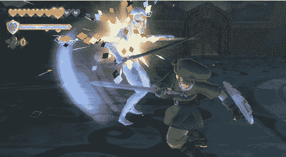

# 40/40:塞尔达天空之剑获得 Famitsu TechCrunch 满分

> 原文：<https://web.archive.org/web/http://techcrunch.com/2011/11/16/4040-zelda-skyward-sword-lands-perfect-score-from-famitsu/>

# 40/40:塞尔达天空之剑获得法米松的满分

日本(或许也是世界上)最大的视频游戏杂志《Famitsu》在最新一期测试了[塞尔达天空之剑](https://web.archive.org/web/20230204234224/http://zelda.com/skywardsword/)(为 [Wii](https://web.archive.org/web/20230204234224/https://techcrunch.com/tag/wii/) 开发的最新塞尔达游戏)。显然，他们喜欢他们玩的游戏:作为今年的第一款游戏，塞尔达天空之剑获得了完美的 40/40 分。

四位测试者每人给出了十分中的十分，使得 Wii title 成为塞尔达系列中第三个获得完美总分的游戏。事实上，N64 的《时间之笛》是第一款获得 fami tsu 40/40 的游戏(1998 年 11 月)。大约四年后在 Gamecube 上发售的《塞尔达:风之觉醒》也得到了同样的评价。

在美国，塞尔达天空之剑将于 11 月 20 日上市。

以下列表显示了迄今为止从 Famitsu 获得满分的所有图书:

1.塞尔达传说:时间之笛(1998，为任天堂 64 制作)2。灵魂之剑(1999，为 Dreamcast 制作)
3。流浪者的故事(2000，为 PlayStation)
4。塞尔达传说-风之觉醒(2003，为 GameCube)
5。任天堂(2005，为 DS)
6。最终幻想 XII (2006 年，为 PlayStation 2 制作)
7。超级粉碎兄弟争吵(2008，为 Wii)
8。[合金装备固体 4:爱国者之枪](https://web.archive.org/web/20230204234224/http://www.crunchgear.com/2008/06/04/metal-gear-solid-4-gets-rare-perfect-score-from-famitsu-magazine/) (2008，为 PlayStation 3)
9。428: Fusasareta Shibuya de (2008，为 Wii)
10。[龙之任务九](https://web.archive.org/web/20230204234224/http://www.crunchgear.com/2009/07/15/40-out-of-40-famitsu-magazine-gives-dragon-quest-ix-perfect-score/) (2009，为 DS)
11。[怪物猎人三](https://web.archive.org/web/20230204234224/http://www.crunchgear.com/2009/08/05/4040-rating-capcoms-monster-hunter-3-gets-perfect-score-from-famitsu/) (2009，为 Wii)
12。魔兵惊天录(2009 年，为 PlayStation 3/XBox 360 拍摄)。[新超级马里奥兄弟](https://web.archive.org/web/20230204234224/http://www.crunchgear.com/2009/11/24/4040-new-super-mario-bros-gets-perfect-score-from-famitsu-magazine/)。(2009，针对 Wii)
14。[合金装备固体:和平行者](https://web.archive.org/web/20230204234224/https://techcrunch.com/2010/04/21/4040-metal-gear-solid-peace-walker-gets-perfect-famitsu-rating/) (2010，为 PSP)
15。神奇宝贝黑白版(2010 年，任天堂 DS 版)