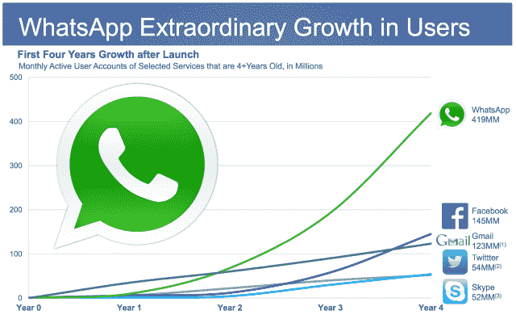

# 脸书为何在 WhatsApp 上砸下 190 亿美元:进军欧洲、新兴市场——474 页——TechCrunch

> 原文：<https://web.archive.org/web/https://techcrunch.com/2014/02/19/facebook-whatsapp/474/>

WhatsApp 每月拥有 4.5 亿用户，每天有 100 多万人注册，在国际移动通讯竞赛中遥遥领先，脸书、T2 无法赶上，正如你在上面我们去年制作的图表中看到的一样。脸书要么不得不放弃海外移动社交网络的关键，要么在 WhatsApp 变得更大之前掏钱收购它。[它选择了后者](https://web.archive.org/web/20200728001843/http://newsroom.fb.com/News/805/Facebook-to-Acquire-WhatsApp)。

脸书最近在几周前的收益电话会议上表示，其 11 月重新推出的 Messenger 的使用量增加了 70%，发送了更多的消息。但这在很大程度上可能发生在美国和加拿大，在这两个国家，独立即时通讯应用的战争仍将是赢家。

在国际上，脸书是信使党的迟到者。它直到 2011 年脸书收购白鲸后才推出，当时它的中心是短信服务特别薄弱的群发短信。

WhatsApp 于 2009 年推出，专注于一款简洁、干净、快速的移动通讯应用。虽然国际消息市场非常分散，但它能够在 Messenger 未能占据的领域占据重要地位，正如您在上面的图表中所看到的。

与基于 PC 的社交网络不同，移动通讯领域没有杰出的市场领导者。尽管如此，WhatsApp 在欧洲和印度等美国以外的市场仍占据绝对主导地位。

【更新:根据 Jana Mobile 进行的一项小型调查的数据，WhatsApp 在几个大型发展中市场比脸书更受欢迎，该调查由 Information 发布(要求我们删除数据图表)。在印度、巴西和墨西哥，与脸书相比，受访者认为 WhatsApp 是他们最常用的即时通讯应用的可能性高出 12 到 64 倍。这些大国拥有大量脸书需要的用户。]

脸书也不可能收购像微信这样的其他亚洲竞争对手，这是中国巨头腾讯拥有全球消费品的唯一希望。

因此，很明显，WhatsApp 对脸书有着战略利益，我们知道两人不时会进行交谈。

我们使用 Onavo 的数据制作了上面的地图，on AVO 是另一家总部位于以色列的公司，脸书出于竞争情报的目的收购了它。因为脸书在 10 月份以超过 1 亿美元的价格收购了 Onavo，我们再也无法获得活跃的使用数据。外人唯一能看到的是应用商店的排名，这意味着下载率，而不是当前的使用情况。

那么去年发生了什么？在发展中市场，WhatsApp 似乎已经远远领先于脸书，以至于无法追赶。马克·扎克伯格今天在一篇帖子中说，这款应用正在接近 10 亿用户。

我们听说脸书有兴趣收购 WhatsApp 已经有两三年了。[我们在 2012 年](https://web.archive.org/web/20200728001843/https://beta.techcrunch.com/2012/12/02/whats-up-with-whatsapp-facebook-might-want-to-buy-it-thats-what/)报道过，脸书正在就收购 WhatsApp 进行谈判。但在过去的一年里，很明显，脸书不能不不惜一切代价让 WhatsApp 加入自己的团队。

所以脸书问题的答案最终是 190 亿美元。

显然，这就是将简·库姆和他在红杉资本的支持者赶出市场的代价。如果再等下去，这个数字可能会变得更大。

你可能想知道 WhatsApp 将如何赚回收购成本，但这次收购并不是为了增加脸书的总收入。这是关于如何在全球移动化的浪潮中生存下来。

【T2