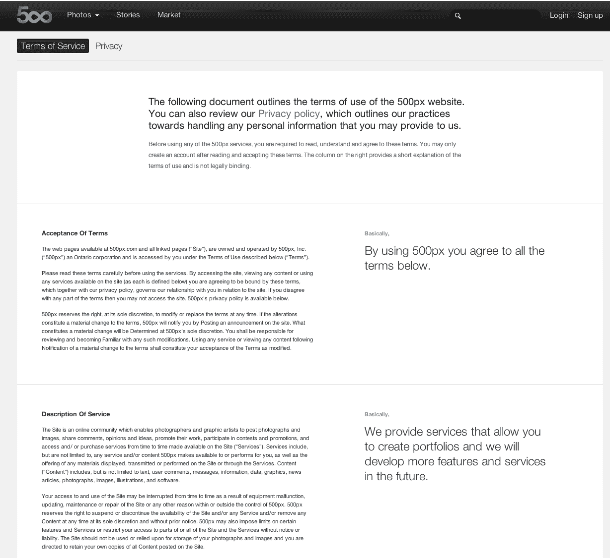

# 500px 的服务条款有点牛逼 

> 原文：<https://web.archive.org/web/https://techcrunch.com/2012/04/12/500pxs-terms-of-service-are-kind-of-awesome/>

由于设备故障、网站的更新、维护或维修或任何其他在公司控制之内或之外的原因，您对网站的访问和使用可能会不时中断。公司保留随时自行决定暂停或中止网站和/或任何服务的可用性和/或删除任何内容的权利，恕不另行通知。公司还可能对某些功能和服务施加限制，或限制您访问部分或全部网站和服务，恕不另行通知或承担责任。

你知道以上这些意味着什么吗？你看的时候睡着了吗？可悲的是，这就是一个非常典型的服务条款的样子——你知道，这是一个无聊的、难以理解的法律术语，它描述了你、用户和相关服务之间的关系。没有人读这些东西，然而不管你喜欢与否，你都要感激它们。

这就是为什么热门的 Flickr 竞争对手 [500px](https://web.archive.org/web/20221007042411/http://500px.com/) 对其[服务条款](https://web.archive.org/web/20221007042411/http://500px.com/terms)所做的事情如此令人耳目一新——它用日常语言解释了这件奇怪的事情。

这家初创公司[周一刚刚推出了新的付费会员服务](https://web.archive.org/web/20221007042411/https://beta.techcrunch.com/2012/04/10/500px-debuts-plus-paid-membership-plan-to-go-head-to-head-against-flickr/)，以迎合休闲摄影爱好者，而在此之前，该公司主要专注于专业摄影师。对于那些新用户来说，他们只是想了解事情的要点，可能不太关心照片的知识产权，500px 的条款是一个受欢迎的景象。

当你访问[500px.com/terms](https://web.archive.org/web/20221007042411/http://500px.com/terms)时，实际的服务条款在页面的左侧以完全律师模式书写，而其背后的精神在右侧以简单的日常语言解释。

例如，在一个名为“服务描述”的部分，一名律师用了两个段落来解释什么是 500px *是*，而简短而甜蜜的“基本上”部分用一句话就结束了:

> 我们提供允许您创建投资组合的服务，我们将在未来开发更多的功能和服务。

咄。那很简单。

说真的，创业公司——为什么不是每个人都这样做？

毕竟，服务条款是一件大事。只有用户应该理解它们才有意义。

举例来说: [Pinterest 最近不得不更新其服务条款](https://web.archive.org/web/20221007042411/https://beta.techcrunch.com/2012/03/24/pinterest-terms-api-copyrigh/)，以澄清如何在商业上使用网站上发布的信息，从而更好地传达其文字背后的精神。显然，出售用户内容的部分激怒了一些人，促使首席执行官本·希伯尔曼解释说:“我们最初的条款规定，通过向 Pinterest 发布内容，你授予 Pinterest 出售你的内容的权利。销售内容从来都不是我们的意图，我们已经从更新的条款中删除了这一点。”

大公司也不能幸免于让用户挠头的冗长的服务条款变化。例如，[网飞最近修改了条款](https://web.archive.org/web/20221007042411/https://beta.techcrunch.com/2012/03/20/netflix-doesnt-want-you-to-sue-them-according-to-new-terms-of-service/)说用户不能起诉他们，而[安吉星在秋天不祥地更新了条款](https://web.archive.org/web/20221007042411/https://beta.techcrunch.com/2011/09/21/onstar-amends-its-terms-of-service-to-allow-for-tracking-without-consent/)说它可以在未经同意的情况下跟踪用户——这在当时听起来像是对用户隐私的严重侵犯。两家公司肯定会受益于通俗易懂的解释。

但是在每个人都加入简单 TOS 页面的行列之前，这里有一些重要的事情需要指出。如果这种*真的*变得更常见，大多数用户可能只会阅读基本版本，这就给公司留下了空间，将协议中更有问题的部分偷偷放进法律术语中，因为他们知道很少有人会在那里发现它。

正如[在黑客新闻](https://web.archive.org/web/20221007042411/http://news.ycombinator.com/item?id=3831357)上指出的(今天早上发现了 500px 的 TOS，现在有一个有趣的讨论正在进行)，500px 的简单条款似乎遗漏了一个重要条款:

> 授予 500px 的许可包括出于促销目的完全
> 或部分使用您的内容的权利，以及向其他方、网站、应用程序和其他实体(…)分发和再分发您的内容的权利

这和[曾经让专业摄影师反对](https://web.archive.org/web/20221007042411/http://www.washingtonpost.com/blogs/blogpost/post/google-may-carry-dangers-for-photographers/2011/07/08/gIQAr2Ea3H_blog.html)Google+的条款是一样的，不管它值不值得。在长版本中留下这样的内容可能只是 500px 的一个失误，但对于其专业用户(他们实际上关心这些事情)，在简化的解释中没有提到这一点是值得关注的。

我们应该注意到，除了上述条款，两个版本似乎都缺乏如何处理 DMCA 违规行为的细节。

正如旧金山 JMG 画廊的职业摄影师吉姆·戈尔茨坦解释的那样，“使用基础版的一个缺陷是，简化版永远无法涵盖原始文档的所有细节。这确实会产生一些漏洞，”他说。“500px 在尝试新事物方面肯定值得肯定。我敢肯定，他们的策略会让一些律师有点不安，当然也不会消除所有摄影师的担忧，但我认为这是一个开始，也是一个好主意。”

**更新** : [鸟舍](https://web.archive.org/web/20221007042411/http://www.aviary.com/terms)伸出手来表示他们已经这样做了很多年。太棒了，伙计们。下一个是谁？