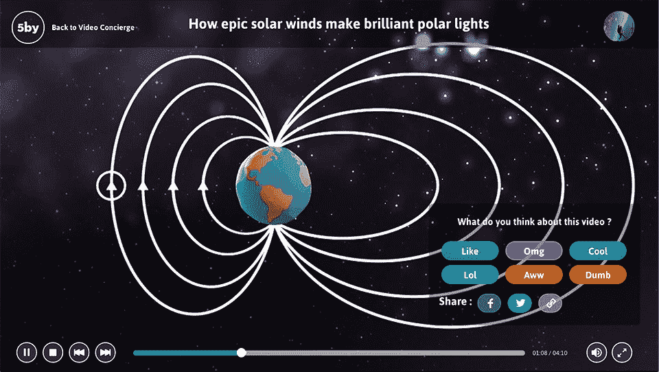

# 5by 想成为你的网络视频管理员，它也瞄准了手机和电视 TechCrunch

> 原文：<https://web.archive.org/web/https://techcrunch.com/2013/07/22/5by-wants-to-be-your-web-video-concierge-and-its-taking-aim-at-phones-and-tvs-too/>

我倾向于认为我们都曾有过这样的经历:你无聊透顶，而不是尝试做些有成效的事情，你只是在 YouTube 上一小时又一小时地消磨时间。在这种情况下往往会出现的问题是，过一会儿，你就再也找不到让你感兴趣的视频了。悲剧，我知道。

碰巧的是，这正是总部位于蒙特利尔的网络视频初创公司 [5by](https://web.archive.org/web/20221224143933/http://www.5by.com/) 的创始人兼首席执行官格雷格·伊森伯格试图解决的问题。5by 采取了一种截然不同的方法来为你寻找和播放视频，尽管如果你花了一些时间摆弄移动音乐应用程序，它可能看起来有点熟悉。

5by 被称为视频的 [Songza](https://web.archive.org/web/20221224143933/http://techcrunch.com/tag/songza) ，不难看出为什么。一旦你逛到这个网站，迎接你的不是零星的视频，而是一系列的分类，比如“把你吹走”和“消磨时间”。点击这些类别中的任何一个，你都会看到一组更精细的选项可供选择(想想“动物”，或者我个人最喜欢的“空间”)，再点击一次，你就会直接进入 5by 选择的视频(选自 YouTube 或 Vimeo)。

当你在视频中时，你会有一系列的反应:你可以点击按钮来表示你对播放给你的视频感到好笑，讨厌它，或者感觉它在拨动你的心弦。如果你不喜欢某个视频，总会有一个跳转按钮把你带到很远很远的地方。当所有这些跳过或喜欢或 OMG-ing 正在进行时，5by 正在悄悄地进行所有这些小互动，并了解你喜欢和不喜欢什么，以便下次它可以为你提供更适合你口味的视频。

这听起来是一个足够简单的概念，Isenberg 说目前为止效果非常好。他和 5by 团队的其他成员在今年 3 月举行的发布会上推出了一个非常精简的网站版本，在接下来的几天里，5by 吸引了数千名游客，他们在网站上停留了大约 12 分钟。如今，在网站上的平均时间已跃升至 19 分钟，Isenberg 说，该网站已经策划了约 10 万个视频供用户观看。

在这一阶段，所有的内容监管都由 5by 小组处理，一种旨在从多个来源引入高价值视频的监管算法提供了一点帮助。该算法知道从 Vice 和 Epic Meal Time 等流行来源中提取视频，并将它们分类到合适的类别中，供用户发现。但这种监管过程不会在内部持续太久。5by 货币化计划的一部分取决于 StumbleUpon 依赖的 CPV 模式，但 Isenberg 表示，公司开始签约担任策展人，并向喜欢视频类别或特定类型视频的观众推送自己的视频。

众所周知，视频内容和这些视频之间的广告之间的界限已经变得非常模糊，BuzzFeed 等网站上的赞助内容表明，有相当一部分人不介意将内容和广告混合在一起。现在，第三方策展人可以针对特定类型的用户接收视频和原生广告(请记住，5by 可以找出你喜欢什么，不喜欢什么)，Isenberg 表示，《花花公子》已经签约成为第一家。

5by 团队没有回避的一件事是，尽管向后倾斜的网络视频体验非常迷人，但当你坐在电脑显示器前时，你只能向后倾斜这么多。就 Isenberg 而言，5by 的未来将依赖于从传统 PC 中拓展出来。他们正在开发一款 iOS 应用，它抛弃了网页版的分类视图，转而更加关注你有多少空闲时间可以挥霍。

伊森伯格还证实，5by 已经与两家主要的电视原始设备制造商就将 5by 融入他们即将推出的智能电视的前景进行了谈判。为什么？好吧，由于缺乏更好的术语，你会在大多数智能电视上发现的 YouTube 体验通常相当糟糕。现在对 5by 来说还为时尚早，但我已经发现自己在那里浪费的时间比我想的要多——如果 Isenberg 的跨平台扩张计划成功，我们都会有一点麻烦。