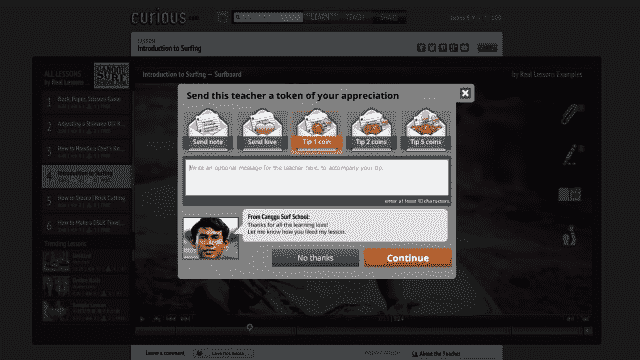

# 5K 视频和计数，好奇从 GSV 获得 1500 万美元帮助教师将一口大小的课程货币化 

> 原文：<https://web.archive.org/web/https://techcrunch.com/2014/02/13/5k-videos-and-counting-curious-lands-15m-from-gsv-to-help-teachers-monetize-bite-sized-lessons/>

由于智能设备、云服务和更流畅的内容创作和分发系统的激增，技术正在从根本上改变我们的学习方式。不仅查找、创建和消费学习内容比以往任何时候都更容易、更便宜，而且随着更好的数字视频解决方案涌入每个教室，学习实际上正在成为一种愉快的体验。

虽然网络上现在充斥着基于视频的学习工具，但当今大多数流行的平台都专注于学术体验和用例，提供课堂、课程和讲座的数字版本。去年夏天推出的好奇为终身学习者、爱好者和好奇者提供了一个属于他们自己的基于视频的平台和市场。

700 多名教师提供简短的“一口大小”的视频课程，主题从适当的缝纫技术和初学者的普拉提课到高级 MS Excel 辩论，好奇正在寻求成为更有针对性、可导航和互动的 YouTube 版本——用于继续教育。换句话说，这是你通过网络或手机阅读和发现任何主题的酷的“操作”风格内容的首选目的地。

虽然[从红点风险投资](https://web.archive.org/web/20221206194354/https://beta.techcrunch.com/2013/05/01/with-7-5m-from-redpoint-bill-campbell-others-curious-launches-a-marketplace-for-life-long-learning/)和苹果前董事长比尔·坎贝尔和其他人那里获得 750 万美元的支持肯定有所帮助，但如果好奇希望与大公司并驾齐驱——以及对基于视频的学习平台日益增长的需求——快速扩展是关键。因此，这家初创公司一直在努力扩大市场，建立课程库，增加学科领域的深度，并逐渐增加边缘功能。

移动设备也是《好奇》早期关注的焦点，尤其是“如何”内容的学习体验可以通过移动设备的访问得到改善。如果你用“好奇”来学习如何修理你的汽车引擎，如果你不能随身携带说明书，它的大部分效用就会消失。

好奇在 8 月份推出了它的第一个 iPad 应用程序，随着它的本地 [iPhone 应用程序最近紧随其后](https://web.archive.org/web/20221206194354/https://beta.techcrunch.com/2013/12/19/curious-launches-on-the-iphone-to-let-you-watch-bite-sized-how-to-lessons-on-the-go/)，好奇现在为大多数 iOS 生态系统提供支持，并允许用户在旅途中访问其微视频课程库。

例如，它的 iPhone 应用程序有几个功能，虽然谈不上令人兴奋，但对于消费移动视频课程来说是非常必要的。通过应用程序的 LearnSync 功能，用户可以从他们停止的地方继续学习课程，无论他们在哪里开始上课，室内，室外，火车上，飞机上，西班牙，桌面或移动设备上。你可以开始在办公桌前看一堂课，然后给你的比特币经纪人打几个威胁电话，在你乘坐 Lyft 前往当地酒吧的过程中，用手机接回电话。

这位好奇的创始人认为，正是像这样的 K.I.S.S .功能，使得其三分之一的注册现在是通过手机进行的。最重要的是，该公司还看到“近三位数的月环比增长”，而其课程库已增长到 5000 多个视频，Kitch 说。因此,“好奇”号认为它已经准备好迈出下一步了。

创始人表示，第二阶段的很大一部分，以及教育创业公司(甚至是那些“持续”学习的公司)一直存在的大象，是“证明其如何学习模式的货币化潜力”。为了帮助它做到这一点，好奇正在进行 1500 万美元的 B 轮融资。

该投资由 GSV 资本牵头，现有投资者参与，包括红点风险投资公司(Redpoint Ventures)、比尔·卡普贝尔(Bill Capbell)和杰西·罗杰斯(Jesse Rogers)。作为新一轮融资的结果，GSV 董事长兼首席执行官迈克尔·莫(Michael Moe)将加入这家初创公司的董事会。

有了新的资本，好奇不会等着让这些收入渠道流动起来。如今，它还为其日益稳定的 700 名教师增加了几个新的创收机会。除了向教师提供销售单一课程的能力，教师现在还可以将课程捆绑到播放列表(即课程)中，为学习者提供围绕特定目标或主题订购系列课程的折扣。

此外，好奇现在让学习者能够在课程结束时向老师提供一点金钱奖励，作为一种象征性的数字方式来表达“谢谢，教吧，继续努力。”

一旦用户完成了他们的课程，比如说，如何正确烹饪朝鲜蓟，他们将能够给他们的老师发一张纸条，并可以选择包括一个数字“提示”，由一个、两个或五个“奇怪的硬币”组成。基于数字货币的小费伴随着一个“热爱这节课”图标，该图标依次显示在教师的个人资料上。

好奇长期以来一直表示，它不感兴趣的只是成为一个片面的、仅供消费者使用的学习平台，拥有一个庞大、古老、价格合理的入门内容库，而是一个服务提供商，为另一方(教师)提供工具，以分享和货币化他们的课程。这家初创公司的新“课程”包本质上是按照他们可能已经(或应该已经)的顺序捆绑课程，以便学习者能够以更全面、整体的方式掌握技能和主题。“好奇”号将在发布时提供其中的 50 门课程，并计划在未来几个月内迅速扩大其名册。

Kitch 说，再一次，课程由多个主题组成，需要多个连续的课程来让学习者获得技能。因此，尽管“好奇”以前为用户提供了边走边浏览“相关课程”的能力，但现在内容可以按特定顺序呈现，并以折扣价捆绑购买。根据 Kitch 的说法，每门课程的价格将从 9 美元到 49 美元不等，包含 5 到 30 节课，像所有好奇的课程一样，一旦下载，就属于学习者终身学习。

好奇当然是进入正题(看到我在那里做了什么？)而不浪费任何时间。与 Coursera 更有分寸的货币化努力，或者像 Edmodo 这样的平台需要多长时间才能开始产生可观的收入相比，好奇似乎行动迅速。首先增加一大块别人的钱和资本，然后转身做一些你自己的——如果你能改变它，这是一个不错的公式。

下面，你可以找到我们最近对好奇创始人贾斯汀·基奇的 TCTV 采访，他在采访中演示了 startu 的新 iPhone 应用程序。