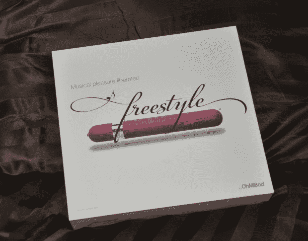

# 69adget 的 OhMiBod 自由泳评论

> 原文：<https://web.archive.org/web/https://techcrunch.com/2009/10/24/69gadgets-ohmibod-freestyle-review/>

# 69adget 的 OhMiBod 自由泳评论

**[欧米博德自由式振动器](https://web.archive.org/web/20230315060314/http://www.ohmibod.com/freestyle.html)** 让你 DJ 你自己的高潮——真的。振动器与您的 iPod 或 iPhone 无线连接，并随着节拍振动。对于那些被热门的 Jay-Z 新歌(或瑞奇·马丁，这很酷，他也在我的播放列表上)吸引的人来说，无论你选择的音乐是什么，这款振动器都将重新定义你看待你的 iPod 的方式。

[YouTube http://www.youtube.com/watch?v=UCsEL163uv8&hl=en&fs=1&]

**在盒子里:**

我见过很多性玩具，但是这个和你第一眼看到它的时候完全不同。OhMiBod 的好心人给我发了 OhMiBod Freestyle 作为样品，让我回顾和思考一切——从包装到概念。振动器装在一个内部有衬垫的硬塑料盒中，以便最大限度地携带到学校、工作、商务旅行、超市或健身房……更好的是，它配有三种不同的电源适配器，所以无论你在欧洲、美国、澳大利亚、新西兰或英国，你都可以使用振动器。下次你出门在外时，你永远不会感到兴奋或干燥——谢谢你，OhMiBod！

**高科技热度:**

Freestyle 配有一个充电器和一个 2.4GHz 无线发射器，强度可调，可与音乐播放器同步。振动器有两种功能:手动和音乐同步模式。相当强烈的震动，不适合心脏虚弱的人。在手动模式下，有七种编程模式，在音乐同步模式下，脉冲模式取决于您选择的播放列表。真正酷的是，你可以将振动器与几乎任何具有 3.5 毫米端口的设备同步，包括 iPhones、iPods、CD 播放器、立体声系统或其他 MP3 音乐播放器。完全无线，振动器在充满电的情况下运行 5 小时，长 8 英寸，厚 1.5 英寸。唯一的缺点是它有点大，由硬塑料制成，这可能会让一些寻求更真实外观或感觉的人失去兴趣。这款售价 130 美元的振动器安装简单:将发射器插入你的 iPod，然后插上耳机，或者让它从你的 iPod 基座上发出声音。设置这个东西最困难的部分是选择正确的播放列表。我的第一个想法是，我的电子音乐播放列表可能会很有趣，因为这可能是你能得到的最有节奏的音乐。令人惊讶的是，旋律强烈的歌曲感觉最好。想想坎耶、碧昂斯和布兰妮。令人敬畏的建设让我渴望合唱团。如果“所有单身女士”没有让你达到目的的旋律，你可以在中途将振动器调到手动模式，以获得持续的振动和强烈的效果。这对夫妇来说也很棒，尽管这显然不是必要的！

**我的播放列表:**
坎耶西《淘金者》

布莱特·迈可斯《只有美好时光》

碧昂斯“单身女士”

贾斯汀·汀布莱克(Justin Timberlake)《摇滚你的身体》(T3)

**判决:甩了你的男朋友:**

自爱会议通常经不起真正的爱情会议的主要原因是，当你独自一人时，你完全处于控制之中。你很清楚接下来会发生什么。自由泳解决了这个问题，因为它融合了这么多不同的强度，让你感到惊讶，想知道接下来会发生什么。如果麦当娜唱了一个特别响亮的音符或者低音响起，你会感觉到。由于不同的脉冲、意想不到的振动和不断变化的强度，这种惊喜的元素完全控制和模仿了你和伴侣的高潮类型。但是好多了。你会乞求播放列表上的下一首歌开始。

想了解更多最新的性玩具和技术，请查看 69adget.com 的