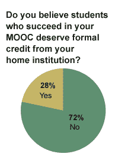

# 72%教授在线课程的教授认为他们的学生不值得表扬 TechCrunch

> 原文：<https://web.archive.org/web/https://techcrunch.com/2013/03/22/72-of-professors-who-teach-online-courses-dont-think-their-students-deserve-credit/>

# 72%教授在线课程的教授认为他们的学生不值得表扬

这对于在线教育来说不是一个好兆头:72%教授过大型开放式在线课程的教授不认为学生应该获得官方大学学分，即使他们在课堂上表现良好。更重要的是，这些是自愿花时间教授在线课程的教授，这意味着实际上不相信 MOOCs 质量的教授人数可能要高得多。这项调查揭示了高等教育机构与科技公司和立法者联盟之间的巨大差距，这些公司和立法者正在 T2 强制要求在线课程的大学学分。

自从世界上最大的大学系统——加州州立大学系统——宣布了低成本在线低年级课程的试点计划(T5 )( T6)以来，全国各地的学校都在以一种疯狂的速度竞相取代大学物理教学(T7 )( T8)。仅在一个月的时间里，威斯康星大学开始提供完全合法的大学学位，没有任何课时要求，许多学校宣布，他们将在不久的将来效仿科罗拉多州立大学低年级试点。

但是，这主要是管理驱动的。总的来说，教授们都吓坏了。当加州立法者提议强制接受在线课程时，教师参议院给立法者发了一封措辞强硬的信:“加州大学的教师不可能通过将课程管理权交给任何外部机构来推卸对学生的责任”

《教育纪事报》的最新调查显示，教授们对自己的课程信心不足。《纪事报》的史蒂夫·科洛维奇写道:“甲板上有些忠实的信徒。”该调查调查了 184 名教授过 MOOC 课程的知名教授。

在线教育还处于早期阶段，保守势力不会不战而降。

[ [*图片鸣谢:Flickr 用户 Ed Yourdon*](https://web.archive.org/web/20221206171244/http://www.flickr.com/photos/yourdon/3475417696/sizes/n/in/photostream/) ]