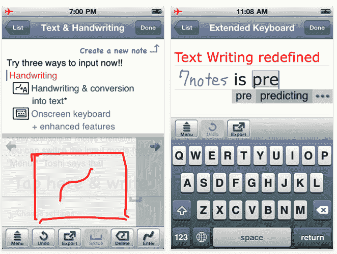
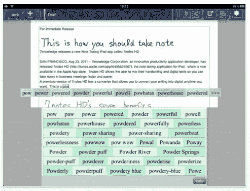
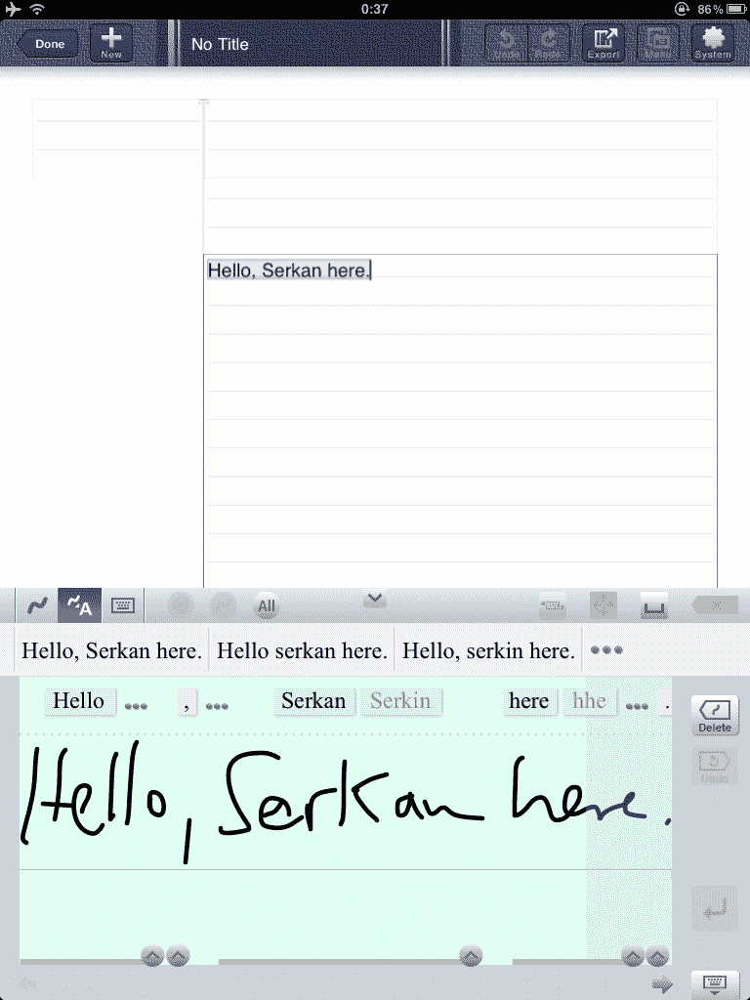
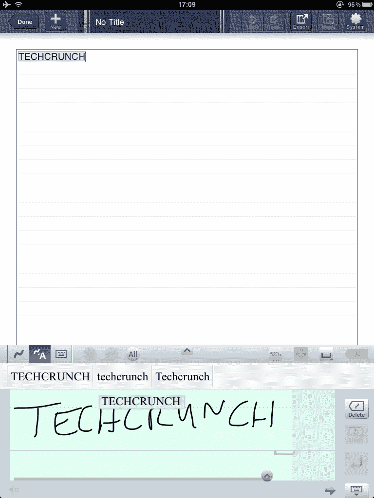

# 7notes:适用于 iPad 和 iPhone 的精确手写识别应用 

> 原文：<https://web.archive.org/web/http://techcrunch.com/2011/08/23/7notes-ipad-iphone/>

# 7 注释:适用于 iPad 和 iPhone 的精确手写识别应用程序

有相当多的 iOS 生产力应用程序具有手写识别功能，例如 [Notes Plus](https://web.archive.org/web/20230203102137/http://itunes.apple.com/us/app/notes-plus-handwriting-note/id374211477?mt=8) ，面向儿童的 [iWriteWords](https://web.archive.org/web/20230203102137/http://itunes.apple.com/us/app/iwritewords-handwriting-game/id307025309?mt=8) ，或者([间接](https://web.archive.org/web/20230203102137/http://blog.evernote.com/2011/05/23/livescribe-and-evernote-it-gets-better/) ) Evernote。但是识别手写文本并不简单，这就是为什么一款名为 [7notes](https://web.archive.org/web/20230203102137/http://7knowledge.com/en) (iPad: [免费](https://web.archive.org/web/20230203102137/http://itunes.apple.com/us/app/7notes-hd/id455624452?mt=8)，[8.99 美元高级版](https://web.archive.org/web/20230203102137/http://itunes.apple.com/us/app/7notes-hd-premium/id455625507?mt=8) /iPhone: [免费](https://web.archive.org/web/20230203102137/http://itunes.apple.com/us/app/7notes/id449800424?mt=8)，[4.99 美元高级版](https://web.archive.org/web/20230203102137/http://itunes.apple.com/us/app/7notes-premium/id449801689?mt=8))的新应用几乎完全专注于这个问题——并且做得非常好。

该应用程序在 iPhone 和 iPad 上的工作方式是一样的(在试用了两个版本后，如果可以的话，我建议下载 iPad 应用程序)。只需使用手指或手写笔(推荐)记下笔记，让 7notes 发挥其魔力，并在需要时将手写文本转换为数字字体(或混合手写和数字笔记)。所有的笔记都可以被“修饰”并与图片或网页结合。

 
 
有一系列额外的功能，例如自动滚动，不同的字体大小，线条颜色，自动建议句子中单词的“预测引擎”，自学字典，自动保存所有笔记等。等等。如果需要，还可以拉起 iPad 或 iPhone 的虚拟键盘。

7 notes maker 7 knowledge/[meta moji](https://web.archive.org/web/20230203102137/http://www.metamoji.com/en/company)的创始人声称，他们在语言和文档处理软件行业有超过 30 年的经验，这一点也显示了出来。该应用的主要卖点是手写识别的质量:大多数时候(在练习一段时间后)，该应用在识别我用手指写的单词方面惊人地准确。

这里有两个展示我书法的例子。该应用程序也识别类似“Serkan”或“Techcrunch”的单词(iPad 版/点击放大):
 

用户可以打印笔记并通过电子邮件发送，保存在 iPad 或 iPhone 的相册中，发布到脸书和 Twitter，或者发送到 Dropbox 或 Evernote 等其他应用程序。

我建议先试试免费版的 7notes，即使只有付费应用提供手写到数字的转换(同样，你需要一点练习才能获得好的结果):
7notes iPhone 版([免费](https://web.archive.org/web/20230203102137/http://itunes.apple.com/us/app/7notes/id449800424?mt=8)/[)【4.99 美元高级版](https://web.archive.org/web/20230203102137/http://itunes.apple.com/us/app/7notes-premium/id449801689?mt=8) )
7notes 高清 iPad 版([免费](https://web.archive.org/web/20230203102137/http://itunes.apple.com/us/app/7notes-hd/id455624452?mt=8)/[【8.99 美元高级版](https://web.archive.org/web/20230203102137/http://itunes.apple.com/us/app/7notes-hd-premium/id455625507?mt=8) )

【YouTube = http://www . YouTube . com/watch？v=KUYNUlfD6eg&w=420&h=345]