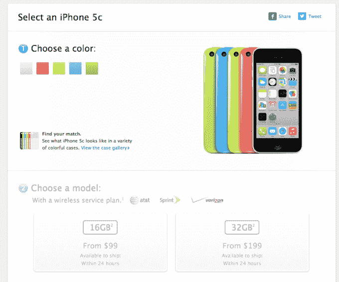
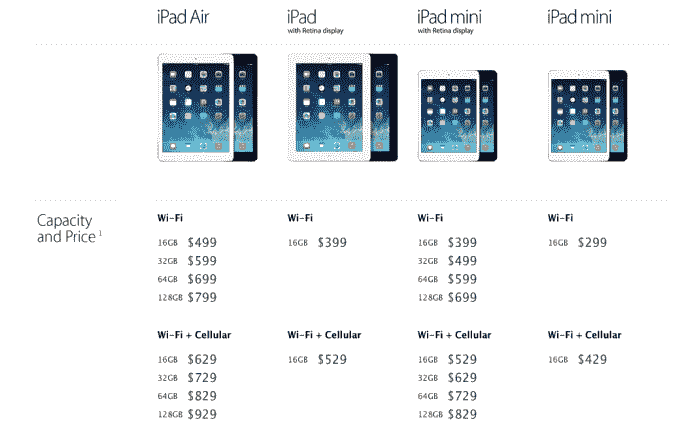

# 更新:8GB iPhone 5c 在欧洲和亚洲上市销售，苹果也调整了全球 iPad 产品线 

> 原文：<https://web.archive.org/web/https://techcrunch.com/2014/03/18/8gb-iphone-5c-goes-up-for-sale-in-europe/>

# 更新:8GB iPhone 5c 将在欧洲和亚洲销售，苹果也调整了全球 iPad 产品线

根据我们昨天在[报道的谣言](https://web.archive.org/web/20221208220126/https://beta.techcrunch.com/2014/03/17/apple-said-to-be-launching-an-8gb-iphone-5c-tomorrow/?ncid=rss)，苹果现在已经在欧洲商店增加了 8GB 版本的 iPhone 5c(通过 [9to5mac](https://web.archive.org/web/20221208220126/http://9to5mac.com/2014/03/18/apple-introduces-8-gb-iphone-5c-to-help-boost-disappointing-sales/) )。

在英国苹果商店，8GB 设备的解锁价格为 429 英镑，比进入 iOS 世界的价格低了 40 英镑。8GB 的 iPhone 5c[也在英国运营商 O2 的网站上销售](https://web.archive.org/web/20221208220126/https://www.o2.co.uk/shop/phones/apple/iphone-5c-8gb-blue/)。

**更新:**8GB 的 iPhone 现在也在法国苹果商店有售，这将使买家花费€559，比 16GB 的版本便宜€50。

**更新 2:**8GB 的 iPhone 5c 现在也在[中国](https://web.archive.org/web/20221208220126/http://store.apple.com/cn/buy-iphone/iphone5c)有售，在苹果商店售价 4088 元人民币(比 16GB 版本便宜 400 元人民币)；在澳大利亚，售价为 679 澳元(比 16GB 版本便宜 60 澳元)。

苹果商店上的 5c 以“为了多彩”的口号销售，这是指其糖果色的塑料外壳，显然没有苹果希望的那么好。因此降低了产能和价格。

但与低端安卓设备相比，429 美元的“廉价 iPhone”仍有相当大的溢价。摩托罗拉广受好评的 8GB Moto G 目前可以在亚马逊上以 129 英镑的价格买到，这只是运行 Android 操作系统的廉价智能手机的一个例子。

在撰写本文时，8GB 版本的 iPhone 5c 在美国苹果商店不可用，目前仅提供 16GB 和 32GB 选项:

**更新:**苹果已经确认了 8GB iPhone 5c 在第一波发布中的销售地点——因此，也暗示了它还没有在哪里销售:也就是美国

“8GB iPhone 5c 将于 3 月 18 日在英国、法国、德国、澳大利亚和中国上市，”该公司在提供给 TechCrunch 的一份声明中表示。

**那么再见了，iPad 2……**

同样在今天，苹果调整了其 iPad 产品线，停止了老牌的 iPad 2 平板电脑，代之以重新推出的配备 Retina 显示屏的第四代 iPad，只有 16GB 的容量。重新推出的配备 Retina 的第四代 iPad 售价为 399 美元(仅 Wi-Fi)或 529 美元(Wi-Fi 和蜂窝)。

此举在苹果平板电脑系列中的顶级 iPad Air 和(目前唯一的)其他全尺寸 iPad 之间建立了更清晰的重量差异，第四代 iPad 和 Air 之间的重量差异超过 0.40 磅，厚度差异为 0.08 英寸。

目前所有的 iPads 都配备了苹果的 Lightning 连接器。

