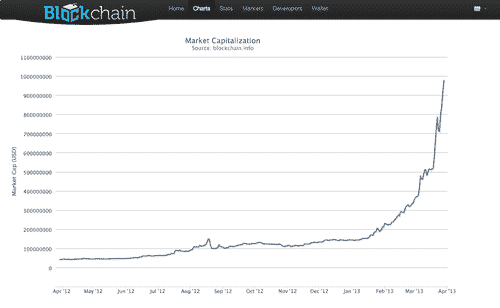

# 比特币:一种不受监管、分散的虚拟货币如何成为一个十亿美元的市场——第 92 页——

> 原文：<https://web.archive.org/web/https://techcrunch.com/2013/03/28/bitcoin-how-an-unregulated-decentralized-virtual-currency-just-became-a-billion-dollar-market/92/>

在科技行业待久了，你或你认识的人会说，“这太疯狂了，这可能行得通。”两年前，如果你告诉我，一种开源的 P2P 货币很快就会成为一个繁荣的、价值数十亿美元的市场，我会告诉你，你正在一辆孤独的公交车上驶向美国的 CrazyTown，但今天，[比特币](https://web.archive.org/web/20200214194459/http://bitcoin.org/en/)正式成为一个疯狂的想法，实际上正在发挥作用。

如今，流通中的所有比特币——约 1090 万枚——已集体突破 10 亿美元大关。和往常一样，比特币的价值(及其汇率)今天大幅波动。一度，美元价值达到 78 美元左右，然后被推到 90 年代中期。截至这一分钟，徘徊在 90 美元左右。

好吧，这仍然是谷歌市值的一小部分，但这是一件大事——特别是对于一种很大程度上不受监管、分散的虚拟货币来说。(快速说三遍。)提醒你一下，这是世界上最受欢迎、最具争议的加密货币。

比特币的支持者会嗤之以鼻，告诉你这不是什么新闻，比特币已经存在并蓬勃发展了很多年。事实上，它最早出现在 2009 年，从那以后就开始慢慢壮大。但比特币在很大程度上一直不在主流媒体的关注范围之内，因为没有人能十分确定它是怎么回事。这是一时的时尚，一个滑稽的极客驱动的现象，还是真实的交易？

事实上，它已经真正被归入超级极客的领域，或者被视为无政府主义者或疯狂的数字自由主义者的货币。被称为[丝绸之路](https://web.archive.org/web/20200214194459/http://en.wikipedia.org/wiki/Silk_Road_(marketplace))的黑市允许几乎任何人匿名出售“替代产品”(即大量个人选择的药物)，使用比特币作为其货币。这并不完全有助于比特币的“跨越”吸引力。

极客们有一个观点:最终，随着 P2P 网络、虚拟货币和数字市场越来越受欢迎，这些实体发生碰撞、有记录的虚拟货币出现只是时间问题。没有政府控制？！甚至更好！

比特币突破 10 亿美元的门槛可能看起来并不多，但如果有什么不同的话，它似乎是一个信号，表明任何人都在倾听，加密货币已经准备好被认真对待。当然，仍然有很多担忧，正如[约翰·比格斯在 2011 年](https://web.archive.org/web/20200214194459/https://beta.techcrunch.com/2011/10/24/the-business-of-bitcoin-entrepreneurs-see-opportunities-in-alternative-currencies/)所说。

但是为什么比特币会成为一个千亿级的市场呢？

首先，创业公司开始传递火炬。正如亚历克斯昨天写的那样，Expensify 宣布它现在支持比特币，“为国际承包商提供一种替代 PayPal 和与该服务相关的高额费用的选择。”Reddit 和 WordPress、Namecheap 等网站也加入了这股潮流。

总部位于门洛帕克的加速器 Boost VC 的创始人亚当·德雷珀(Adam Draper)最近宣布，该团队将在夏季课程中重点关注以比特币为核心的初创公司。正如他今天在一篇文章中所阐述的，比特币开始腾飞的另一个重要原因——当然，除了它允许在不传输个人信息的情况下进行安全的数字交易——是投资者的信心正在增长。比特币初创公司开始筹集资金，德雷珀声称，他们的基金远远不是唯一感兴趣的基金。

更重要的是，政府终于意识到，它需要开始认真对待虚拟货币，并制定一项战略来处理这些类型的货币。FinCEN 最近发布了一系列[“指导方针”](https://web.archive.org/web/20200214194459/http://www.fincen.gov/statutes_regs/guidance/pdf/FIN-2013-G001.pdf)，这些指导方针将为未来的监管提供信息，但也致力于建立虚拟货币，特别是比特币的信任和可信度。

还有全球金融市场的气候，特别是塞浦路斯的恐慌，在政府[冻结了其公民的银行账户](https://web.archive.org/web/20200214194459/http://money.cnn.com/2013/03/25/news/economy/cyprus-bailout-banks/index.html)之后，塞浦路斯接受了救助。许多人认为，欧洲及其他地区脆弱的金融市场创造了一种氛围，像比特币这样的数字灵丹妙药已经成熟。

当然，比特币争论的另一面是，不稳定的金融市场和虚拟货币的飞速增长(加上炒作)正在创造一场完美的风暴，相当于比特币只是一个等待破裂的巨大泡沫。

此外，正如我的同事格雷格·库姆帕拉克(Greg Kumparak)今天指出的那样，比特币本身在政策上仍处于脆弱的境地。一旦政府充分认识到比特币是一个 10 亿美元的市场，并且还在增长，那么一个分散的、不受监管的市场很有可能会吓得政府屁滚尿流。“这是政府有史以来最容易提出的‘这是资助恐怖主义’的恐慌论点，因此在未来一两年内肯定会有一场大战，”他说。

无论人们将其视为一种现象还是一种合法的机构，比特币都在全力以赴成为后者——现在有了一个值得我们全力关注的真实案例。无论哪种方式，你都可以惊讶于一种几乎凭空出现的虚拟货币(由某个[幽灵数学家/经济学家](https://web.archive.org/web/20200214194459/http://www.newyorker.com/reporting/2011/10/10/111010fa_fact_davis)创造的)如何从帽子里变出一个十亿美元的市场。

丝绸之路见？