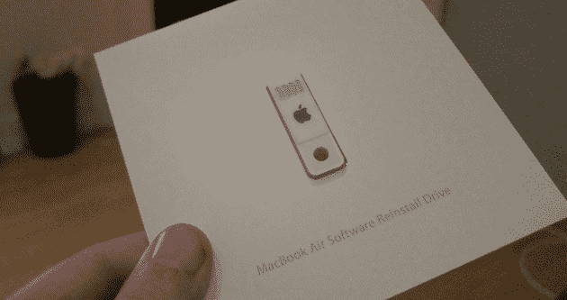
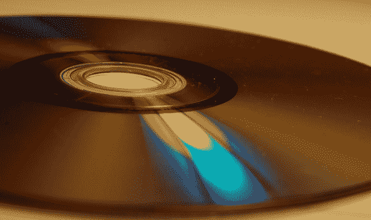
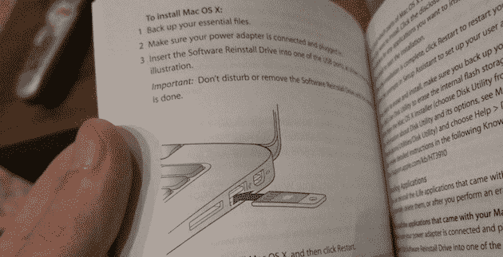

# 是的，苹果今天取消了 CD

> 原文：<https://web.archive.org/web/https://techcrunch.com/2010/10/20/a-compact-death/>

停下来。深呼吸。在我的标题让你激动之前，考虑一下我在这里说的话。CD 和其他光盘，如 DVD 和蓝光，显然将作为一种传输媒体的方式存在一段时间。但毫无疑问，今天，苹果公司通过两次发布，已经有效地决定了光盘在计算机行业的命运。很快，它将步软盘的后尘。

上周，我写了一篇文章，列出了我希望苹果(Apple)推出的新款 MacBook Air 会带来什么。我意识到[我从未在我目前的 MacBook Pro 中使用过光驱](https://web.archive.org/web/20230322160428/https://techcrunch.com/2010/10/15/new-macbook-air/)，它只是占用了很多空间，让我的电脑变得不必要的笨重。我想换成 MacBook Air。[现在我可以](https://web.archive.org/web/20230322160428/https://techcrunch.com/2010/10/20/new-macbook-air-pictures/)。我不会是唯一一个知道的人。

现在，我知道你在想什么:但是 MacBook Air 已经问世好几年了，它还没有消灭光盘。没错，但是上次少了几个关键成分。

首先，第一代 air 是动力不足和价格过高的糟糕组合。情况不再是这样了。第二，他们需要一些复杂的桌面电脑 CD 同步系统，以便能够从光盘上安装一些东西(或者一个可选的 USB 插件)。这种情况也不再存在(尽管两者仍然存在)。

当你拿到 MacBook Air 并打开盒子时，你会发现里面装的正是 *zero* 光盘。通常情况下，苹果至少会提供一张备份 DVD，以便在电脑出现故障时重新安装 OS X 和其他软件。但现在，它已经被一个超薄的 u 盘取代了。这个棒，装在你的手册里，是你现在重新安装你的系统所需要的。

这很有道理。CD 被 DVD 所取代，因为它们提供了更多的存储空间。但是闪存卡，比如苹果公司随 Air 附带的那种，在存储方面已经让 DVD 相形见绌。它们的生产成本可能仍会更高，但苹果显然已经找到了一种让它运转起来的方法。我怀疑我们可能会看到更多像这样的驱动器(它比典型的 USB 闪存驱动器使用更少的塑料——似乎甚至比光盘使用更少的塑料)。

但那只是未来的一半。

另一半是苹果今天发布的一个潜在的更大的公告:Mac 应用商店。虽然苹果还没有给出大量的细节，但这个商店似乎会像他们的应用商店一样在 iPhone，iPad 和 iPod touch 上工作。会有免费和付费的应用。会有一键下载。会有自动更新。所有这些。

不会有任何光盘。

到目前为止，绝大多数软件(至少是合法软件)都是通过 CD 或 DVD 发行的。苹果应用商店可以很好地改变这一点。在那个商店里找到的每一个应用程序，毫无疑问包括我们今天都知道、喜爱并在我们的电脑上使用的大应用程序，都将在互联网上分发。早就应该这样了。

许多公司已经尝试互联网分销很长时间了。有些成功了，有些没有。但是没有一个像苹果公司在这里提供的那种中央存储库。这将是巨大的。

如果这听起来类似于谷歌[在](https://web.archive.org/web/20230322160428/https://techcrunch.com/2010/10/19/chrome-web-store-launch-2/)开发的 Chrome 网络商店，或者 Mozilla[提出的](https://web.archive.org/web/20230322160428/https://techcrunch.com/2010/10/19/mozilla-web-apps/)开放网络生态系统，请记住，这些只是*网络*应用。我们说的是 Mac 应用商店的原生应用。我们说的是在你的电脑上运行的应用程序，就像你现在拥有的一样，它们只是以一种更有意义的方式发布。

它们的发行方式使得 CD、DVD 和其他所有光盘都过时了。这很好，因为很快光驱也将开始消失。

七年半前，随着 iTunes 音乐商店的推出，苹果开始扼杀 CD。今天，他们开始了最后的攻击。不会有幸存者。

**更多** : [像小鸟一样自由:使用新 MacBook Air 一天后的初步想法](https://web.archive.org/web/20230322160428/https://techcrunch.com/2010/10/21/new-macbook-air-review/ "Free As A Bird: Initial Thoughts After A Day With The New MacBook Air")

*【图片:Flickr/[stuartpilbrow](https://web.archive.org/web/20230322160428/http://www.flickr.com/photos/stuartpilbrow/3253768371/)*