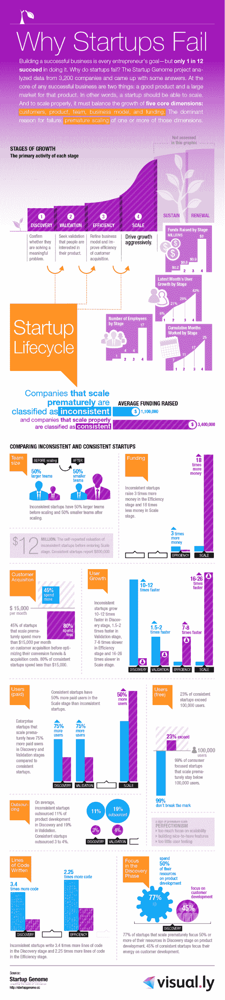

# 深入了解 Blackbox 关于创业失败及其主要原因的数据:过早扩展[信息图] 

> 原文：<https://web.archive.org/web/http://techcrunch.com/2011/09/01/a-deeper-look-at-blackboxs-data-on-startup-failure-and-its-top-cause-premature-scaling-infographic/>

本周早些时候，我们报道了负责创建[初创公司基因组报告](https://web.archive.org/web/20230327061609/http://blog.startupcompass.co/)的年轻公司 [Blackbox](https://web.archive.org/web/20230327061609/http://blackbox.vc/) ，这是一个正在进行的合作研发项目，旨在全面探究硅谷初创公司成功的原因，以及失败的原因。([在这里阅读我们最初的报道。](https://web.archive.org/web/20230327061609/https://techcrunch.com/2011/05/28/what-makes-a-startup-successful-blackbox-report-aims-to-map-the-startup-genome/))周二，[我们报道了该公司推出的](https://web.archive.org/web/20230327061609/https://techcrunch.com/2011/08/29/what-kills-startups-blackbox-releases-reportapp-to-help-founders-avoid-the-deadpool/)所谓的[初创公司基因组罗盘](https://web.archive.org/web/20230327061609/https://www.startupcompass.co/)，这是一款针对初创公司的基准工具，帮助创始人监控他们在不同增长类别的进展。自那以来，已有超过 6000 家初创公司注册使用指南针。

除了诊断工具，Blackbox 还发布了一份关于创业失败主要原因的新研究报告，其中可能更重要的是，创业失败的主要原因是:过早扩张。虽然这在我们之前的报道中有所涉及，但我们认为可能值得详细阐述他们的发现，包括展示由团队在 [Visual.ly](https://web.archive.org/web/20230327061609/http://twitter.com/#%21/Visually) 创建的漂亮的信息图。

为了更新，自 2 月份以来，Blackbox 收集了超过 3200 家高增长科技创业公司的数据集，他们的研究结果显示，过早的规模扩张是创业公司失败的主要原因，影响了 70%的创业公司。值得注意的一点是:基于这 3200 家初创公司，创业者的经验、性别、国籍、教育和年龄对失败的预测可能性没有影响。

但是，正如一些敏锐的读者在我们上一篇文章的评论部分指出的那样，挖掘由创业公司(以及实际的——同样多样化的——人类)创造的大量不同数据，声称世界已经找到了一个单一的、最终的失败原因，可以作为各种创业公司的药方，这肯定是危险的。虽然 Blackbox 团队可能略有不同，但这项研究旨在帮助初创公司避免死池。就这么简单。启动基因组是一个正在进行的研究项目，似乎旨在阐明，而不是强制喂食处方。它的方法是科学的，它的一些语言可能看起来很枯燥——而且它可能并不适用于所有人。

此外，“过早扩展”似乎是一个过于简单的术语，很容易被误解。Blackbox 团队在他们的研究中定义过早扩大规模是一种表示创业公司核心维度(产品、客户、团队、财务和商业模式)不同步的方式。也就是说:一个(或多个)以不同的速度增长。正如 Blackbox 联合创始人 Bjoern Herrmann 所指出的，“在某些情况下，功能失调的缩放可能是一个更好的描述”。

考虑到这一点，研究发现，那些过早扩张(或功能失调)的初创公司与那些更加同步的初创公司之间存在一些相当显著的差异。最值得注意的是:没有一家初创公司过早地突破了 10 万用户大关。不仅如此，93%的初创公司从未跨过年收入 10 万美元的门槛。而且，也许有些违反直觉，适度规模的创业公司比过早扩大规模的创业公司增长快 20 倍。

投资者和连续企业家布拉德·菲尔德(Brad Feld)对过早的规模扩张进行了权衡，他说:“在客户采用之前雇佣任何数量的销售或营销人员都是过早的规模扩张。所有早期的雇佣都应该是技术或产品方面的。不过，至少有一位联合创始人应该从一开始就痴迷于销售和营销。在产品上市后增加一名销售人员和一名营销人员没问题，但这些人应该是‘实干家’而不是‘副总裁’”。

为了进一步阐述 Blackbox 团队如何定义他们的研究，Hermann 说，他们将初创公司定义为“旨在发展成为大公司的临时组织”。一旦定义完毕，该团队就试图用科学的方法来理解这些初创公司的生命周期——几乎像行为心理学家一样——通过定义它们进化的六个发展阶段:发现、验证、效率、规模、维持和保护。

Herrmann 说，早期创业公司的设计是为了在极端不确定的条件下寻找产品/市场的契合度，而晚期创业公司的设计是为了寻找可重复和可扩展的商业模式，然后扩大规模成为大型公司，在更高确定性的条件下执行。听起来很合理。

但他们更进一步:他们确定，每个初创公司都有一个实际阶段和一个行为阶段，其中“实际阶段”是通过客户对初创公司产品的反应来衡量的，通过查看用户数量、用户增长、激活率、保留率、收入等指标。“行为阶段”由初创公司可以控制的五个顶级维度组成，如客户、产品、团队、财务和商业模式。赫尔曼说，每一个维度，包括实际的和行为的，都被划分为六个发展阶段中的一个。

就这个模型与过早扩展的关系而言，一家初创公司在研究中获得了这个标签，当时它的行为阶段变得比实际阶段“更大”。Blackbox 的联合创始人说，一个明显的过早扩张的例子是，一家初创公司在拥有任何客户之前，迅速将团队规模扩大到 30 至 40 人。在这个例子中，创业的实际阶段是验证阶段，但是团队的行为阶段是规模化阶段。

另一方面，Blackbox 倾向于将“功能失调性缩放”定义为行为阶段低于实际阶段的情况。根据 Blackbox 说法，提供这种例子的初创公司包括:Tokbox、Friendster、Orkut、Wesabe、Digg、SixApart、Myspace、abd Chatroullete。

但是，这里有一个例子，而不是进入每一个单独的阶段:特别是旧的“客户获取”类别。Blackbox 认为，当一家初创公司在真正完善其实际产品或市场契合度之前，在收购上花费了太多资金，或者过度补偿或缺少产品和市场契合度，过于关注营销和媒体支出时，该初创公司相对于其客户收购规模过早扩大。在这种情况下，一个有启发性的统计数据是，在所有其他类别同步之前，初创公司在获取客户方面花费更多的可能性是其他公司的 2.3 倍。Blackbox 引用 Color、Webvan 和 Pets.com 作为初创公司在客户获取维度上花费过多、过早的例子。

现在，我们就到此为止。但是对于那些感兴趣的人来说，[点击这里](https://web.archive.org/web/20230327061609/http://startupgenome.cc/pages/startup-genome-report-extra-on-premature-scal)查看 Blackbox 关于过早结垢的研究。

话不多说，Visual.ly 关于过早缩放的信息图如下:

