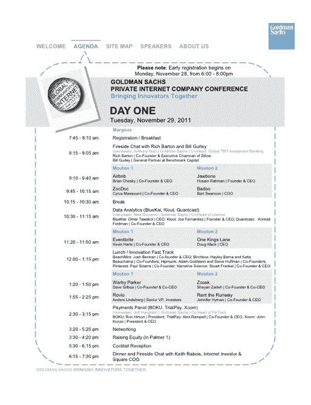
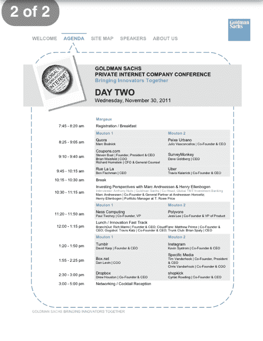

# 高盛认为最有可能 IPO 的初创公司名单 TechCrunch

> 原文：<https://web.archive.org/web/https://techcrunch.com/2011/12/03/a-list-of-startups-goldman-sachs-thinks-will-most-likely-ipo/>

# 高盛认为最有可能 IPO 的初创公司名单

本周，投资银行和证券公司[高盛](https://web.archive.org/web/20221225011723/http://www2.goldmansachs.com/?cid=PS_01_05_06_99_01_01)非常安静地(几乎没有谷歌的足迹)在拉斯韦加斯举行了其[私人互联网公司会议](https://web.archive.org/web/20221225011723/http://plancast.com/p/8jje/goldman-sachs-private-internet-company-conference)。在 11 月 29 日至 30 日为期两天的会议上，一群公司向由银行家、投资者和同行组成的精英观众展示了他们的商业模式。

与会者聆听了由 [A16Z](https://web.archive.org/web/20221225011723/http://a16z.com/) 的[马克·安德森](https://web.archive.org/web/20221225011723/http://www.crunchbase.com/person/marc-andreessen)和 [Square 的](https://web.archive.org/web/20221225011723/http://www.square.com/)和[基思·拉布瓦](https://web.archive.org/web/20221225011723/http://www.crunchbase.com/person/keith-rabois)所做的演讲(他在周二晚上做了主题演讲)。SV 天使的 [罗恩·康韦](https://web.archive.org/web/20221225011723/http://www.crunchbase.com/person/ron-conway)也在那里，做他自己。总之，我听说这次经历非常非常有趣。有道理。

那么，如果你是 IPO 承销商，为什么要为早期公司召开会议呢？这个活动基本上是一种极具前瞻性的销售线索挖掘形式。据我采访的多位人士透露，高盛已经指定了 30 家左右的初创公司作为潜在的 IPO 候选人。它希望尽早建立关系，以防他们中的一些人在这个过程中确实需要高盛的服务。

那么这些白热化的创业公司是谁呢？好了，给你！(我可能会漏掉一两个，所以如果你在这个名单上，或者知道谁应该在这个名单上，请给我发电子邮件，如果你的故事得到证实，我会把你/他们放在名单上。)

按字母顺序排列:

*   爱彼迎（美国短租平台）
*   海滩造币厂
*   波尚
*   Birchbox
*   布鲁凯
*   巴杜
*   博库
*   Box.net
*   分枝
*   云耀斑
*   Coupons.com
*   DropBox
*   Eventbrite
*   Gogobot
*   Hipmunk
*   照片墙
*   颚骨
*   克劳特
*   叙事科学
*   Ness 计算
*   拼趣
*   国王巷一号
*   Peixe Urbano
*   聚乙烯醇
*   量子广播
*   Quora
*   租用跑道
*   拉拉街
*   罗维奥
*   商店扒手
*   特定媒体
*   调查猴子
*   平方
*   试用工资
*   树干俱乐部
*   Tumblr
*   优步
*   沃比·帕克
*   WePay
*   Xoom
*   佐多克
*   祖斯克

每个初创公司都向大约 60-80 名观众展示了 30 分钟，只有四个左右的小公司除外，比如 [Gogobot](https://web.archive.org/web/20221225011723/http://www.gogobot.com/) ，他们向所有 500 人展示了 15 分钟。高盛在管理整个名单方面做得很好，尽管我会把 T2 的 Spotify 加入进来。

但这只是我。

**更新:**完整议程截图，如下。有传言称，Dropbox 被认为是最有可能 IPO 的候选公司，这是会议讨论的共识。我听说，周二晚上参加 Dropbox/IVP 派对是件大事。

*上图 via: [希腊股票](https://web.archive.org/web/20221225011723/http://www.greekshares.com/initial_public_offering.php)*