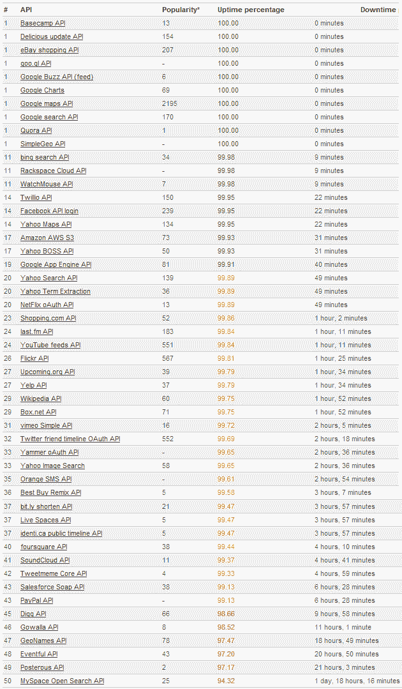

# 50 个流行 API 的正常运行时间 TechCrunch

> 原文：<https://web.archive.org/web/https://techcrunch.com/2011/03/25/a-look-at-the-uptime-of-50-popular-apis/>

# 看看 50 个流行 API 的正常运行时间

API 就像网站一样:它们大部分时间都是可用的，但不幸的是并不是所有时间都是可用的。

网站和应用程序性能监测初创公司 [WatchMouse](https://web.archive.org/web/20230218025630/http://www.watchmouse.com/en/) [对](https://web.archive.org/web/20230218025630/https://techcrunch.com/2010/01/19/watchmouse-api-status/)50 个最受欢迎的 API(按 [ProgrammableWeb](https://web.archive.org/web/20230218025630/http://www.programmableweb.com/) 排名)的正常运行时间进行了一个月的监测，以查看[哪些是最可靠的](https://web.archive.org/web/20230218025630/http://www.watchmouse.com/en/spi/2011/API_availability.php)——哪些是相当不可靠的。

WatchMouse 也在 API-Status.com 实时发布 API 状态，发现其中 10 个在 2 月 16 日至 3 月 17 日期间运行顺利，包括 goo.gl、Quora、易贝、谷歌地图和 Basecamp。

一些 API，即来自 Digg、GeoNames、Gowalla、Posterous 和 Eventful 的 API 表现相当差，但是境况不佳的 Myspace 在不可靠性方面表现最好。

不用说，许多网站和应用程序依赖 API 来开展业务，因此正常运行时间对于避免令人讨厌的多米诺骨牌效应非常重要。

为该特定报告测试站点的方法包括一个简单的 API 调用和对有效结果的检查，这意味着它不是对完整 API 的深入功能测试，但仍可用于评估是否应该依赖某些 API 来实现业务目的。完整报告可在[此处](https://web.archive.org/web/20230218025630/http://www.watchmouse.com/en/spi/2011/API_availability.php)获得。

全球 56 个观察站每 5 分钟进行一次 API 检查。错误用于计算每个站点的可用性或正常运行时间的百分比。

