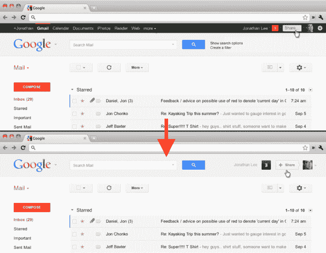

# 一个新的谷歌栏:黑色被淘汰，谷歌跨产品搜索进入 

> 原文：<https://web.archive.org/web/https://techcrunch.com/2011/11/29/a-new-google-bar-black-is-out-google-search-across-products-is-in/>

在过去的六个月里，谷歌进行了一次全面的大扫除——或者可能它正在蜕皮。一方面，这意味着淘汰不再受欢迎的产品，比如 9 月份宣布计划关闭 [Aardvark、Desktop、Notebook 和 Fast Flip、](https://web.archive.org/web/20221208141617/https://beta.techcrunch.com/2011/09/02/google-does-a-full-house-cleaning-sunsets-notebook-fast-flip-and-more/)等产品。然后[上周继续说再见(官方)波，知识单元，朋友连接，和更多的](https://web.archive.org/web/20221208141617/https://beta.techcrunch.com/2011/11/22/google-announces-plans-to-shutter-knol-friend-connect-and-more/)。另一方面，谷歌一直在更新它的外观，嗯，它的设计。

这意味着谷歌搜索页面有点改头换面，因为该公司在页面顶部添加了一个黑色的导航栏(有点类似于 Drupal 的顶部栏，不是吗？)，一个较小的徽标，链接移动到浏览器窗口的顶部和底部边缘。谷歌追求的是一个更干净、更简单的外观——它所有的产品都是如此。这些变化在搜索、地图、翻译以及后来的阅读器(boo，hiss)，甚至 Gmail 上都可以看到。

事实上，谷歌一直在试图让它的主页、搜索页面有点像你的桌面，让你可以更快地(在一个地方)访问他们的所有产品(和你的东西)，最优先考虑的是在所有这些产品中推广 Google+集成。

[今天，谷歌在其博客](https://web.archive.org/web/20221208141617/http://googleblog.blogspot.com/2011/11/next-stage-in-our-redesign.html)上宣布，它已经“准备好进入下一阶段”的重新设计，这显然包括一个新的谷歌栏，它将使用户能够更快地在每种产品之间切换，并与 Google+用户轻松分享。

这意味着到达黑酒吧。黑色工具栏将被一个新的灰色“嵌套在谷歌标志下的谷歌下拉菜单”所取代。这将包括一个链接列表，以及谷歌的服务，可以通过悬停在列表底部的“更多”链接来访问。

黑色导航条，我们几乎不认识你。我刚刚开始习惯它，但它也有点烦人，我喜欢减去那个耀眼的黑条，更多空间的想法，以及我现在可以搜索我正在使用的谷歌产品的内容的事实。即使正如我的一位同事所调侃的那样，这是谷歌“更多空白空间，没有任何理由”的口头禅的一部分。

我可能需要多点击几次，但这保持了设计和感觉的一致性，尤其是考虑到最近 Chrome 网络商店的重新设计。只要不是为了易用性而追求一致性，谷歌的设计调整是受欢迎的。

[https://web.archive.org/web/20221208141617if_/https://www.youtube.com/embed/vSIMpFfNLEA?feature=oembed](https://web.archive.org/web/20221208141617if_/https://www.youtube.com/embed/vSIMpFfNLEA?feature=oembed)

视频