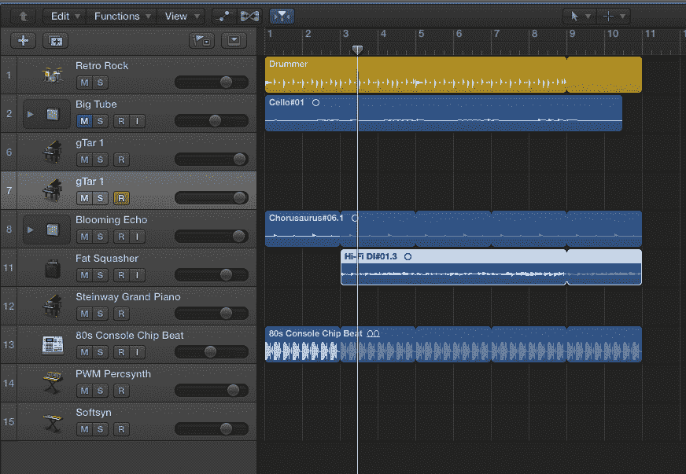
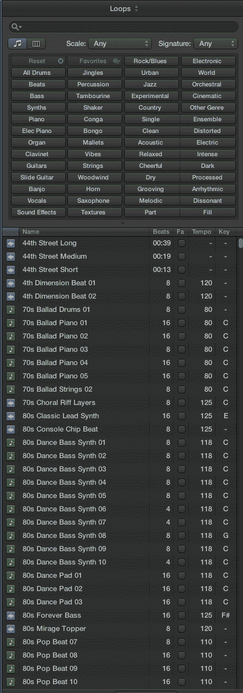
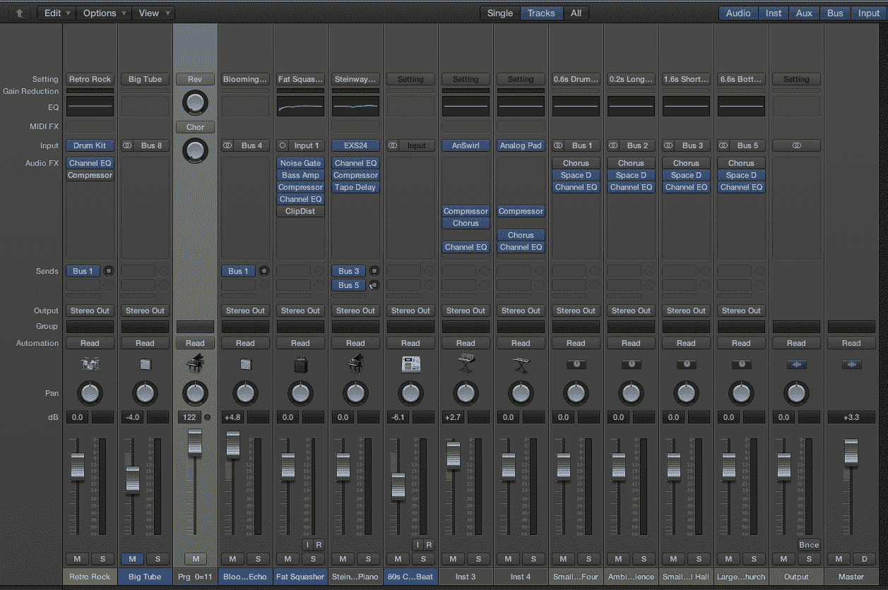
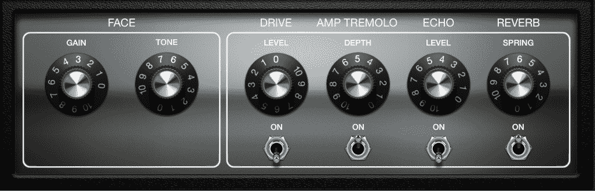
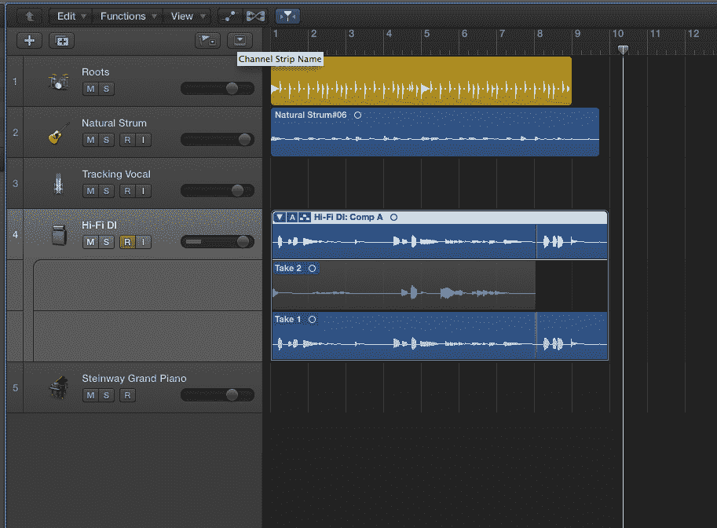

# 一个新手对 Logic Pro X TechCrunch 的印象

> 原文：<https://web.archive.org/web/https://techcrunch.com/2013/07/30/a-newbies-impressions-of-logic-pro-x/>

专业级影音软件一直让人望而生畏。虽然普通电脑用户知道如何在一般意义上操作它们(非线性编辑的出现从根本上改变了我们对拍摄和录制内容的看法)，但特效、混音板和 MIDI 乐器等专业级功能的添加可能会让特伦特·雷诺垂涎三尺，但却让卧室吉他手感到害怕。

几周前，苹果发布了 Logic Pro X，我只能用低调来形容。评论高度评价了内置的虚拟鼓手，它可以快速轻松地为您的作品构建背景音乐，以及一个远程控制 iPad 应用程序，它可以通过平板电脑虚拟控制您的录音。专业人士称赞苹果，怀疑新版本是否会出现。然而，我想评估一下这个新软件对于更习惯于 Garage Band 和其他简单编辑器的人的可用性。
T3

打开应用程序后，新用户会发现自己置身于一个令人想起旧游戏《冒险》的环境中——你置身于一个迷宫，里面有许多弯曲的小通道，全都一样。

该应用程序支持许多模板，包括为电子音乐、歌曲创作和音乐配乐准备的曲目。大多数入门级用户会想要歌曲创作，它提供 8 个干净、空白的音轨，或者，如果你是*想象龙*类型，在电子模板中预先设置循环、音频和 MIDI 轨道的集合。要正确使用该应用程序，你需要一个好的电容麦克风或键盘等 MIDI 设备。你也可以使用 iPad 应用程序作为一种迷你键盘来输入 MIDI 音乐。

【T2

和任何计算机程序一样，古老的格言“垃圾进，垃圾出”在这里是正确的。如果你的音轨很难听到或者你的输入太低——也就是说你的麦克风没有接收到足够的音频——你的音轨会很差。应用程序中有多种修复音频的效果和技术，但良好的录音技术很重要。

Logic Pro X 中有多种类型的轨道，包括录音、MIDI 和循环。安装后，该应用程序会下载 2g 非常有用的循环和填充，包括 GarageBand 用户熟悉的音乐，以及滴答声时钟、滑稽的喇叭和人群等声音效果。例如，在拼凑一组音频采访时，我通过添加一个滴答作响的秒表和一个拥挤的酒吧的声音，在发言者之间创建了一个小小的过渡，与采访的声音床完美匹配。当然，这在 GarageBand 中可以很容易地完成，但是 Logic Pro 的速度和功能集给了我一个更大、更丰富的调板。

简而言之，这就是入门级应用和逻辑的最大区别。大量的控件和编辑技巧让它变成了一个售价 199 美元的便携式专业录音棚。将轨道并轨到磁盘，也就是说，像渲染视频一样“渲染”它们，产生了我在 Mac 上做过的一些最高质量的录制，这是高度赞扬。

听起来像什么？首先，请理解我是一个糟糕的吉他手，只是现在才开始好转。也就是说，这是一个内置 DSP 的 [Squier electric 吉他演示，可以直接作为 USB 设备输出。我从低音线——背景中的嘎嘎声——开始，然后在它上面添加了一些强力和弦。这两个都是录音。然后我循环低音线，并添加了一个鼓手轨道，它可以快速“听”音乐，并添加适用的节奏。使用共享功能将整首歌曲录制并导出到 SoundCloud 非常简单。我是在一台全新的 iMac 上录制的，音频渲染需要几分钟时间。](https://web.archive.org/web/20221206011855/https://beta.techcrunch.com/2012/11/30/review-squier-by-fender-strat-guitar-with-usb-connection/)

[soundcloud URL = " http://API . soundcloud . com/tracks/102574679 " params = " " width = " 100% " height = " 166 " iframe = " true "/]

接下来我们有一首迷人的电子音乐歌曲，是我用大约五分钟写的。因为循环可以转置到任何键，我选择了一些 MIDI 和数字录音，并把它们调到 c 大调。先打鼓，然后是奇怪的电子舞曲。你这里的电钢琴是一个 MIDI 文件。该文件的一个版本在名为 Crystal Pad 的乐器中播放，另一个版本在 Mellow Poly 中播放。我稍微抵消了它们，并在末尾添加了一些字符串和一个合成器。我不需要知道每个鼓轨道的 BPM 样本会自动将自己设置到合适的速度。出乎意料的简单，我不禁对自己的糟糕表现感到一丝欣慰。我在新的 MacBook Pro 上渲染了这个，也花了几分钟。

[soundcloud URL = " http://API . soundcloud . com/tracks/103087501 " params = " " width = " 100% " height = " 166 " iframe = " true "/]

因为这是从一个新手的角度来看这个应用程序，我建议你访问电子音乐网站，在那里真正熟悉录音室的人可能有更多的话要说。然而，Logic Pro X 显然非常强大，但并没有压倒性优势。
T3

该不该升级？当我大约在 2009 年第一次使用 Logic 时，这款应用类似于 1990 年左右的战斗机驾驶舱。有大量的计算机控制和其他稀奇古怪的东西让飞行员更容易操作，但如果你不能正确读取刻度盘，你仍然会在起飞时坠毁。我会把 Pro X 与新梦想飞机的驾驶舱相提并论，所有这些易于使用、受触摸屏启发的控件的复杂性足以取悦老用户，而简单性将鼓励新用户直接投入其中。鉴于我可能无法在早期版本的 Logic 中创作出这两段音乐，我想说苹果成功地把事情简化到足以让像我这样的白痴欣赏的程度。

苹果可以做哪些不同的事情？在不疏远长期专业用户的情况下不多。转盘和控制装置对严肃的音频调音师来说很重要，音乐家会喜欢他们对每件乐器的控制。因为这个应用程序与我用过的其他多音轨音频应用程序非常相似，所以我能够立刻投入进去，而不必看一堆滑块或理解各种图标。一点探索带来了更多的定制，因此超出了我的视野，包括控制一个设计巧妙的机器人鼓手系统的能力，该系统为每个打击乐手提供了一个迷人的潮人名字，如 Aiden，Anders 和 Max(自然带有 A 的无政府符号)。简而言之，苹果已经将它变成了一款既能取悦长期用户，又能为 GarageBand 用户铺平道路的应用。

歌手和吉他手也将享受弹性时间录音功能，如音高和定时校正。有了合适的麦克风，你可以用这些工具录制一张录音室级别的专辑，只需要一把吉他和你的反叛精神。我的一个吉他手朋友在看到一些功能时评论说，他“希望他在高中时就有这些工具。”

“虽然，”他补充道，“我可能从来没有去上过课。”

在这个重新设计的应用程序中，并非一切都是阳光和玫瑰。这仍然令人望而生畏，如果不理解术语，事情会变得很棘手。每个轨道旁边的小按钮 M、S、R 和 I 代表静音、独奏、录音和输入监听。如果你不知道这一点，你会很难解释如何在不调低音量的情况下将单个音轨静音。此外，用单个轨道创建堆栈的能力有点令人困惑，直到您意识到堆栈只是几个轨道的容器——比如您想要反复使用的背景低音线和鼓轨道，或者您想要精确控制的大型管弦乐部分。您可以像单个轨道一样上下翻转这些堆栈，甚至可以在其他项目中重复使用它们。

像大多数其他专业级工具一样，我相信我会听到用户抱怨逻辑被夸大或不可用，而是指他们使用 Tascam 8 声道数码录音机和索尼的 Acid 录制 20 首爵士乐队的能力(我的音乐家朋友可以使用自 2000 年代初以来就没有更新过的软件来做这件事和更多事情)。也就是说，我认为像 Logic 这样的工具就相当于 20 世纪 60 年代的打字机:如果你仔细观察，你会发现一台更好的，但有时一台按键行程恰到好处的 Olivetti 便携电脑正是你所需要的，它们全都完成了工作。

我能给 Logic 的新手什么建议？找一个好的麦克风——我有一个蓝色的麦克风，但是你可以找到类似的——还有 MIDI 键盘。简而言之，这就是你开始工作所需要的一切。然后按照卡内基音乐厅的指示，练习，练习，再练习。我已经决定从 GarageBand 转移到这个版本的 Logic，以便编辑我们的播客和我偶尔的歌曲创作，我认为这在以前版本的应用程序中是不可能的。复杂得令人望而生畏，那些弯弯曲曲的小段落都一样，太暗了，我那盏微弱的灯无法照亮。现在，借着断断续续的火炬之光，我可以尝试像专业人士那样使用这个应用程序，最重要的是(冒着混淆游戏的风险)，我没有被 Grue 吃掉的危险。