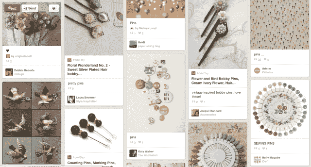

# Pinterest 上的一个大头针的销售额比去年增加了 25%,可以推动数月的访问和订单 

> 原文：<https://web.archive.org/web/https://techcrunch.com/2013/11/13/a-pin-on-pinterest-is-worth-25-more-in-sales-than-last-year-can-drive-visits-orders-for-months/>

根据社交营销人员在 [Piqora](https://web.archive.org/web/20221006220052/http://www.piqora.com/) ( [之前的](https://web.archive.org/web/20221006220052/https://beta.techcrunch.com/2013/03/19/pinfluencer-is-now-piqora-as-it-preps-to-add-tumblr-twitter-and-more-to-its-social-marketing-net/) Pinfluencer)获得的新数据，Pinterest 上一个 pin 的价值正在增长——今天，一个 pin 平均产生 78 美分的销售额。Piqora 说，这比 2012 年第四季度增长了近 25%。或许更重要的是，一个大头针可以在最初固定几个月后驱动浏览量和订单量。

Pinterest pins 平均提供两次网站访问和六次页面浏览量，以及超过 10 次重新发布。该公司指出，这比 Twitter 更具病毒式传播，在 Twitter 上，帖子的转发率仅为 1.4%

Piqora 最初是在 [Pinterest 进入分析业务](https://web.archive.org/web/20221006220052/https://beta.techcrunch.com/2013/03/11/pinterest-launches-new-data-analytic-tool-for-businesses-as-it-prepares-to-monetize/)之前跟踪 Pinterest 的使用情况，后来扩大了业务范围并更名，以反映其在其他社交网络上的更广泛足迹，例如 Tumblr 和 Instagram。但由于早期的努力，它仍然对 Pinterest 网络上发生的事情有着深刻的理解。

今天，数百个品牌向 Piqora 寻求见解，包括 Overstock.com、史蒂夫·马登、Crate&Barrel、ZGallerie、AMC、丝芙兰、Orbitz、HauteLook 和 Shape 等。

为了得出一枚胸针价值不断增长的结论，Piqora 的工程师分析了 Pinterest 上从今年 2 月到 10 月底的 1000 个品牌，包括电子商务品牌和其他出版商。它发现，总体而言，Pinterest 作为一个社交商务平台正在走向成熟，因为越来越多的品牌开始在网站上添加“Pin It”按钮，并引入更多可以返回产品页面的 Pin。

在 pin 的价值计算方面，该公司解释说，这也包括 Pinterest 网络上由重新 pin 驱动的访问和订单。如果你对这个数字感到惊讶，请记住，它包括了广泛的品牌——不仅包括吸引 Pinterest 核心受众(主要是女性受众)的电子商务网站，还包括其他出版商。

Piqora 首席执行官沙拉德·维尔马说，当电子商务品牌中的一些类别更符合 Pinterest 用户的喜好时，它们甚至可以做得更好。“Martha Stewart 去年从 Pinterest 获得的流量比从脸书获得的多 10 倍，”他说。“因此，很明显，在食品、时尚或家居装饰等视觉领域，出版商或零售商很可能会进行两次以上的网站访问。”

换句话说，一个 pin 码的实际价值取决于你卖的东西——所以数字会因网站而异。

但有趣的是，收集的数据显示，在第一次锁定发生后，网络可以在一段时间内实现产品发现。一半的现场访问发生在首次锁定后 3.5 个月，而一半的订单发生在锁定后 2.5 个月。

“好的大头针在 Pinterest 上被及时冻结了，”维尔马解释道。“这个网络有很强的记忆力——如果一个产品被锁定，它就表明这是一个值得购买的产品。”

产品在 Pinterest 上长期畅销的原因是该网站的结构方式。在 Twitter 和脸书这样的社交网络上，信息发现和用户体验都集中在 feed 上。用户除了自己的订阅源之外，不会浏览太多其他信息。但在 Pinterest 上，用户可以导航到其他类别和热门版块，从而找到更多商品。

鉴于 Pinterest 在几轮[大型](https://web.archive.org/web/20221006220052/https://beta.techcrunch.com/2013/02/20/pinterest-confirms-massive-new-200-million-series-d-funding-round-and-2-5-billion-valuation/) [融资](https://web.archive.org/web/20221006220052/https://beta.techcrunch.com/2013/10/23/confirmed-pinterest-raises-225-million/)后的高估值，这些新发现是相关的，该网络的估值为 38 亿美元。在今年的过程中，Pinterest 终于开始了其货币化努力，最初是通过引入 rich pins 和 product pins 等品牌工具，以及出现在用户订阅源和类别页面上的 pin 推荐(广告)。

维尔马指出，Pinterest 在移动领域的吸引力可能是该公司未来货币化努力方向的一个暗示。Piqora 的分析发现，Pinterest 的移动用户群今年增长了 50%，其中 75%的使用发生在移动设备上(根据 brands 自己的分析数据)。

“我确实相信 Pinterest 正逐渐成为视觉网络的谷歌，”维尔马说。“我们认为，Pinterest 正在成为移动设备上产品发现和产品娱乐的起点。”当用户想要在产品领域查找一些东西时，他们可以开始转向 Pinterest，这可能会导致网络拥有电子商务产品发现。“然后，广告商可以为持续和突出的产品植入付费，就像那些广告商在谷歌上做的那样，”他补充道。

同样值得注意的是，Piqora 收集的点击量和收入数据是在 2013 年假期之前收集的，当用户在这个月和下个月在线购买礼物时，这些数据可能会激增。去年第四季度，该公司发现一枚胸针价值 64 美分，而在假期之前，它已经价值更高。在 2013 年第四季度购物季结束时，Piqora 应该会有额外的分析。

*【图片:由[快门架](https://web.archive.org/web/20221006220052/http://www.shutterstock.com/)*修改而来】