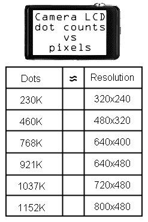

# LCD 中“点”与“像素”的快速 PSA 

> 原文：<https://web.archive.org/web/https://techcrunch.com/2010/07/21/a-quick-psa-on-dots-versus-pixels-in-lcds/>

如今，当你去查看一台新相机或摄像机的规格时，首先检查的是液晶显示器。但通常情况下，你会遇到一个不熟悉的数字:大量的“点”大多数人不熟悉这一指标，因为这是一个稍微技术性的指标，这就是为什么选择它而不是更常见的普通分辨率数字。

我决定写下这篇简短的公益广告，以便让普通的相机购买者对整个事情更加清楚。

就我个人而言，我认为这种做法具有误导性，就像用比特而不是字节来评价消费者的互联网连接。一般人对一个字节一点也不了解(通常对亚当一个字节也不了解)，所以他们没有办法真正理解这些数字。越多越好，尽管他们不确定自己能得到更多什么——而这正是互联网和相机公司想要的。他们卖给你一个抽象概念，你知道的越少，对他们越好。

点与像素的事情是一个有点奇怪的辩论，因为像 MBps 和 Mbps 一样，它们都是有效的测量，有时两者都是必要的。然而，在大多数情况下，相机制造商只是在放烟幕弹。其实很简单:液晶显示器是由像素组成的，像素是由点组成的。

在大多数液晶显示器上，每个像素有三个点:绿色、红色和蓝色各一个。很长一段时间以来都是这样，在像素真正成为像素之前，在液晶显示器普及之前。然而，有些液晶显示器为了节省空间或增加有效像素密度，基于不同的显示模式在像素之间共享点，你可能会听到这被称为矩阵或五边形布局，但这是相对罕见的，像你在大多数相机上看到的低成本液晶显示器每个像素将有 3 个点。

所以当你看到点数的时候，一点数学就能帮你搞定。假设你的相机显示了 460，000 个*点*或大约 460，000 个点。除以三，你会得到大约 153000 个像素。现在，分辨率通常是 640 的倍数或约数。所以试着除以其中的几个，四舍五入到最接近的 10。

**153000/640=240**
可能不是 640×240，那会是一个微小的全景图。
**153000/480 = 320**
这就对了！480x320x3=~460K 点。

如果你把这种方法应用到一些更常见的点计数上，你会得到我在右边做的小图表。有时相机制造商会偏向一边或另一边，或者说明点的准确数量——但通常他们谈论的是相同的分辨率。但是请记住，这是一条经验法则，不同的点布局和不常见的分辨率也有例外。

比上面列出的要大得多，他们会开始用其他名字。一个 1280×720 的液晶面板不会被宣传为具有 2765K 个点——他们只会称之为 720p，因为这比用点数掩盖实际数字更有市场。

所以，现在你准备好了。你甚至可以算出 PPI——如果你想做一点三角学的话。我不知道，所以你只能靠自己了。