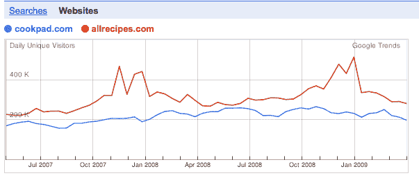
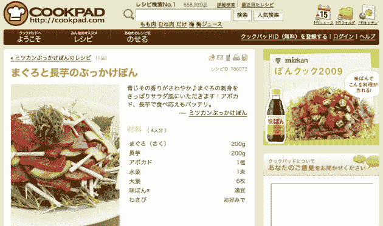

# 一家食谱网站在日本上市

> 原文：<https://web.archive.org/web/https://techcrunch.com/2009/06/12/a-recipe-site-goes-ipo-in-japan-cookpad/>

# 一家食谱网站在日本上市

看起来，即使在经济低迷时期，科技股仍然有上市的空间，至少在日本是这样。[Cookpad](https://web.archive.org/web/20230204111355/http://cookpad.com/)【JP】，全国最大的分享食谱网站，今天宣布将于 7 月 17 日在东京证券交易所[【母亲】板块](https://web.archive.org/web/20230204111355/http://www.tse.or.jp/english/listing/mothers/index.html)上市。

Cookpad 早在 1997 年就由总部位于东京的同名公司推出。这个仅限日本人的网站现在提供了近 56 万种不同的食谱(由用户提交)，上个月的浏览量高达 3.51 亿，由 680 万独立访客产生。相比之下，美国领先的烹饪网站之一，[Allrecipes.com](https://web.archive.org/web/20230204111355/http://www.allrecipes.com/)声称其数量几乎是这个数字的两倍，但谷歌趋势显示并没有太大的差异。

Cookpad 主要面向 20 多岁和 30 多岁的日本女性，赚了不少钱。该网站预计本财年(截至 2010 年 4 月)的收入为 1850 万美元，净利润为 360 万美元。基本会员是免费的，但用户可以选择加入高级版本(每月 3 美元)以获得更多功能。额外的收入来自展示广告。

更多关于该网站的信息(英文)可以在[这里](https://web.archive.org/web/20230204111355/http://asiajin.com/blog/2008/09/09/cookpad-the-number-one-recipe-site/)找到。

高增长初创公司的“母亲”部分与日本网站 [GREE](https://web.archive.org/web/20230204111355/http://www.crunchbase.com/company/gree) 相同，这是一家仅提供移动社交游戏服务的网站[，于去年 12 月上市](https://web.archive.org/web/20230204111355/https://techcrunch.com/2008/12/22/mobile-social-network-gree-lands-a-big-ipo-in-japan/)，上市首日市值达到 13 亿美元。格力和 Cookpad 的首次公开募股对日本网络产业来说是个好消息，这个产业的目标是世界第三大互联网用户。

