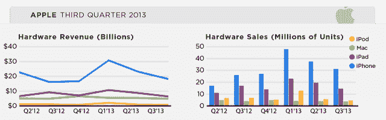

# iPad 首次出现年度销量下滑，第三季度销量为 1460 万部，iPhone 保持强劲，销量为 3000 万部，同比增长 20% 

> 原文：<https://web.archive.org/web/https://techcrunch.com/2013/07/23/aapl-13q3-iphone-ipad-mac-ipod/>

苹果今天发布了 2013 年第三季度财报，宣布在截至 6 月份的三个月内售出了 3100 万部 iPhones，以及 1460 万部 iPad。iPhone 和 iPad 的销量都比上一季度有所下降，但这标志着 iPad 的销量首次出现年度下降，同比下降 14%。

分析师[预计](https://web.archive.org/web/20221006101901/http://tech.fortune.cnn.com/2013/07/22/apple-earnings-smackdown-q3-2013/)苹果本季度将售出 2700 万部 iPhones、1800 万部 iPads、385 万部 MAC 和 490 万部 iPods。

[上个季度](https://web.archive.org/web/20221006101901/https://beta.techcrunch.com/2013/04/23/apple-sells-37-4m-iphones-and-19-5m-ipads-in-q2-tablet-business-shows-65-yoy-growth/)，苹果公司的销售额比上一个创纪录的季度略有下降，共售出 3740 万部 iPhones 和 1950 万部 iPads。

本季度的 3100 万部 iPhones 手机代表了 21%的季度亏损，但仍比去年同期增长了 20%。然而，iPad 连续下降了 25%，比去年下降了 14%。

有趣的是，iPhone 的平均售价从上个季度的 613 美元下降到今年的 580 美元左右，这或许标志着云创新要求用户购买更少的容量，但更有可能指向智能手机的几乎无处不在。

当每个人都拥有智能手机时，与早期用户和技术狂热分子相比，低端机型在价格上更具吸引力，尤其是在运营商大力促销的情况下。

iPad 和 iPhone 季度销量的下降可以归因于这样一个事实，即对于苹果和所有消费电子产品公司来说，这是一个历史上缓慢的时期，而且这两款设备都预计很快会更新。

iPhone 5 于去年秋天发布，下一代苹果智能手机预计将于今年秋天与 iOS 7 一同发布。就 iPad 而言，最近一次更新是在 11 月，iPad mini 上市了。

当然，那个圣诞节季度是苹果 iPhone 和 iPad 销售最强劲的一个季度，打破了这两款产品的以往记录。但自明星产品推出以来，事情并没有那么令人惊讶地放缓，许多人现在都在等待新款上市。

与此同时，Mac 和 iPod 的销量与上个季度相比仍相对持平。苹果在截至六月的季度售出了 375 万台 MAC 电脑，仅比上个季度的 390 万台略有下降。这意味着同比下降了 7%，比上一季度下降了 5%。

很明显，我们周围的个人电脑市场正在走向死亡，所以年度和季度的平稳增长确实令人印象深刻。

Mac 的销售通常在返校季最好。在 2012 年第四季度，也就是从 7 月到 9 月，Mac 的销量达到了 490 万台，实际上比去年同期增长了 1%。

但在圣诞节期间，13 英寸视网膜 MBP 上市的第一个完整季度，Mac 的销量仅达到 410 万台，同比下降 16%。更糟糕的是，与去年同期相比下降了 21%。[上个季度](https://web.archive.org/web/20221006101901/https://beta.techcrunch.com/2013/04/23/apple-mac-sales-q2-2013/)，Mac 销量基本持平，售出 395 万台，仅比上个季度下降 1%，与去年同期的 400 万台几乎持平。

ipod 继续失去对一群对 iPhone 和 iPad 越来越感兴趣的用户的吸引力，这两者都提供相似但更强大的技术。

第三季度销售总额为 450 万，低于上一季度的 563 万，同比下降 32%。

