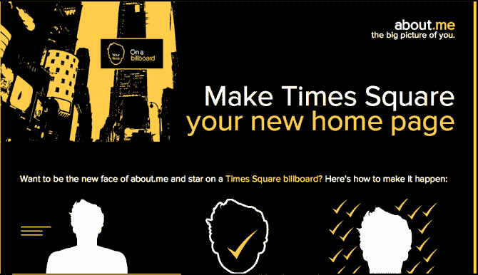

# About.me 希望你成为其新时代广场广告牌广告活动的代言人 

> 原文：<https://web.archive.org/web/http://techcrunch.com/2011/08/23/about-me-wants-you-to-be-the-face-of-its-new-times-square-billboard-ad-campaign/>

# About.me 希望你成为其新时代广场广告牌广告活动的代言人

个人资料初创公司 [About.me](https://web.archive.org/web/20230204191059/https://about.me/) ，其[由我们的母公司美国在线](https://web.archive.org/web/20230204191059/https://techcrunch.com/2010/12/20/aol-acquires-personal-profile-startup-about-me/)所有，正在寻找[‘about . me’的代言人](https://web.archive.org/web/20230204191059/http://about.me/inTimesSquare)，并开始在一个新的广告活动中展示网站上的个人资料。

作为背景资料，About.me [为人们提供免费的个人资料页面。在您的专用个人资料页面上，可以包含您的姓名、简历以及到 Twitter、脸书、LinkedIn 和其他包含您信息的网站的链接。用户还可以上传高分辨率的照片到网站上，让个人资料看起来相当时尚和专业。你可以在这里查看联合创始人](https://web.archive.org/web/20230204191059/https://techcrunch.com/2010/12/16/about-me-has-400000-beta-testers-opens-doors-to-all/)[托尼·康拉德](https://web.archive.org/web/20230204191059/http://www.crunchbase.com/person/tony-conrad)的简介[。](https://web.archive.org/web/20230204191059/http://about.me/tonyconrad)

该公司即将展开一场巨大的广告闪电战，并试图从现有用户和新用户中寻找这场运动的面孔。新的和现有的 About.me 用户将被要求在其个人资料中选择参加比赛，一旦选择参加，该个人资料的任何访问者都可以在 About.me 页面上投票，以便在活动中展示。这项比赛几个小时前才开始，但已经在推特上引起了轰动。

获得最多票数的三名幸运的 About.me 用户将出现在秋季活动中(包括纽约时代广场的广告牌，以及其他广告牌、出租车广告和航班广告)，并将与一名嘉宾一起飞往纽约参加广告牌活动启动的特别活动。七名亚军也将出现在广告牌和其他广告中。

投票的最后一天是 9 月 20 日，所以时间紧迫，你可以在时代广场露面了！

披露:TechCrunch 也归美国在线所有。