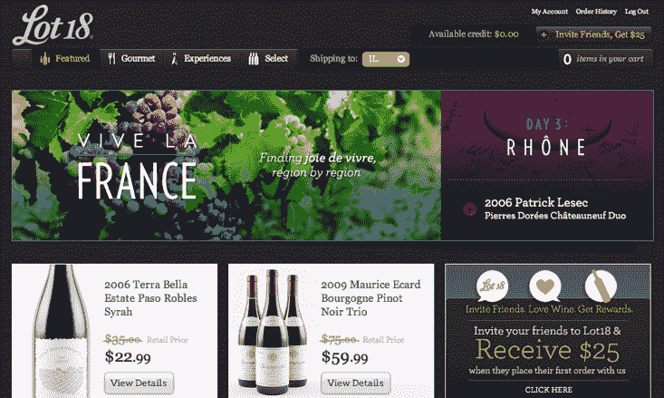

# Accel 在葡萄酒和美食的快闪销售网站中领先 3000 万美元 18 

> 原文：<https://web.archive.org/web/http://techcrunch.com/2011/11/04/accel-leads-30m-round-in-flash-sales-site-for-wine-and-gourmet-food-lot18/>

提供葡萄酒、葡萄酒配件和美食的 Gilt Groupe for wine】已经在由 Accel Partners 牵头的 C 轮融资中筹集了 3000 万美元，现有投资者 New Enterprise Associates 和 FirstMark Capital 也参与了融资。Accel 合伙人 Sameer Gandhi 将加入 Lot18 的董事会。

一年前推出的会员专属快闪销售网站旨在让消费者获得高质量的精选葡萄酒，限量供应。Lot18 后来扩展到包括葡萄酒和酒吧配件(即玻璃杯、醒酒器)、美食和手工食品，甚至旅游观光。

上个月，该公司推出了 Lot18 Experiences，其中包括以葡萄酒和美食为主题的旅行游览，以及米其林星级餐厅的会员专属葡萄酒搭配晚餐等当地优惠。

自 Lot18 推出以来，该网站已从 6 名员工发展到 80 多名员工和 50 多万名会员，新老会员的重复购买率很高。该公司的商品总量已经连续 12 个月增长，并促成了超过 500，000 瓶葡萄酒的销售(我恰好是这些销售之一，也是该网站的粉丝)。

让甘地进入 Lot18 的董事会对这家电子商务公司来说应该是极其有价值的。他曾支持 Diapers.com 和 Soap.com 的母公司 Quidsi。该公司一年前以 5.55 亿美元的价格卖给了亚马逊。他认为 Quidsi 和 Lot18 的潜力有很多相似之处。

这家初创公司由菲利普·詹姆斯和企业家凯文·福尔图娜创办，菲利普·詹姆斯创办了大型葡萄酒网站 Snooth.com，企业家凯文·曾任广告技术公司 Quigo 的首席执行官，该公司于 2007 年 11 月以 3.6 亿美元的价格被美国在线时代华纳收购。

C 轮融资是在 2010 年 11 月由 FirstMark Capital 牵头的 300 万美元 A 轮融资和 5 月由 New Enterprise Associates 牵头的 1000 万美元 B 轮融资之后进行的。后一轮包括 Quidsi 创始人 Marc Lore 和 Vinit Bharara 的投资。

这些资金将支持持续增长，以及进一步的技术和产品开发，特别是 Lot18 Gourmet 和 Experiences(该公司的食品和旅游垂直业务)的扩张。

当然，Lot18 并不是唯一一个出售葡萄酒和美食的闪购网站。几乎所有的闪购网站都出售葡萄酒和手工食品，包括 Gilt Groupe、One Kings Lane 等。而 Gilt 刚刚推出了专门的美食美酒垂直， [Gilt Taste。](https://web.archive.org/web/20230204223905/https://techcrunch.com/2011/05/18/gilt-taste-a-pricey-online-marketplace-for-artisan-foods/)

但 Lot18 的优势在于它专注于葡萄酒和高质量的精选食品，这可能有助于该网站继续成为优质葡萄酒图片和交易的可靠来源。在许多快速销售网站上，如果我不知道葡萄园或标签，很难判断我是否真的买到了好酒。就像 One Kings Lane 在家居设计和配饰方面开创了一个成功的、声誉良好的业务一样，Lot18 也可以成为葡萄酒、配饰等商品的热门销售网站。

One Kings Lane】与名人和知名设计师建立了合作关系，获得了 Bravo 电视真人秀的代言，并帮助建立了品牌。Lot18 很容易采取类似的策略。

