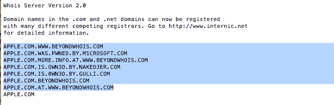

# “拒绝访问”:iPhone 4S 事件后 Apple.com 下台 

> 原文：<https://web.archive.org/web/http://techcrunch.com/2011/10/04/access-denied-apple-com-goes-down-post-iphone-4s-event/>

# “拒绝访问”:iPhone 4S 事件后 Apple.com 下台

如果你在过去的 25 分钟左右不在 Twitter 附近——“拒绝访问”现在是热门话题——[Apple.com](https://web.archive.org/web/20230203105221/http://www.apple.com/)一直在下降，然后回升，下降，然后回升，为*喘息*几乎半个小时，显示上述错误信息。

没人知道网站为什么会关闭(据一位知情人士称，这可能是黑客的企图)，但我敢肯定，数以百万计的极客屏息点击刷新没有帮助。

**更新:**通过 Carlos Granier 的 Whois 查询显示[苹果的 DNS 确实有猫腻。但是还不清楚这是由于黑客](https://web.archive.org/web/20230203105221/http://cgranier.com/post/11028553747/apple-gets-hacked-while-delivering-their-iphone-4s)[还是 DNS 垃圾邮件制造者。](https://web.archive.org/web/20230203105221/http://superuser.com/questions/37954/how-to-use-command-line-whois-for-spam-infected-domains-like-apple-com)

**更新 2:** 看起来像是 *[是](https://web.archive.org/web/20230203105221/http://superuser.com/questions/37954/how-to-use-command-line-whois-for-spam-infected-domains-like-apple-co)* 负责不可靠的 Whois 查找的 DNS 垃圾邮件发送者——我上面的消息来源也在看同样的东西。这些问题可能只是普通的老服务器问题——我知道这很无聊。

https://twitter.com/#!/mattbuchanan/status/121302333622726656

https://twitter.com/#!/Steven jayl/status/121300964710944768

https://twitter.com/#!/泰勒布雷/status/121300900219338752