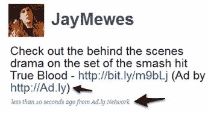

# Ad.ly 带来名人的赞助推文 

> 原文：<https://web.archive.org/web/https://techcrunch.com/2009/09/22/ad-ly-brings-sponsored-tweets-from-celebrities/>

随着 Twitter 继续思考如何赚钱，初创公司正在寻求利用微博平台的广告潜力。媒体网络 Glam Media 将[推出](https://web.archive.org/web/20221210044546/http://www.beta.techcrunch.com/2009/06/27/confirmed-glam-media-shares-details-on-twitter-ad-network-plans/)一个 Twitter 广告网络。今天，洛杉矶初创公司 [Ad.ly、](https://web.archive.org/web/20221210044546/http://ad.ly/)推出了一个基于 Twitter 的广告网络，将高端品牌广告商与名人和知名 Twitter 用户联系起来。这家初创公司背后的想法很简单:广告商可以选择他们想在推特上发布产品的名人，一旦名人批准了这条推特，广告商就会付给他或她一大笔钱。基本上，Ad.ly 是广告商和推特用户之间的中间人。事实上，创始人兼首席执行官 Sean Rad 表示，他希望 Ad.ly 成为 Twitter 的联合媒体。

Ad.ly 的平台对推特用户和广告商来说都是自助式的。例如，戴尔的广告客户可以选择哪位名人或超级用户来推销他们的广告，然后向某个特定的用户提交出价。名人(或出版商)然后批准或拒绝请求。一旦发布者批准了这条推文，消息就会通过他们的账户由 Ad.ly 发出。每个活动都要求名人在一周内发出四条推文。这是一个名人发出的推特样本。值得注意的是，每条推文都标识了广告，并链接到某个品牌的在线互动活动:

那么，广告商如何知道他们的活动在 Twitter 上做得有多好呢？Ad.ly 有一个定制的仪表板，可以跟踪点击率、转发量，甚至转发广告的用户的地理位置。这家初创公司还在推出一款“机器学习客户端”产品，该产品将识别名人用户群的构成，然后根据品牌广告的目标受众匹配广告商。例如，这项新技术将决定一个名人的追随者基数按性别的细分。

每个发布者设定一条推文活动的价格，但 Ad.ly 会根据各种指标给发布者一个定价建议。Ad.ly 的专有算法评估粉丝数量、权威性和推文质量，并帮助确定 Twitter 的价值。当我说名人的收入“丰厚”时，我是认真的。如果一个名人有超过 100 万的粉丝，每条推文都有五位数的粉丝，多条关于某个产品的推文会给这个名人带来六位数的奖励(是的，四条推文！).Ad.ly 从名人的收入中提成，但 Rad 不愿透露具体比例。

如果这些数字是正确的，这是一个有趣的想法和潜在的有利可图的赚钱机会，但我有一些担忧。首先，名人的 Twitter“权威”会受到他或她的信息流中出现的广告的负面影响吗？我的第二个问题是，一个名人将从其他人点击他们的推文中赚钱。我不确定关注者对此会有什么反应，考虑到这些名人中的许多人已经赚了很多钱。

但 Rad 表示，广告不会扭曲名人信息流的质量，因为推文是每两天传播一次，通过 Ad.ly 平台推广的广告活动是为戴尔、玛莎拉蒂和希尔顿等高端品牌提供的。他补充说，广告赞助的推文明显标有 Ad.ly，所以如果人们愿意，他们可以忽略这些推文。至于货币化问题，拉德说，名人可以选择将他们从竞选中获得的任何收入捐赠给他们选择的慈善机构。

为了这个发布会，Rad 已经积累了一个令人印象深刻的名单，上面都是愿意参与这个网络的知名人士。名人[包括](https://web.archive.org/web/20221210044546/http://ad.ly/publisher-list/)金·卡戴珊、布鲁克·博克、妮可·里奇、布洛迪·金纳、德鲁博士和萨曼莎·罗森。

Ad.ly 最近从 GRP Partners 获得了 A 轮融资，但 Rad 拒绝透露融资金额。Ad.ly 面临来自 Twitter 广告网络伙伴[喜鹊](https://web.archive.org/web/20221210044546/http://be-a-magpie.com/)和 [Twittad 的竞争。](https://web.archive.org/web/20221210044546/http://www.twittad.com/)

