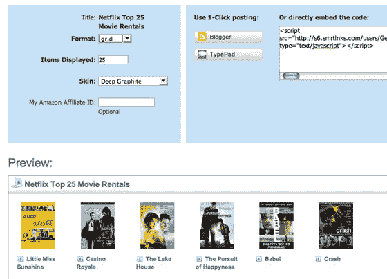

# AdaptiveBlue 让 SmartLinks Feeds 病毒化| TechCrunch

> 原文：<https://web.archive.org/web/http://www.techcrunch.com:80/2007/08/23/adaptiveblue-makes-smartlinks-feeds-viral>

新的 SmartLink Feeds 来自该公司的旗舰产品 [Blue Organizer Firefox 插件](https://web.archive.org/web/20160422100259/http://www.adaptiveblue.com/),现在包括一个“Grab Me”按钮，允许任何人复制一个收藏夹列表，并将其放在他们的网站和社交网站上。SmartLink Feeds 还可以在外观、内容方面进行定制，用户还可以插入他们的个人会员 ID，以将参与网站的流量货币化。

AdaptiveBlue 现在还将发布和更新流行的 SmartLink Feeds，使任何人都可以将它们粘贴到自己的网站上，而不必是普通用户。SmartLink 订阅源包括《纽约时报》畅销书、网飞顶级租赁、亚马逊热门小工具、iTunes 顶级专辑和 Wine.com 顶级葡萄酒。

点击查看我们之前关于 AdaptiveBlue Smartlink [的报道。
](https://web.archive.org/web/20160422100259/http://www.techcrunch.com/2007/05/22/adaptive-blue-releases-new-version-of-blue-organizer/)