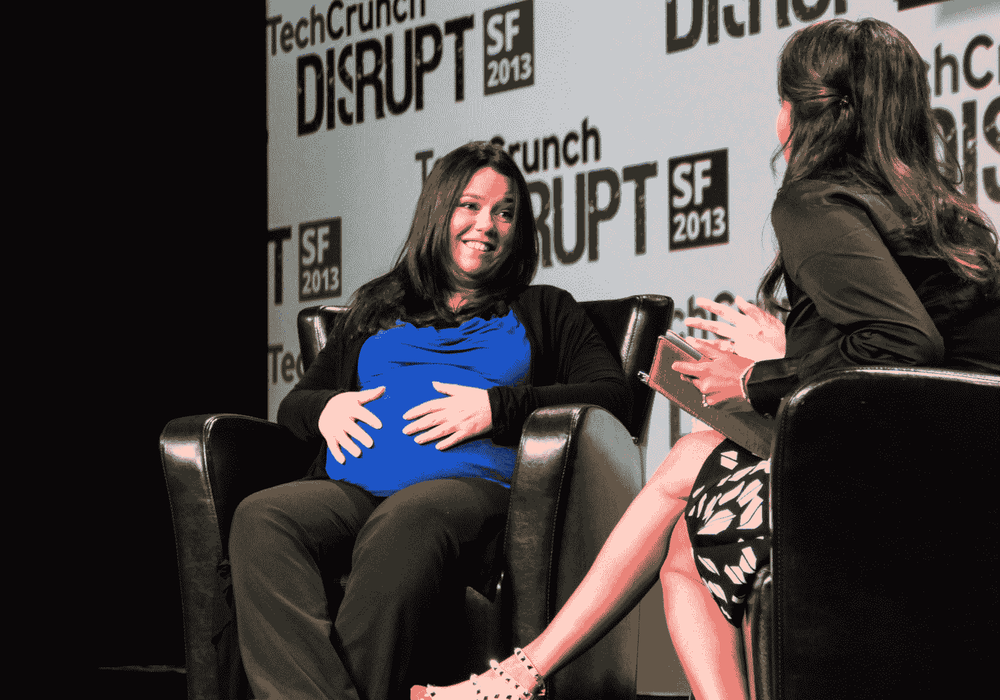

# Houzz 的 Adi Tatarko:“自举是发生在我们身上的最好的事情

> 原文：<https://web.archive.org/web/https://techcrunch.com/2013/09/10/adi-tatarko-of-houzz-bootstrapping-was-the-best-thing-that-ever-happened-to-us/>

快速发展的家居改造和设计在线平台, [Houzz](https://web.archive.org/web/20230403113219/http://www.houzz.com/) 的首席执行官兼联合创始人 Adi Tatarko 今天上午在 TechCrunch Disrupt SF 上与我们的 Leena Rao 讨论了该公司的过去、现在和未来。塔塔尔科与丈夫阿龙·科恩(Alon Cohen)共同创立了这家公司，她强调了发展公司的重要性，还强调了一旦有了良好的基础，找到合适的导师和投资者如何帮助他们扩大规模。

他们创建 Houzz 是为了满足个人需求。她并不是真的想再开一家公司，但事情就这样自然地发展了。“我们想改造和设计我们的房子，但工具不在那里，”她告诉饶。当时，塔塔尔科和科恩刚刚在帕洛阿尔托买了一栋房子。“我们曾梦想翻新它会有多有趣，但这是一场噩梦。”这是大约三年前，他们无法找到合适的工具来获得灵感，也无法找到合适的承包商来将他们的愿景变为现实。

塔塔尔科说，在此后的很长一段时间里，Houzz 只是“一个有趣的项目”。“我们对此非常非常有热情。太棒了。在某种程度上，我们只是觉得很难扩大规模。”尽管如此，她仍然认为“自力更生是发生在我们身上最好的事情。”她认为，太多时候，“企业家花了前六个月或一年去追逐投资者。他们走出去，制作演示文稿，会见投资者。”但是，投资者告诉他们去改变他们的演示文稿，然后再做一遍。“但是为什么要这样做呢？”鞑靼科问道。"为什么不在前几个月创造一个人们使用和喜爱的产品呢？"

当然，Houzz 的优势是红杉找到了他们(在 2010 年柳文欢·泽夫领导了该公司的第一轮 200 万美元融资之后)。起初，Houzz 团队并不真的想拿钱，Tatarko 告诉饶。“自举意味着我们在运营一家非常精简的公司，不需要投资。”在某种程度上，他们意识到要扩大规模，他们不仅需要外部资金，还需要找到合适的导师。一旦 Houzz 决定与红杉合作，Zappos.com 前董事长林毅夫就加入了 Houzz 董事会。当被问及为什么他们决定与红杉合作时，Tatarko 指出“红杉不会改变我们的工作方式。”相反，风投公司告诉他们“做你需要做的，我们会支持你的。”

值得注意的是，Houzz 现在有 120 名员工和一个非常扁平的组织结构，每个人都有相同的职称。

至于她自己以及与丈夫一起创业的挑战，塔塔尔科指出，这相对容易，但工作与生活的平衡可能是一个挑战。“我们做出了双管齐下的决定，所以你必须放弃其他事情。因为我是一个母亲，这迫使我把注意力集中在真正重要的事情上——无论是在家还是在工作中。公司总是在你的脑海中，但你学会了平衡这一点。”

塔塔尔科说，该网站继续快速增长。例如，它现在拥有超过 200 万张照片(几个月前只有 120 万张)，它为专业人士提供的付费项目迅速从十几个城市扩展到今天的 420 多个市场。“对我们来说，用户体验之后才是盈利，这有助于我们后来的盈利，”她告诉饶。“你买不到爱情。你必须创造一种人们喜爱和需要的体验。”

展望未来，看起来 Houzz 可能会专注于国际市场。目前，Houzz 的用户来自美国和加拿大，但该公司在世界各地拥有大量用户，这种扩张对该公司来说是很自然的一步。

* * *

## 后台采访