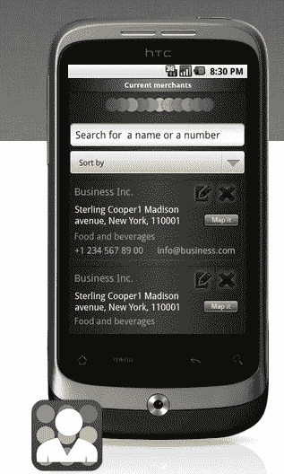

# adlimination 推出每日交易服务，优惠以移动广告的形式出现 

> 原文：<https://web.archive.org/web/http://techcrunch.com/2011/10/18/adlibrium-launches-daily-deals-service-where-offers-appear-as-mobile-ads/>

# ad 平衡推出每日交易服务，优惠以移动广告的形式出现

广告和社交媒体初创公司 [Camber Tech](https://web.archive.org/web/20230203061122/http://www.cambertech.mobi/) 正在推出其名为[adbalance Dailies](https://web.archive.org/web/20230203061122/http://dailies.adlibrium.com/)的免费增值服务，这是一项通过移动应用程序分发交易的移动每日交易服务。该服务通过广告交换，以及通过电子邮件发送给自己的用户群，在应用程序中通过残余移动广告库存显示标准横幅广告。当点击时，横幅广告打开了广告商的报价、折扣或优惠券。

这项服务现已在旧金山、洛杉矶、纽约、伦敦、迪拜、孟买、班加罗尔、新加坡和悉尼上线。

早在 8 月份，T4 就在 Android 平台上推出了私人测试版 T5，主要面向中小型企业市场。该平台让本地企业可以创建类似 Groupon Now 的固定价格和时间敏感的优惠和广告活动。不同之处在于，Adlibrium 不收取佣金，而是收取发起新活动的启动费(10 美元、50 美元或 100 美元，取决于广告类型，从基于文本的广告到独家优惠)，以及广告商选择的定位能力水平。优惠和广告的价格可能从 20 美元到 1000 美元不等，取决于它们运行的时间和目标的狭窄程度。例如，广告可以只针对特定位置 5 英里半径内的用户。

截至今天，该公司表示，它现在通过其网络(通过电子邮件和手机)接触到了 400 万消费者。关于这项服务的更多信息请点击[这里](https://web.archive.org/web/20230203061122/http://faqme.com/adlibriumdailies)。

此外，adliminary 现在还推出了一个按需本地 salesforce 平台，名为[adliminary Agents](https://web.archive.org/web/20230203061122/http://app.net/adlibriumagents)。这项服务以 Android 应用的形式提供，面向中小企业服务提供商，并向任何为该市场提供服务的人开放。

