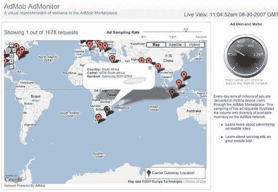

# AdMob AdMonitor:实时观察移动广告的显示位置

> 原文：<https://web.archive.org/web/http://www.techcrunch.com:80/2007/08/30/admob-admonitor-watch-where-mobile-advertising-is-displayed-in-real-time/>

 [AdMonitor](https://web.archive.org/web/20160419012705/http://www.admob.com/s/home/live) ，一个来自移动广告服务公司 [AdMob](https://web.archive.org/web/20160419012705/http://www.crunchbase.com/company/admob) 的谷歌地图混搭，提供了全球范围内谁在观看移动广告的实时数据，包括他们使用的网络和手机。

总部位于圣马特奥的 AdMob 在关注度方面似乎有所下降，而竞争对手却被收购了；第三屏媒体被美国在线收购，Screentonic 被微软收购。然而，这是一家拥有一些出色数据和支持的公司。AdMob 现在每月提供 10 亿条移动广告，其投资者包括红杉资本和 Accel Partners。董事梅纳德·韦伯在 2002 年至 2006 年期间担任易贝的首席运营官，员工包括 YouTube 的前销售副总裁托尼·内瑟卡特和谷歌的前高级工程经理凯文·斯科特。

AdMonitor mashup 提供了一种简单的方法来查看 AdMob 提供了多少广告。值得注意的是，诺基亚似乎仍将是全球最受欢迎的手机供应商。

AdMob 的客户包括 ESPN 和哥伦比亚广播公司。

