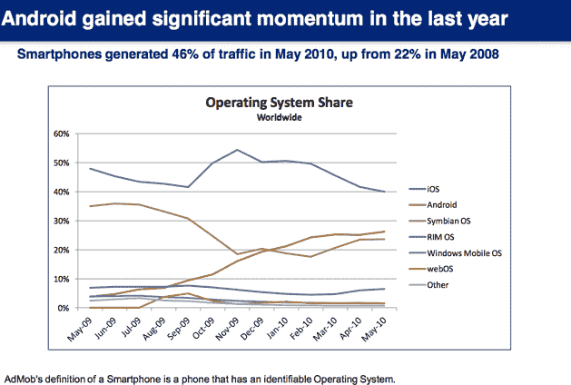
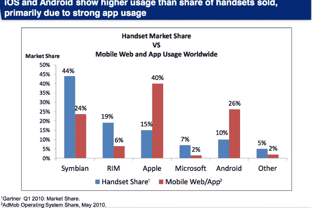
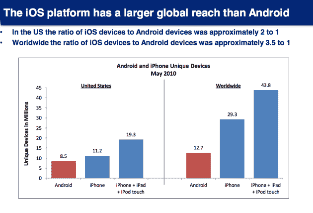
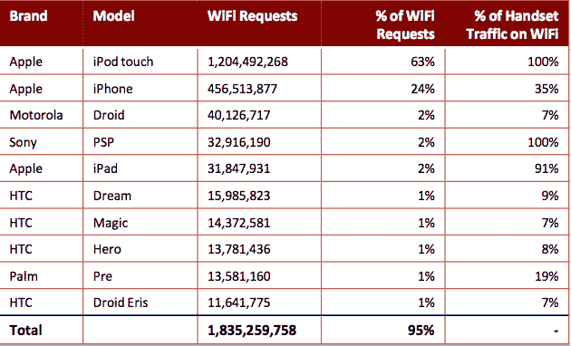

# AdMob 的最终移动指标报告:Android 正在崛起，但苹果仍在全球占据主导地位 TechCrunch

> 原文：<https://web.archive.org/web/https://techcrunch.com/2010/06/30/admob-android-apple/>

# AdMob 的最终移动指标报告:Android 正在崛起，但苹果仍在全球占据主导地位

移动广告网络 AdMob(现在是谷歌的一部分)今天发布了最终的移动指标报告(嵌入下面)，至少有一段时间。AdMob 从数以百万计的手机和移动设备上收集数据，这些设备为其广告投放提供服务，其中包括近 4400 万台 iOS 设备(iPhones、iPod Touches 和 ipad)。停止披露数据的决定可能与它的新主人谷歌有关，谷歌希望评估它想在那里发布什么，但也可能与 AdMob 可能不再能够访问任何 iPhone 数据的事实有关，因为苹果明确威胁要阻止它。

不管是什么原因，AdMob 的报告已经被证明是跨平台移动网络的丰富数据来源，因为移动网络和移动应用程序上的移动广告印象是移动网络/应用程序整体使用情况的良好代表。所以让我们开始吧。

在过去的两年里，来自智能手机的移动广告展示已经从 22%增长到 2010 年 5 月的 46%。苹果 iOS 设备占全球最大份额，有 40%的份额。但是正如你在上面的图表中所看到的，自从 2009 年 11 月达到 50%的峰值后，这一比例一直在下降。在这段时间里，Android 的市场份额稳步上升，上升至 26%。

手机市场份额与移动网络和应用程序使用的比率并不直接相关。诺基亚的 Symbian 占有全球手机市场 44%的份额，但仅占移动网络/应用使用的 24%。相比之下，苹果只有 15%的手机市场份额，安卓有 10%，但它们加起来占了移动网络和应用使用的三分之二。

在全球范围内，苹果设备在移动广告展示方面仍然超过安卓设备，几乎是安卓设备的 3.5 倍。在美国，这一比例约为 2 比 1。根据 AdMob 的调查，iPhone 用户的满意度(91%)高于 Android(84%)或 Palm 的 WebOS 用户(69%)。安卓 84%的满意度相当不错，但与 iPhone 仍有差距。

报告中还有一些有趣的数据:

*   虽然 iPhone 是推动移动广告印象的最大设备，但 Android 手机占据了前 10 名手机中的 7 个(另外两个是诺基亚)。
*   只有 58%的 iPad 用户在美国。接下来最大的国家是日本(5%)、英国(4%)、中国(4%)和加拿大(3%)。
*   安卓的国际化程度较低，在美国有 66%的用户，但安卓的第二大用户国是中国(13%)，其次是英国(4%)。
*   HTC 和摩托罗拉手机占据了安卓 83%的使用量。
*   下载付费应用的 iPhone 用户是 Android 用户的两倍。
*   WiFi 是巨大的。近四分之一的美国移动流量来自 WiFi。最大比例的 WiFi 请求(近三分之二)来自 iPod Touch——这是一款仅支持 WiFi 的设备——但 35%的 iPhone 流量也通过 WiFi 传输

[scribd id = 33741060 key = key-2 ngvuibigvlcmf 5 db 8 he mode = slide show]