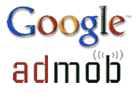
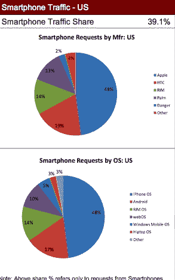

# AdMob 的收入正在“接近 1 亿美元”。谷歌认为可以几十亿。

> 原文：<https://web.archive.org/web/https://techcrunch.com/2009/11/09/admob-is-approaching-100-million-in-revenues-google-thinks-it-can-make-it-billions/>

几周前，当谷歌首席执行官 Eric Schmidt [提到](https://web.archive.org/web/20230211035157/https://techcrunch.com/2009/10/07/a-conversation-with-sergey-brin/)时，他说的并不是涓涓细流。今天，移动广告初创公司 [AdMob 宣布以 7.5 亿美元](https://web.archive.org/web/20230211035157/https://techcrunch.com/2009/11/09/google-acquires-admob/)收购谷歌，这是谷歌自 2008 年 3 月以 31 亿美元[收购 DoubleClick](https://web.archive.org/web/20230211035157/https://techcrunch.com/2007/04/13/google-spends-31-billion-for-doubleclick/) 以来最大的一笔收购，也是自 2006 年以 16.5 亿美元[收购 YouTube】以来的第三大收购。](https://web.archive.org/web/20230211035157/https://techcrunch.com/2006/10/09/google-has-acquired-youtube/)

为什么下这么大的赌注？因为谷歌正在努力主导移动网络广告，而 AdMob 已经在显示领域有了早期的立足点。红杉资本(Sequoia Capital)合伙人、AdMob 董事会成员吉姆·戈茨(Jim Goetz)表示，通过关注移动应用开发者的需求，AdMob“在三年内建立了接近 1 亿美元的业务”，他指的是该公司的年化收入增长率。由于 AdMob 的收入与出版商分成 60/40，这意味着 AdMob 将从 1 亿美元的总收入中获得 4000 万美元。该公司的现金流也是正的，有 140 名员工。

但从现在开始，吸引谷歌的更多是移动广告的增长潜力。“开放移动的兴起是每个人都在考虑的事情。我认为这是下一个战场，”Accel Partners 的 Richard Wong 说，Accel Partners 是 AdMob 背后的另一个大投资者。(这笔交易，加上今天将 Playfish 出售给 Electronic Arts 的交易，给了 Accel 一天 10 亿美元的退出机会。谷歌正在推动使用安卓系统的开放式手机得到更广泛的采用，并且看到所有网络手机的移动搜索量大幅增长。尽管搜索有望占据移动广告收入的大部分，谷歌也需要在移动展示广告上竞争。

事实上，这笔交易对谷歌如此重要，以至于拉里·佩奇和谢尔盖·布林都亲自参与了 sweet talk AdMob 创始人奥马尔·哈穆伊(Omar Hamoui)的工作，正如你所希望的那样，他们会参与这么大的一笔交易。“企业家之间的个人互动至关重要，”戈茨说。

AdMob 已经和谷歌的文化有了很多共同点。它以类似于 AdSense 的模式与开发者分享网络广告收入，并专注于移动应用开发者的[需求，以帮助将钱放进他们的口袋。iPhone 和现在的 Android 的崛起，正在创造更多的移动应用程序和更多的移动网页浏览，这反过来又创造了更多的移动广告库存，供 AdMob 填充。9 月，AdMob 在 15，000 个移动网站和应用程序中提供了 102 亿次广告请求。其中约 28%来自 iPhones 和 iPod Touches，Android 增长迅速，另外占 7%。如果你只看智能手机，苹果设备占广告请求的 48%，Android 以 17%的比例位居第二。](https://web.archive.org/web/20230211035157/https://techcrunch.com/2009/03/16/admob-is-working-on-an-iphone-app-exchange-to-swap-ads-for-traffic/)

现在，就在那些移动广告起飞的时候，谷歌开始进入这个游戏。有了 AdMob，它不是在购买尖端技术或受欢迎的消费目的地。很明显，这是在购买未来的收入来源。谷歌在加速 AdMob 的收入增长方面处于独特的地位，它可以将 AdMob 插入现有的 AdWords 和 DoubleClick 系统，并将其展示给成千上万已经使用谷歌并可能希望将移动显示广告添加到其广告活动中的广告商。

AdMob 目前 1 亿美元的收入增长率令人印象深刻，但谷歌的收购价格告诉我们，它认为移动显示广告的机会至少有数十亿美元。