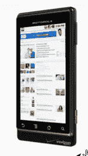
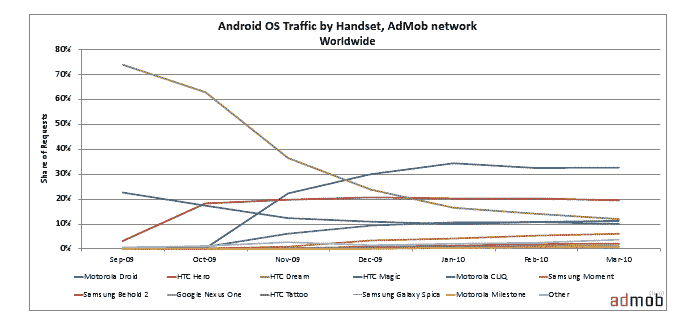

# AdMob 报告:三分之一的 Android 手机占据了 96%的流量，摩托罗拉 droid 领先 

> 原文：<https://web.archive.org/web/https://techcrunch.com/2010/04/27/admob-report-11-devices-account-for-96-percent-of-android-traffic-motorola-droid-takes-the-lead/>

# AdMob 报告:三分之一的 Android 手机占据了 96%的流量，摩托罗拉 droid 领先

移动广告网络 AdMob】发布了其三月份的月度移动指标报告，该报告密切关注 Android 操作系统的流量。2010 年 3 月，消费者可以买到来自 12 家制造商的 34 款 Android 设备。2010 年 3 月，在 AdMob 的网络中，11 台设备占据了 96%的 Android 流量，而 2009 年 9 月只有两台设备。2010 年 3 月，Android 操作系统的三个主要版本都带来了巨大的流量——Android 1.5(38%)、Android 2.0/2.1(35%)和 Android 1.6(26%)。摩托罗拉和 HTC 是领先的 Android 设备制造商，分别拥有 44%和 43%的流量。

据 AdMob 称，2010 年 3 月，摩托罗拉 Droid 是领先的 Android 手机，产生了 32%的 Android 流量，而谷歌 Nexus One 仅产生了 2%的 Android 流量。令人惊讶的是，谷歌的 Nexus one 产生的流量如此之少，考虑到谷歌的[声称的盈利能力](https://web.archive.org/web/20221006201824/https://beta.techcrunch.com/2010/04/15/google-android-market-now-serving-38000-apps-nexus-one-is-a-profitable-business/)和该设备的成功。

报告称，至少 54%的 Android 流量来自带有 QWERTY 键盘的设备。当然，只有三种设备——iPhone 3GS(39%)、第二代 iPod touch(25%)和 iPhone 3G(20%)产生了 iPhone OS 总流量的 84%。iPhone 3GS 的流量份额从 2009 年 9 月的 30%增长到 2010 年 3 月的 39%。2010 年 3 月，第一代 iPhone 只产生了 2%的 iPhone OS 请求。AdMob 网络的全球总流量环比增长了 18%。

当然，该报告强调了 Android 生态系统中设备的多样性，在过去的七个月中，每个制造商都创建并推出了不同外形、功能和操作系统版本的设备。相比之下，iPhone OS 运行在来自单一制造商、单一外形的设备上(直到 4 月份 iPad 上市)，所有设备都有升级 OS 版本的能力。

Android 生态系统正在稳步增长，应用市场现在有 38，000 多个应用，比一个月前增加了 8000 个。当然，与苹果蓬勃发展的应用商店相比，这就相形见绌了。

谷歌 Nexus One 手机的流量份额很小并不奇怪，当你考虑到来自 Flurry 的[报告时，](https://web.archive.org/web/20221006201824/http://www.mobilecrunch.com/2010/03/16/flurry-more-droid-devices-than-iphones-sold-in-first-74-days-on-the-market/)报告了 Nexus One 的低销量。事实上，有很多关于 Nexus One 的首次推出如何失败的[言论](https://web.archive.org/web/20221006201824/http://www.techmeme.com/100316/p15#a100316p15)。但就在几周前，谷歌声称该设备已经盈利，并为 Nexus One 的增长和未来描绘了一幅美好的画面。

AdMob 和谷歌可能有点麻烦。据报道，联邦贸易委员会正准备挑战谷歌-AdMob 交易，由于反垄断法规，搜索巨头去年秋天以 7 . 5 亿美元收购了流行的移动广告网络。几周前有报道称，联邦贸易委员会的律师将建议委员会阻止这项交易。考虑到[我们听说](https://web.archive.org/web/20221006201824/https://beta.techcrunch.com/2010/04/02/4info-tells-ftc-approve-the-googleadmob-deal/)谷歌正在采取[前所未有的步骤](https://web.archive.org/web/20221006201824/https://beta.techcrunch.com/2010/03/17/google-asks-mobile-companies-for-help-with-ftc-over-admob-deal/)接触 AdMob 的竞争对手，争取他们对收购该公司的支持，以回应联邦贸易委员会可能阻止该交易的传言，我们并不感到惊讶。消费者团体也游说阻止这项交易。

