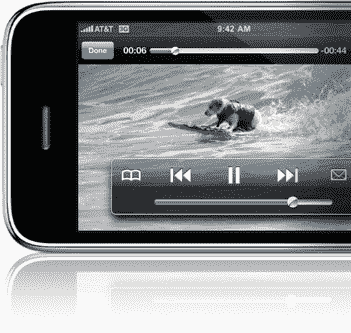

# Adobe 突破！闪存在苹果手机上运行。。。在实验室的模拟器上，哦，好吧，技术崩溃

> 原文：<https://web.archive.org/web/https://techcrunch.com/2008/06/17/adobe-breakthrough-flash-working-on-the-iphone-in-the-labs-on-an-emulator-oh-well/>

# Adobe 突破！闪存在苹果手机上运行。。。在实验室的模拟器上，哦，好吧

来自[克朗彻奇的](https://web.archive.org/web/20221209122030/http://www.crunchgear.com/2008/06/17/adobe-already-has-iphone-version-of-flash-running-on-emulator/)尼古拉斯·德伦:

*Adobe [已经有了一个运行在仿真软件上的针对苹果手机的闪存版本](https://web.archive.org/web/20221209122030/http://www.alleyinsider.com/2008/6/adobe_flash_apple_iphone_maybe_someday)，如果苹果允许的话，但愿能够把它带到手机本身。这就是 Adobe 昨天在 Q2 电话会议上所说的。或:*

> *我们有一个版本，正在进行仿真。这仍然在计算机上，您知道，我们必须继续将它从测试环境移动到设备上，并继续使其工作。因此，我们对迄今为止取得的内部进展感到满意。*

但是苹果会允许苹果手机使用闪存吗？史蒂夫·乔布斯(Steve Jobs)在过去曾声称，移动版的闪存——大概是 Adobe 将移植到苹果手机上的版本——功能不足以在灵活优雅的苹果手机上使用。与 Safari 的集成？哈。

这就给了 Adobe 一些选择，如果它想从甜蜜的苹果手机市场分一杯羹的话。它可以简单地在即将到来的[应用商店](https://web.archive.org/web/20221209122030/http://www.crunchgear.com/2008/06/11/apples-app-store-coming-june-27th/)上发布一个独立的闪存应用程序，但至少可以说这很麻烦。

(此处继续阅读)。

话说回来，在苹果的 MobileMe 服务后面，总是有[SproutCore](https://web.archive.org/web/20221209122030/http://news.cnet.com/8301-13505_3-9970263-16.html)、Javascript 框架[可以用来在网络浏览器中构建其他“厚”客户端应用程序。](https://web.archive.org/web/20221209122030/http://www.beta.techcrunch.com/2008/06/09/want-to-try-out-mobileme-check-out-sproutcore/)