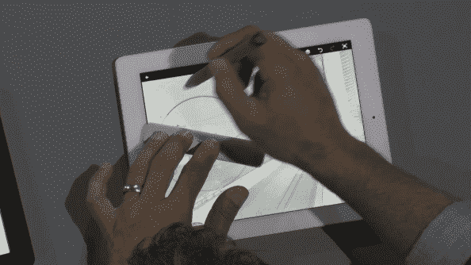
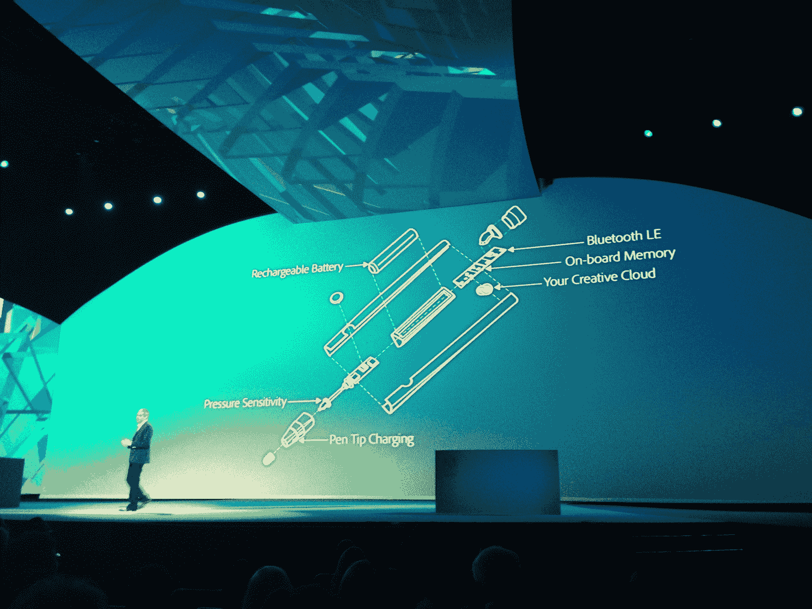

# Adobe 推出用于平板电脑的“Project Mighty”智能手写笔和数字标尺和指南“Napoleon”

> 原文：<https://web.archive.org/web/https://techcrunch.com/2013/05/06/adobe-debuts-project-mighty-smart-stylus-for-tablets-and-napoleon-a-digital-ruler-and-guide/>

# Adobe 推出用于平板电脑的“Project Mighty”智能手写笔和“Napoleon”，一种数字标尺和指南

Adobe 今天在其年度 MAX 大会上展示了一款新的硬件产品，让所有人感到惊讶，其中包括 Project Mighty 和 Napoleon。Mighty 是一款压敏数字笔，可与平板电脑配合使用，并在云中存储各种设置和偏好。Adobe 展示了它在 iPad 上的工作，它看起来类似于我们从其他公司的现有压敏输入设备中看到的，但与 Adobe 产品的集成更紧密。

例如，它可以从 Creative Cloud 中获取存储的 Kuler 调色板主题，以及笔刷设置和一个云剪贴板，该剪贴板存储您以前创建的用于新绘图的资源。从一台平板电脑移动到另一台平板电脑会保留与您的笔相关联的设置，这使得从一台平板电脑移动到另一台平板电脑成为可能。

【T2

Napoleon 看起来有点像现代的苹果遥控器，但允许你通过 snap tools 结合 Mighty 等数字笔轻松绘制直线和圆弧。这几乎就像传统的绘图工具，包括正方形和三角形，但更适合数字媒体。对于精确的绘图和更严肃、要求更高的图形工作来说，这两个工具结合在一起应该有助于在移动设备上推动创造力，比我们今天所拥有的要多得多。

Mighty pen 本身看起来类似于 Jot Touch 4 压力感应笔，但它背后有 Adobe Creative Cloud services 的完整访问权限。从 Adobe 今天在舞台上向我们展示的内容来看，这有点像一个设备中的整个艺术家盒子。它还利用了非触笔触摸的优势，看起来很新颖，允许用户用空闲的手做擦除之类的事情。但是当与 Napoleon 搭配时，它变得比我们已经看到的更加强大，这应该会真正推动移动创造力的发展。

这款笔的背面有一个 LED，可以根据用户的操作显示不同的颜色，还有一个通过蓝牙连接的按钮。尺子的下侧有两个触摸点，可以为平板电脑提供方向，笔已经成功地让苹果的 iPad 识别出即使是很小的触摸，它使用内置的意外触摸软件主动试图忽略这些触摸。然而，Adobe 并没有确切说明它是如何做到的。

Adobe 指出，这本质上仍然是一个处于 R&D 阶段的项目，但我们肯定会看到它在未来成为一个真正的产品，他们说。真正的问题是，它如何与 Wacom 系列平板电脑等专用设备相比较，Wacom 系列平板电脑在压力敏感度、延迟和模仿传统艺术家材料的整体能力方面比其他任何产品都好得多。