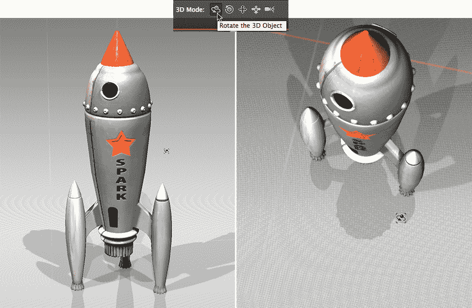
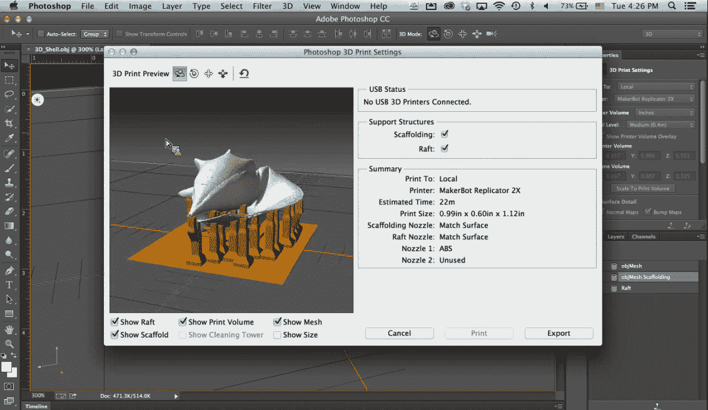
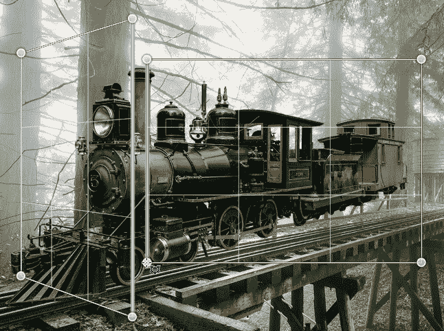
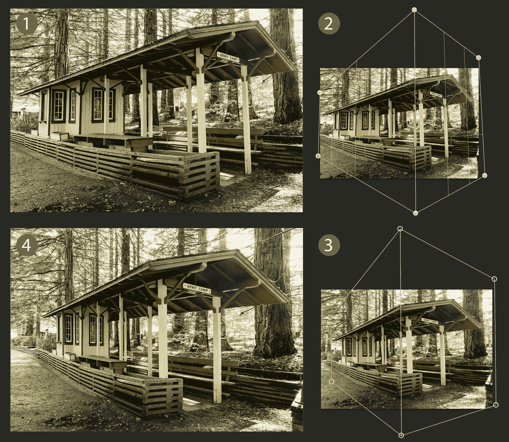

# Adobe 为 Photoshop 带来 3D 打印支持

> 原文：<https://web.archive.org/web/https://techcrunch.com/2014/01/15/adobe-partners-with-markerbot-and-shapeways-to-bring-3d-printing-support-to-photoshop-adds-perspective-warp-tool-resets-30-day-trials/>

Adobe 今天[发布了](https://web.archive.org/web/20221224043103/http://www.adobe.com/news-room/pressreleases/201401/011614Photoshop3DPrinting.html)其基于订阅的[创意云](https://web.archive.org/web/20221224043103/http://www.adobe.com/products/creativecloud.html)套件的最新更新。虽然该公司正在更新各种工具，但主要公告是增加了一个对照片视角进行细微改变的工具和对 Photoshop 的 3D 打印支持。

其他新功能包括为[插图画家](https://web.archive.org/web/20221224043103/http://www.adobe.com/products/illustrator.html)设计的新铅笔工具，这使得绘制好看的手绘线条和曲线变得更加容易。InDesign 获得了更好的 EPUB 支持和简化的(更智能的)超链接。Adobe 的字体工具 Typekit 现在也将其字体带到了桌面，用户可以从任何桌面应用程序轻松访问它们，并将它们包含在 PDF 文件和打印项目中。此外，Adobe 还进行了各种更改，以简化不同应用程序之间的设计工作流程。

作为此次更新的一部分，Adobe 还重新设置了 Creative Cloud 的所有 30 天试用期。自 2012 年 5 月推出以来，任何注册试用的人现在都可以开始另一个 30 天的免费试用。鉴于 Creative Cloud 最近发生的所有变化，Adobe 决定在承诺订阅之前，给人们另一次机会来尝试其应用程序的最新版本。

[https://web.archive.org/web/20221224043103if_/https://www.youtube.com/embed/VCq0mKuJbYg?feature=oembed](https://web.archive.org/web/20221224043103if_/https://www.youtube.com/embed/VCq0mKuJbYg?feature=oembed)

视频

### Photoshop 中的 3D 打印

所有这些都很棒，但人们可能谈论最多的功能是 Photoshop 的变化，特别是大多数人认为的照片处理应用程序中添加了 3D 打印支持。

虽然你总是可以在 Photoshop 中创建基本的 3D 模型，但它显然不是为这项工作设计的工具，Adobe 坦率地承认这一点。正因为如此，该公司认为你是从第三方工具中引入模型，然后在 Photoshop 中完成它们。例如，这意味着为这些模型添加纹理，并对产品最著名的图像处理进行微调。

Adobe 还将 Photoshop 视为设计 3D 模型和打印它们之间的理想中间步骤。该工具可以采用标准 OBJ、STL、3DS、Collada 和 KMZ 格式的几乎任何 3D 模型，并为打印做准备。例如，这意味着添加必要的脚手架和木筏，这样模型就可以实际打印出来。它还会寻找模型的潜在问题，这样用户就不会浪费大量的时间和材料来打印一个实际上不起作用的模型。

多亏了与 MakerBot(T2)的新合作关系，Photoshop 现在可以直接打印到该公司的 3D 打印机上。由于与 [Shapeways](https://web.archive.org/web/20221224043103/http://www.shapeways.com/) 的类似合作关系，用户也可以轻松地在该服务提供的各种材料和颜色选项上打印他们的设计。Photoshop 甚至会估计这些照片的价格，并根据用户选择的颜色和材料为用户提供预览。Adobe 认为，整个过程应该是“简单的点击”，并且随着时间的推移，它将增加对其他服务和打印机的支持。

除了 MakerBot，Adobe 还支持其他流行的桌面 3D 打印机，用户可以随时为 Adobe 库中尚未提供的设备创建自己的设备配置文件。

作为此次更新的一部分，该公司还向 Behance 添加了 3D 模型支持。默认情况下，Behance 只显示 JPEGs，但 Adobe 已经与 [Sketchfab](https://web.archive.org/web/20221224043103/https://sketchfab.com/) 合作，为 Behance 带来 3D 模型的嵌入。

Adobe 显然对 3D 打印非常感兴趣，鉴于其作为一家迎合创意专业人士的公司的传统，如果它继续在这一领域进行大量投资，我不会感到惊讶。目前，Adobe 的产品线中没有任何 3D 建模工具，所以它可能会在 Photoshop 中添加这一功能，或者推出(或收购)一个 3D 建模工具。

### 透视扭曲

3D 打印并不是 Photoshop 唯一的酷功能。Adobe 还宣布了 3D 透视扭曲功能，该公司在 2013 年 5 月的 [MAX 大会](https://web.archive.org/web/20221224043103/http://tv.adobe.com/watch/adobe-technology-sneaks-2013/sneak-peek-perspective-warp-in-photoshop/)上首次展示了这一功能。

正如 Adobe 设计传道者 Terry White 在本周早些时候的新闻预览中展示的那样，当您处理包含一些从稍微不同的角度拍摄的资产的合成图像时，该功能特别有用。虽然 Photoshop 已经有了一些变形工具，但它们都不能很好地改变图像的视角，也不能将直线变成曲线。

有了这个工具，你只需简单地画出物体的大致轮廓，使其与透视保持一致。一旦 Photoshop 知道了当前透视，您就可以从标记模式切换到扭曲模式并调整透视。在很大程度上，Adobe 将其作为一种修复旧图像镜头失真或合成图像的方式进行营销。我很确定一些有事业心的设计师也会想办法更有创造性地使用它。

