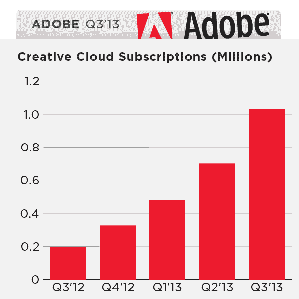

# Adobe 的 Creative Cloud 用户超过 100 万，但 2013 年第三季度收入降至 9.951 亿美元 TechCrunch

> 原文：<https://web.archive.org/web/https://techcrunch.com/2013/09/17/adobes-creative-cloud-surpasses-1m-subscribers-but-q3-2013-revenue-falls-to-995-1m/>

# Adobe 的 Creative Cloud 用户超过 100 万，但 2013 年第三季度收入降至 9.951 亿美元

Adobe 今天公布了今年第三个财政季度的季度收益。虽然该公司[报告](https://web.archive.org/web/20221228200846/http://www.adobe.com/aboutadobe/pressroom/pressreleases/pdfs/201309/Q313Earnings.pdf)收入和每股收益再次下降，分别降至 9.951 亿美元和 0.32 美元——这是大多数[分析师预期的](https://web.archive.org/web/20221228200846/http://finance.yahoo.com/q/ae?s=ADBE+Analyst+Estimates)——但该公司也宣布其[创意云](https://web.archive.org/web/20221228200846/http://www.adobe.com/products/creativecloud.html)订阅服务又一个季度取得令人印象深刻的增长。

然而，更重要的是，Adobe 今天还报告说，Creative Cloud 现在已经超过 100 万订户。今年早些时候，Adobe 表示，预计到今年年底将有 125 万付费用户(包括个人和团队)，这个数字现在似乎触手可及。

Adobe 总裁兼首席执行官尚塔努·纳拉延在今天的一份声明中表示:“我们在第三季度的订阅量超过了 100 万，这表明向创意云的过渡比预期的要快。

Adobe 在 Creative Cloud 上下了很大的赌注，它现在是用户访问其软件的主要方式。虽然大多数用户和专家预计 Adobe 将在未来几年内做出这一举动，但当 Adobe 在今年早些时候的 [MAX 会议上宣布将停止销售收缩包装软件时，许多人都感到非常惊讶。然而，Adobe 一直认为 Creative Cloud 的势头非常好，它决定冒这个险，比预期更快地改变其商业模式。](https://web.archive.org/web/20221228200846/https://techcrunch.com/2013/05/06/adobe-goes-all-in-with-subscription-based-creative-cloud-will-stop-selling-regular-cs-licenses-shrink-wrapped-boxes/)

随着其最重要产品的商业模式发生变化，Adobe 显然正在放弃短期收入，以获得长期订阅收入。这将暂时降低该公司的季度收益——今天的报告清楚地反映了这一点——但对于通常支持该公司举措的投资者来说，这并不意外。事实上，在今天的收益报告发布之前，Adobe 的股票在本周早些时候创下历史新高，并在盘后交易中大幅上涨。