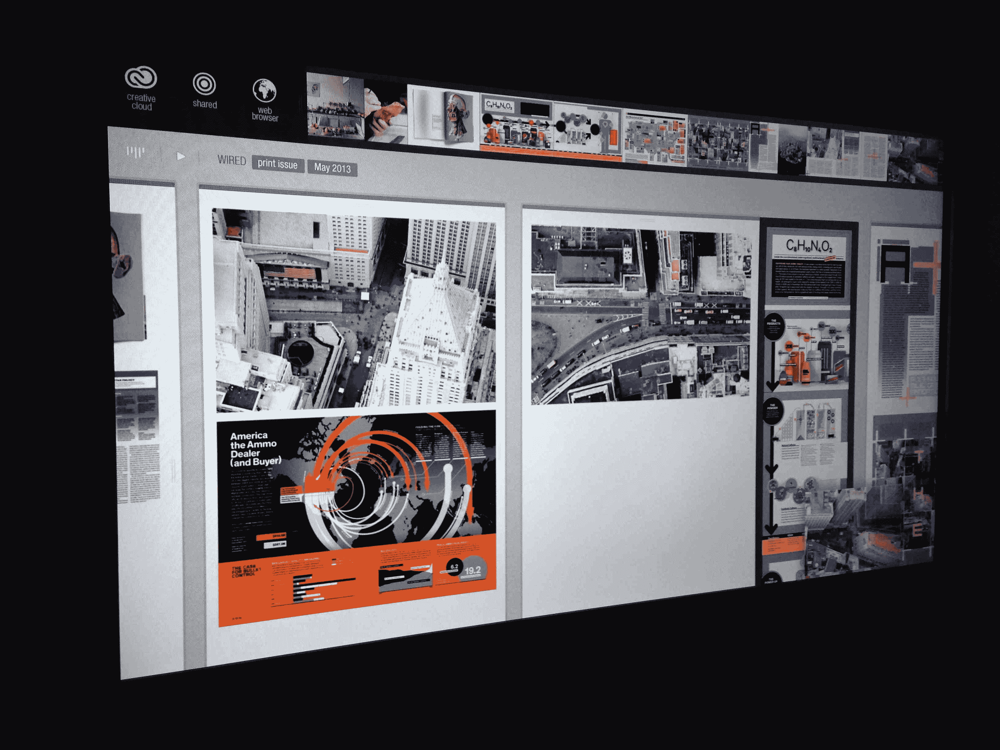
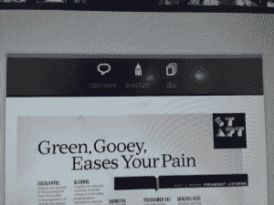
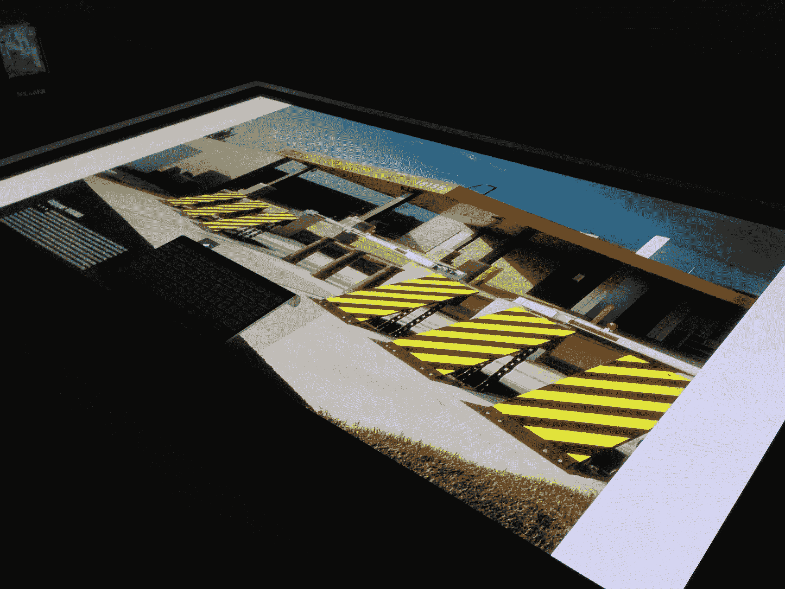

# Adobe 的硬件实验不仅仅是爱好:项目环境实践 TechCrunch

> 原文：<https://web.archive.org/web/https://techcrunch.com/2013/05/06/adobes-hardware-experiments-are-more-than-just-hobbies/>

今天在洛杉矶举行的 [MAX 会议](https://web.archive.org/web/20221005183557/http://max.adobe.com/)上，Adobe 展示了几款即将向客户推出的产品，但[也强调了](https://web.archive.org/web/20221005183557/http://blogs.adobe.com/conversations/2013/05/adobe-xd-explores-the-analog-future.html)一些硬件实验，包括 Project Context，一种完全重新想象的创建杂志版面的方式，以及一种高级手写笔和触摸屏标尺。

在今天早上的主题演讲之后，我有机会与 Adobe 的大卫·梅西坐在一起，谈论了新发布的用于触摸屏的[巨笔和拿破仑统治者](https://web.archive.org/web/20221005183557/https://beta.techcrunch.com/2013/05/06/adobe-debuts-project-mighty-smart-stylus-for-tablets-and-napoleon-a-digital-ruler-and-guide/)，以及项目的背景。所有这些项目绝对不仅仅是 Adobe 的爱好，当我问他公司对这些工具的计划时，Macy 承认了这一点。

虽然 Macy 显然不会谈论 Adobe 计划何时(甚至是否)将这些原型转化为产品，但我的感觉是该公司显然正在考虑这件事。同样清楚的是，所有这些项目背后的 Adobe XD 团队支持探索这些想法。例如，强大的笔的想法诞生于大约一年半前，该团队从那时起就一直在重复这个想法。

在这三个项目中，项目上下文显然是目前最“突出”的一个。很容易想象 Adobe 销售钢笔和尺子，但当谈到巨型触摸屏时，这并不是该公司的核心重点。目前 Context 只专注于杂志设计，但因为它在 OS X 上运行(实际上每个屏幕使用两台 MAC)，该系统也可以适用于其他用途(梅西百货不会透露《连线》或康泰纳仕是否有任何计划在他们的实际生产过程中使用它)。

正如《连线》的设计总监克劳迪娅·德·阿尔梅达今天在舞台上演示该项目时指出的那样，今天新闻编辑室的布局通常仍然是由设计师安排布局的纸张、剪刀和木板物理创建的。“Project Context 的美妙之处在于，”她说，“它吸取了我们在模拟世界中所做的最好的东西，并以数字方式进行了再现。”当然，Adobe 的另外两个硬件项目也是如此。

上下文系统使用两个 1080p 的高清屏幕，周围有一个框架用于拾取触摸信号，另外一个屏幕在另外两个屏幕前面设置成一个类似表面的桌子。因为屏幕太大了，你实际上可以看到单个像素，但 Macy 希望一旦 4k 屏幕变得更加实惠，这将不是一个问题。

他说，拥有这些巨大的触摸屏也能让人们充满活力。Adobe 认为，这是团队协作的一个很好的工具，原型目前支持多达 30 个接触点。

## 项目环境实践

我有机会在 MAX stage 后面玩项目环境，这确实是一个非常酷的体验。布局在很大程度上就是界面。资产位于页面顶部的水平滚动条中，可将它们添加到布局中。用多个手指左右滑动可以让你滚动，用一个手指触摸图像可以让你在页面上四处移动(或在页面之间)，显然你可以调整图像、页面的大小并执行其他操作。该原型还包括一个网络浏览器，尽管它在今天的演示中被停用了。

除了双屏系统之外，Adobe 还使用 Surface table-like 设置，用户可以将单个图像发送到该设置。用户可以在上面放一个键盘，开始在图像上写笔记，或者只是开始用手指在上面画画。完成后，你只需向主屏幕方向滑动，它就会再次出现在那里。

顺便说一下，Adobe 的第一个想法是建造一个可以配备类似 Kinect 的传感器、类似 Wii 的遥控器和类似技术的房间。事实上，Adobe 最终建造了这个房间，但最终，然而，梅西说，“在空中做手势只是觉得很傻。”一旦你有了触摸屏，触摸就成了使用软件的自然方式。该团队的下一个项目是构建一个基于触摸屏的绘图桌(该团队的领导者是一名前建筑师)。然而，在这种情况下，使用虚拟统治者和类似的工具并没有太大的意义，所以力量和拿破仑的想法诞生了——其中一些影响显然也可以在项目环境中看到。

至于这个项目的未来，以及 Mighty 和 Napoleon，Adobe 将何去何从还不清楚，但 Macy 认为它确实指向了未来，Adobe 需要试验像上下文这样的界面，以保持在游戏中的领先地位。

【YouTube http://www.youtube.com/watch?v=Jexqp-MK0pI？feature = player _ embedded & w = 640 & h = 360]