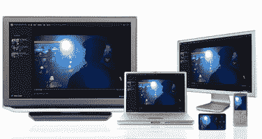

# Adobe 的开放屏幕项目:一次编写，Flash 无处不在 TechCrunch

> 原文：<https://web.archive.org/web/https://techcrunch.com/2008/04/30/adobes-open-screen-project-write-once-flash-everywhere/>

Adobe 正在大张旗鼓地让 Flash 成为事实上的浏览环境，不仅在你的 PC 上，也在你的手机、电视和你能想到的任何其他屏幕上。它宣布了[开放屏幕项目](https://web.archive.org/web/20221227060905/http://www.adobe.com/openscreenproject/)，让跨设备开发应用程序变得更加容易——当然是使用 Flash。Adobe 平台业务(包括 Flash/Flex、AIR 和 Cold Fusion)总经理 David Wadhwani 说:

> *我们认为，现在是时候在全行业范围内开展一场运动，为个人电脑、移动设备和电视的网络开发提供一种一致的方式。*

为了帮助该项目向前发展，Adobe:

> **1。第一次向 Flash 播放器**开放运行时，这样任何人都可以创建自己定制的播放器。具体来说，它将开放 [SWF](https://web.archive.org/web/20221227060905/http://www.adobe.com/licensing/developer/) 和 FLV/F4V 规范。在过去，开发人员必须签署不开发衍生 Flash 播放器的协议，因为 Adobe 希望避免 Java 早年经历的碎片化。但是现在感觉 Flash 已经是一个足够强大的标准，可以承受一些新的进化分支的引入。
> 
> **2。取消移动设备上 Flash 的许可费用。虽然 Flash 在个人电脑上是免费的，但手机制造商和其他设备制造商必须支付版税。这是 Adobe 去年 5200 万美元的业务。(Flash 版本已经在 5 亿台移动设备上运行，预计在未来 12 个月内将增长到 10 亿台)。这项业务(仅占 Adobes 总收入的 2%)正在消失。从 2009 年 Flash(和 AIR)的下一个主要版本开始，它将对设备制造商免费。这应该有助于 Flash 的进一步传播。**
> 
> **3。发布用于将 Flash 移植到其他设备的 API。**这目前也会产生版税。通过打开它，没有理由为什么每个设备不应该预装 Flash。
> 
> **4。发布 Adobe 协议，将内容推送到 Flash Cast 和 AMF 等设备**。Adobe 还将与无线运营商就无线软件更新协议进行合作。(这实际上是一个难题，因为大多数下载到手机上的软件都存储在只读存储器中，直到设备被替换。让移动软件像桌面软件一样容易更新是确保移动应用跟上时代的关键。

在应用程序创建方面，Adobe 将越来越多地采用微件方法。在网页上作为模块运行的小部件和在小屏幕上运行的移动应用程序没有太大区别。瓦德瓦尼解释道:

> *这些东西可以膨胀起来。开发人员希望针对这些小屏幕尺寸进行优化。与其从桌面体验中挤压它，不如从小处着手，逐步构建。*

同样的方法也可以用于其他设备上的应用程序，如机顶盒。

开放屏幕项目对开发人员的承诺是一个古老的梦想，即能够编写一个应用程序，并在任何设备上的任何地方部署它。Adobe 及其在开放屏幕项目中的一系列合作伙伴(诺基亚、索尼爱立信、高通、三星、摩托罗拉、LG、东芝、NTT Docomo、Chungwa Telecom、ARM、英特尔、Marvell、思科、NBC Universal、MTV Networks 和 BBC)并不是唯一有这种愿望的公司。值得注意的是，苹果、谷歌和微软都没有出现在 Adobe 的合作伙伴名单上。对于这种跨设备兼容性如何工作，每个人都有自己的想法。

苹果认为你应该只买那些可以无缝协同工作的苹果产品(Mac，iPhone，Apple TV)。史蒂夫·乔布斯也明显冷落了 Adobe，因为[拒绝在 iPhone](https://web.archive.org/web/20221227060905/http://techcrunch.com/2008/03/05/adobes-flash-not-good-enough-for-steve-jobs/) 上安装 Flash。也许他的工程师们现在可以做出满足他们严格标准的自己的版本。

谷歌从来都不是 Flash 的忠实粉丝，它更喜欢 Ajax 在其 Webtop 应用中的速度。在移动领域，它押注于自己的开放操作系统 Android。它还以传统方式开发移动应用程序——一次一个设备。

但在这方面，与 Adobe 相比，最具统治力、最与众不同的公司是微软。它正在推广自己的 Flash 替代品:Silverlight。(尽管它已经授权 Flash Lite for Windows Mobile 作为一种权宜之计，直到 Silverlight 在移动设备上运行)。更根本的是，微软在如何让应用程序跨设备运行上存在分歧。它的答案最终将是活网格。正如我上周在微软正式发布 [Live Mesh](https://web.archive.org/web/20221227060905/http://techcrunch.com/2008/04/22/microsofts-mesh-revealed%E2%80%94sync-all-apps-and-all-files-to-all-devices-as-long-as-theyre-windows/) 时所写的。：

> Mesh 的基础就是这种以 feed 为中心的编程模型。Web 开发人员可以使用他喜欢的任何编程语言或工具(Python、Ruby on Rails、Flex)构建应用程序，然后使用双向馈送作为基本数据和通信通道，在设备和其他应用程序之间同步应用程序。产品部门经理 Abhay Parasnis 说，对开发人员的承诺是:“如果您的应用程序支持网格，我们将允许您将其扩展到其他设备。”
> 
> 在许多方面，这种努力是对我们在 Adobe Air 或 Google Gears 上看到的努力的平衡，这些努力是为了让基于浏览器的应用程序离线。借助 Mesh，微软实际上是在重申基于客户端的应用程序的主导地位。。。。开发人员可以为他们最初驻留的任何设备定制他们的应用程序——无论是 PC、智能手机还是机顶盒——然后通过将它们同步到网络上的其他应用程序来进行 Webify。

在跨设备和屏幕连接应用程序的方式方面，竞争越激烈，我们就越有可能开始在笔记本电脑之外的其他设备上看到一些我们最喜欢的网络应用程序。

(图片由[阿玛吉尔](https://web.archive.org/web/20221227060905/http://www.flickr.com/photos/amagill/26273015/)拍摄)。