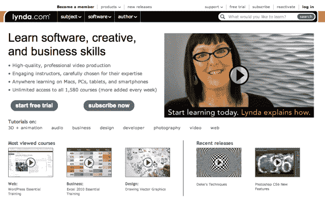

# 17 年后，教育平台 Lynda.com 获得第一轮融资，来自 Accel & Spectrum  的 1.03 亿美元

> 原文：<https://web.archive.org/web/https://techcrunch.com/2013/01/15/after-17-years-education-platform-lynda-com-raises-its-first-round-of-funding-103m-from-accel-spectrum/>

回到 5 月份，[我们分享了老牌视频教育平台 Lynda.com](https://web.archive.org/web/20230401025721/https://techcrunch.com/2012/05/03/lynda-70m/)的独特故事，以及它如何在 2011 年创造了 7000 万美元的收入，而没有从外部投资者那里拿一分钱。从那以后，它继续稳步前进，2012 年的收入增长到 1 亿美元。

Lynda.com[于 1995 年由夫妻团队布鲁斯·海文和琳达·温曼创立，并不是典型的科技初创公司。与竞争对手相比，这家公司历史悠久。不仅如此，它避开了风险投资，仍然由婚姻幸福的联合创始人领导，以认购为基础，自 1997 年以来一直盈利，总部设在南加州的一个小镇——而不是硅谷、纽约或洛杉矶。](https://web.archive.org/web/20230401025721/http://www.lynda.com/)

部分原因是作为先行者的优势，因为该公司早在 YouTube、可汗学院(Khan Academy)或 Courseras of the world 进入市场之前就开始建立其教育和操作视频库。今天，它的图书馆有超过 83，000 个视频。通过创建由真正的行业专家、工作专业人士和资深教师教授的专业质量的视频课程，并以每月 25 美元的价格提供完整的访问权限，Lynda.com 已经吸引了 200 多万付费用户和企业客户，如索尼、皮克斯、迪士尼、时代华纳和 HBO，他们使用它来补充他们的企业学习计划。

由于其简单而有效的模式以及在线教育的日益普及，该公司在过去两年中实现了指数级增长。为了抓住这一机会，[创始人在 12 月聘请 PopCap 首席技术官和长期任职的 Adobe 高管 Frits Habermann 担任首席技术官](https://web.archive.org/web/20230401025721/https://techcrunch.com/2012/12/17/popcap-cto-veteran-adobe-exec-frits-habermann-joins-learning-platform-lynda-com-to-help-it-go-mobile-global/)，帮助开发其移动战略，并领导其向国际市场的扩张。上周，Saba Software 前首席财务官、首席运营官盖亚在线首席财务官 Elaine Kitagawa[于本月早些时候](https://web.archive.org/web/20230401025721/http://www.lynda.com/news/newsreleases.aspx)出任新首席财务官。

随着高层领导的到位，该公司终于决定屈服于投资者的长期兴趣，今天宣布从 Accel Partners 和 Spectrum Equity 筹集了 1.03 亿美元的增长股权，Meritech Capital Partners 也提供了捐款。这笔融资是该公司 17 年历史上的首次外部投资，Accel 的安德鲁·布拉恰(Andrew Braccia)和 Spectrum 的维克·帕克(Vic Parker)将加入该公司董事会。客观来看，Pinterest 在 5 月份筹集了 1 亿美元。

“我们非常幸运，”联合创始人琳达·韦斯曼告诉我们。“我们多年来的增长和盈利能力使我们能够对公司的增长进行再投资，专注于产品，并与业内最好的教师合作，为我们的用户提供灵活的学习途径。”

但是现在，她继续说道，“我们已经准备好进入下一个阶段了。”

对于领导团队来说，首先要扩大课程目录。从一开始，该公司就专注于技术内容，提供如何使用 Adobe、微软和苹果最受欢迎的产品的教学视频，涉及的主题从网页设计到 Excel 简介。

例如，今年 5 月，该平台在 Adobe 上发布了第 500 期课程。但最近，该公司一直在拓展更多的商业内容，提供如何协商或优化时间管理的课程，并更积极地进入移动设计和编程领域，在 iOS 开发方面有着坚实的基础。

然而，凭借其庞大的新资金，该公司最大的增长潜力在于国际市场。截至目前，Lynda.com 的内容只有英文，因此未来它将大力投资于现有内容的多样化和本地化，并可能在美国运营的 20 多家视频工作室的基础上增加一些国际工作室

运营自己的制作和工作室需要更多的资本，但它也保证了更高质量的内容呈现，这反过来又吸引了帮助创建内容的教师和专家。反过来，当许多在线视频平台不补偿教育工作者或依赖自己定价的市场时，琳达在旧模式中获得了成功。

一旦教师和专家通过审查，他们就可以获得工作预付款，这意味着他们有一份有保障的薪水。然后，他们可以根据视频的受欢迎程度，从其内容产生的收入中分享一部分，以此来补充基本工资。最终，它被证明是一个对教师有吸引力的模式，因为它的 250 名教育工作者中有近 20%的年收入来自 Lynda.com。

虽然 Lynda.com 现在正在收获这些模式的回报，但它花了很长时间才达到今天的水平。这对新一代专注于教育的企业家来说是一个重要的教训:建立一个 10 亿美元的教育企业不会在一夜之间发生，它需要几十年的时间。随着技术和教育的变化，谁能最有效地帮助人们驾驭这些新领域，谁就掌握了巨大教育市场的钥匙。

