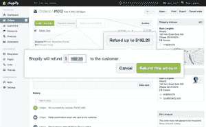
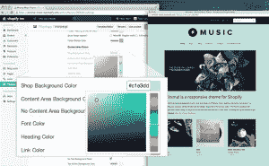

# 经过 7 年时间，创建了 5 万个店面，Shopify 启动了重大的重新设计，以简化在线商店建设| TechCrunch

> 原文：<https://web.archive.org/web/https://techcrunch.com/2013/04/11/after-7-years-50k-storefronts-launched-shopify-launches-major-redesign-to-simplify-online-store-building/>

Forrester 最近预测，未来四年，在线零售市场将从今年的 2310 亿美元增长到 3700 亿美元，复合年增长率为 10%。换句话说，信息很明确:电子商务巨头不会很快减速。2013 年，每个企业都需要某种形式的在线存在；当然，问题是许多小企业主没有技术诀窍(或资本)来建立自己的电子商务市场。

正是这个问题催生了 Etsy、Weebly、Wix、Zaarly 等服务，这些服务旨在让企业和商家更容易在网上销售。《经济学人》杂志的[显然刚刚发现了](https://web.archive.org/web/20230405162804/http://www.economist.com/blogs/schumpeter/2013/04/e-commerce)这项服务，今天的报道中遗漏了许多类似的公司(已经存在多年)。成立于 2005 年，在创建自己的网上商店领域最大的玩家之一是 [Shopify](https://web.archive.org/web/20230405162804/http://www.shopify.com/) ，这项服务允许任何人在几分钟内建立一个网上店面，快速添加他们想要出售的产品，通过 PayPal 和其他方式接受支付，添加图片等等。

该公司最近一直在雷达下飞行，部分原因是它一直在悄悄地准备对其平台进行大规模更新。(事实上，该公司告诉我们，重新设计已经“酝酿了好几年”)在 10 月份开始的私人测试中，今天 Shopify 正在拉开 v2.0 的帷幕，并正式向公众提供。

根据使用 Shopify 创建在线商店的 50，000 多家商家的反馈，该公司增加了 60 多项新功能，首先是对其仪表板进行了彻底的重新设计，并添加了一个实时主题编辑器和更直观的管理功能。创始人告诉我们，新平台是使用 JavaScript MVC 框架构建的，该框架是在开源供公众使用之前在内部开发的。新框架旨在让该公司更快地开发原型和创建应用程序，同时为其大批量商家提供更高的可扩展性。

 新的重新设计是该公司 2200 万美元 A 轮和 B 轮融资以及去年[收购移动应用开发商 Select Start Studios](https://web.archive.org/web/20230405162804/https://techcrunch.com/2012/02/01/ecommerce-platform-shopify-acquires-mobile-app-development-studio-select-start/) 的产物，这有助于该公司加速其移动战略——这是其整体重新设计的基本部分。该团队帮助开发了 Shopify 的新 iPhone 应用程序，该应用程序于去年发布，此后一直专注于向该公司的主题商店添加新的响应主题(即模板)。

除了建设移动平台，Shopify 还改变了其定价模式，现在将为企业提供更便宜的“首发”计划(包括 24/7 支持)，这两项计划都旨在使其平台对小企业来说更实惠、更方便。对于新的定价，Shopify 联合创始人兼首席执行官 Tobias Lütke 表示:

> 多年来，Shopify 最便宜的计划每月花费 29 美元。随着 Shopify 2 的发布，我们现在提供每月 14 美元的“入门”计划，为商家提供相同的电子商务平台，减去一些更高级的特性和功能……我们的想法是，无论商家处于业务生命周期的哪个阶段，我们都希望为他们提供选项，并且，通过我们新的更便宜的选项，我们希望为那些刚刚接触在线销售的人消除障碍。

除了新的“启动”计划，Shopify 还推出了一项企业计划，以迎合高流量客户，价格为每月 1000 美元。虽然人们可能会认为 Shopify 这样的服务主要是为了满足小企业的需求，但大牌品牌也希望获得同样的功能，并渴望降低购买昂贵的第三方电子商务软件的成本——或不得不自己开发软件的成本。

其结果是，Shopify 最近成为越来越多大牌品牌的大本营，包括百威啤酒、佳得乐和维基百科，这位首席执行官告诉我们，这些品牌越来越多地寻求向下游转移到托管的 SaaS 解决方案。这两个新计划使总数达到五个(初级、基本、专业、无限和企业。(此处的功能分解了[个计划。)](https://web.archive.org/web/20230405162804/http://www.shopify.com/pricing)

除了定价，Shopify 的重新设计还包括一系列新功能，包括商家现在可以在不使用 PayPal 的情况下提供部分退款，以及改进整个网站的搜索功能和管理功能(如 meta descriptions，这是用户以前必须付费的一个例子)。首席执行官告诉我们，最大的新增功能是像实时主题编辑器这样的功能，允许商家在发布前在实时预览窗口中构建和定制他们的商店外观。商家现在可以编辑颜色、字体、间距、图像等等，立即看到这些变化会是什么样子。

 该公司还彻底改革了其订单管理系统，现在提供废弃结账管理、商家端订单编辑、退款和改进的欺诈检测。这位首席执行官告诉我们，另一个关键是，Shopify 从根本上从头开始重建了这个平台，以实现更大的灵活性，并允许它扩展到所有形式的电子商务。

这位首席执行官还透露了一些历史增长数据，显示 Shopify 从 2011 年的 18，000 家活跃商店增加到 2012 年的 41，000 家，预计今年将达到 80，000 家。它的商品总值(即店面的总销售额)从 2011 年的 2.75 亿美元增长到 2012 年的 7.42 亿美元，预计到今年年底将达到 15 亿美元。

最终，在简单浏览了一下 Shopify 2 之后，很容易发现在构建新平台上已经投入了大量时间。设计和用户体验都得到了认可；导航就容易多了。正如前面提到的，这个领域现在有一长串的竞争对手，Shopify 花了这么长时间来推动其重新设计可能对自己没有帮助。

但很明显，该公司现在正试图挑战 Magento 和 Volusion 这样的“大商业”玩家。这些大企业客户是否愿意将它作为一种替代方案还有待观察，但新的定价无疑是朝着正确方向迈出的一步——对双方都是如此。