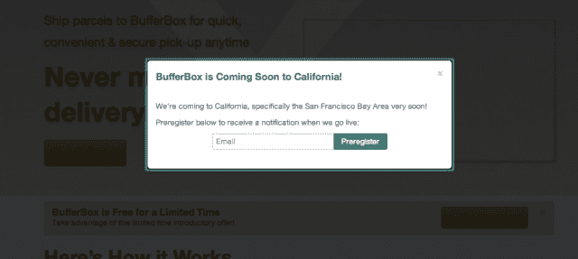
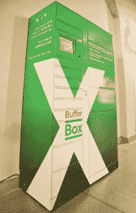

# 被谷歌收购后，运输服务 Bufferbox 正准备在旧金山湾区推出 

> 原文：<https://web.archive.org/web/https://techcrunch.com/2013/04/03/after-being-acquired-by-google-shipping-service-bufferbox-is-preparing-a-bay-area-launch/>

# 在被谷歌收购后，运输服务 Bufferbox 正准备在湾区推出

总部位于加拿大的 Y Combinator 公司 Bufferbox ，旨在解决我们在接收包裹方面的所有问题，已经开始在旧金山湾区推出。去年 11 月，据传谷歌以 1700 万至 2500 万美元收购了 T2 公司，但很少或根本没有讨论该产品的未来计划。

很明显，这可能是谷歌[最近宣布的“购物快递”当天送达服务](https://web.archive.org/web/20230217010011/https://techcrunch.com/2013/03/28/google-starts-testing-google-shopping-express-today-in-sf-free-delivery-at-target-walgreens-staples-and-more/)的重要组成部分。想从缓冲箱里拿东西，而不是让它直接带给你吗？没问题。中间人完全不适合。这项服务在大多伦多地区一直没有中断过，但是加州的这个地区不仅仅是一个测试。

我们知道，美国目前的包裹递送系统已经崩溃，政府资助的邮政服务正在缩减，比如……周末递送。谷歌显然正在大举进入这一领域，Bufferbox 主页上的调侃说明了一切，它很可能获得了我的浏览位置:

现在，你所能做的就是给他们你的电子邮件地址进行“预注册”，这让谷歌对这项服务的需求有了一个很好的了解。

我们已经联系了谷歌了解更多细节，如果我们听到更多消息，我们会及时更新。这绝对是我们*密切跟踪*的一个领域，因为另一家 Y Combinator 公司正在做类似的事情，Swapbox，[最近在湾区](https://web.archive.org/web/20230217010011/https://techcrunch.com/2013/03/15/y-combinator-company-swapbox-launches-and-aims-to-pick-up-where-bufferbox-left-off/)推出。

 不是把东西寄到你的地址，而是送到你的缓冲箱，这样你就可以随时取用。现在，当你有东西送到你那里，却错过了送货员，你就相当糟糕了，不得不等待他们回来，或者更糟，自己去工厂取东西。如果你的包裹真的送到了，它只是放在你的门口，被你的邻居盯着看。

这有点类似于拥有一个邮政信箱的概念，但它不是一个静态的信箱或地址。你可以把货物送到任何你想去的地方。此外，这些东西应该是公开的，所以你可以在白天或晚上的任何时候拿到你的包裹，而不是在邮局关门之前。

正如我们所知，在湾区测试东西是这里每个公司都喜欢做的事情，包括谷歌。对于山景城公司来说，这可能是一个蓬勃发展的业务，因为这是消费者和小企业都会反复使用的东西。这也是一项可以集成到当前所有产品中的服务。想象一下，当发货通知到达你的缓冲区时，它会被放入 Gmail 或你的常规通知栏。或者，想象一下谷歌可能释放的跟踪功能，在谷歌地图上实时显示你的包裹的位置。

那会很酷。

[图片来源: [Flickr](https://web.archive.org/web/20230217010011/http://www.flickr.com/photos/yellowbookltd/2200969789/sizes/z/)