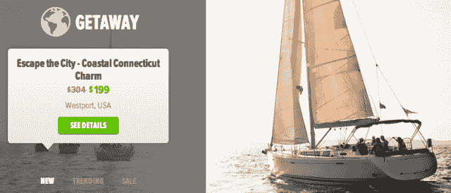
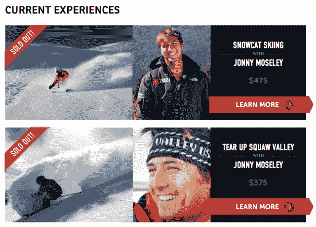

# 抛弃了 Groupon 模式后，Zozi 获得了 1000 万美元来建立名人引导的冒险市场 

> 原文：<https://web.archive.org/web/https://techcrunch.com/2013/04/04/after-ditching-the-groupon-model-zozi-lands-10m-to-build-out-its-marketplace-for-celebrity-guided-adventures/>

# 在抛弃了 Groupon 模式后，Zozi 获得了 1000 万美元来建立名人引导的冒险市场

Zozi 于 2010 年推出成为那些寻找(负担得起的)借口从日常琐事中解脱出来的人的首选目的地，提供各种当地冒险的每日优惠——从亚特兰大的鸡尾酒班到旧金山湾的皮划艇。然而，在拥挤的每日交易领域奋斗了两年后，Zozi 将其重点转移到提供高端、独家的冒险和旅行。

该平台不再提供大幅折扣，不再充当活动和多日游的中间人，而是开始提供由专家和名人主持的千载难逢的体验。随着 Gurus 的[发布，Zozi 不仅允许用户进行皮划艇冒险，还允许用户与世界纪录保持者一起顺流而下——或者与 Jonny Moseley 一起在太浩湖滑雪。](https://web.archive.org/web/20221124021535/http://www.zozi.com/gurus)

虽然这种精英体验(和名人)更难提供，并且通过远离日常交易，它对普通人失去了一些吸引力，但投资者似乎对 Zozi 的新方法买账，可能是因为名人支持的旅游可以赚更多的钱。

今天，这家初创公司宣布，作为 B1 轮融资的一部分，它已经筹集了 1000 万美元的增长资本和债务。投资者包括 Launch Capital、500 Startups、Forerunner Ventures、Par Capital Ventures、硅谷银行、杜比实验室主席戴夫·杜比(Dave Dolby)和无缝创始人杰森·芬格(Jason Finger)等。额外的资本使公司的融资总额达到 1750 万美元。

Zozi 目前在美国和加拿大的 20 多个城市提供服务，提供前往许多国际目的地的旅行，同时为客户提供购买 Timbuk2 和 Marmot 等户外品牌产品的机会。这家初创公司现在拥有 40 多名员工，团队致力于管理其精英体验，现在包括 Travis Rice(三次 X-Games 金牌得主)的穷乡僻壤滑雪板，Michael Mina 的美食烹饪课，葡萄园自行车旅行和 Ironman 冠军 Chris Lieto 的铁杆训练。

展望未来，Zozi 希望扩大其名人专家名册，并增加其在当地体验和装备方面的选择。该公司还希望改进预订和客户关系方面的技术，同时向电子商务领域进一步扩张。

Zozi 的联合创始人兼首席执行官 TJ Sassani 表示，该创业公司成功的关键是，特别是考虑到来自 Peek 等其他风险投资支持的冒险创业公司的竞争日益激烈，为客户提供“一个可靠的来源，帮助他们发现和展示最真实的体验和最新的设备，同时为商家提供一个与目标新客户联系的品牌渠道，这些客户将成为回头客并推荐他们的朋友。”

无论如何，高利润、高价值的体验似乎正在为 Zozi 工作，但直到它提供与精选 TechCrunch 作家的全面接触、穷乡僻壤的博客课程，还有很长的路要走。

在这里找到家里的 Zozi [。](https://web.archive.org/web/20221124021535/http://www.zozi.com/)

【T2