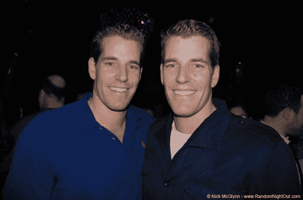

# 七年后，温克沃斯兄弟与脸书展开了一场对决

> 原文：<https://web.archive.org/web/https://techcrunch.com/2011/06/22/after-seven-years-the-winklevosses-give-up-on-battle-with-facebook/>

# 七年后，文克莱沃斯兄弟与脸书展开了决战[更新:他们回来了]

经过七年的诉讼！……在 2008 年与脸书达成 6500 万美元的和解后，他们试图撤销和解，理由是脸书给了他们误导性信息！…他们发誓要挑战第九巡回法院 2011 年 4 月的一项裁决，并将他们的案件一直上诉到最高法院。)温克莱沃斯兄弟刚刚放弃了与脸书的斗争。

在今天提交给旧金山美国第九巡回上诉法院的一份声明中，这对双胞胎和朋友迪维娅·纳伦德拉说，经过“仔细考虑”，他们已经[放弃了](https://web.archive.org/web/20230209125017/http://bits.blogs.nytimes.com/2011/06/22/winklevosses-drop-facebook-fight-keep-settlement/?src=tptw)对最近法院裁决(有利于脸书)的法律上诉这意味着他们将接受最初的和解协议，该协议现在的股票价值远远超过 6500 万美元。

哈佛学生在 2004 年对社交网络提起了最初的诉讼，指控脸书首席执行官兼同学马克·扎克伯格剽窃了他们的 CONNECTU 创意，并随后创建了脸书。

整场打斗中最精彩的部分是，这对双胞胎经历了他们年轻的成年期。脸书对这个消息的反应是，“我们认为这个案子已经结束很长时间了，我们很高兴看到另一方现在同意了。”

鳍。

**更新:**其实，事情并没有结束，确切地说。据《洛杉机时报》报道，兄弟俩周四提交了一份申请，要求波士顿联邦法院调查他们关于脸书在原案中隐藏证据的指控。温克沃斯，我们不能离开你。

*图片:[尼克·麦克格林](https://web.archive.org/web/20230209125017/http://www.randomnightout.com/)*