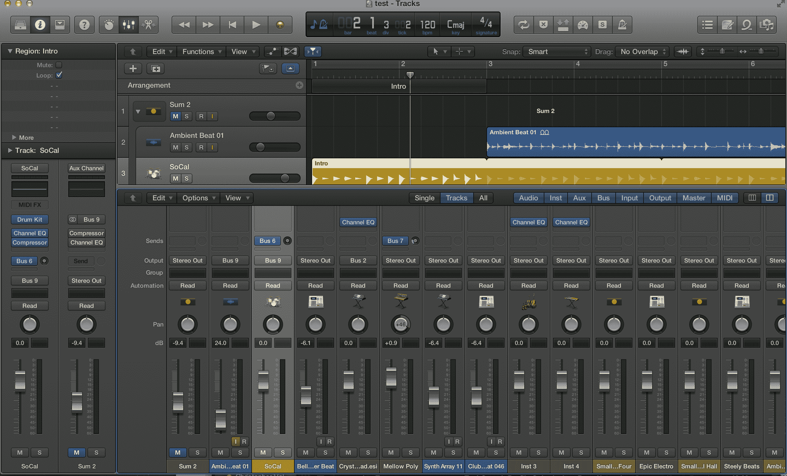

# 在 Skeuomorphism 之后 TechCrunch

> 原文：<https://web.archive.org/web/https://techcrunch.com/2013/08/04/after-skeuomorphism/>

当我在对 Logic Pro X 进行评论时，我突然想到了一件事——滑块在哪里？历史上，专业音频软件一直努力模仿音频工程师使用的模拟和数字工作站。这些板让你按下按钮，旋转旋钮，并插入跳线。逻辑 X 把这些藏起来了。他们在那里，当然，因为整个博客世界都会听到抗议:滑块在哪里！

滑块在那里，但是被隐藏了。普通用户不需要它们。非线性编辑确保了编辑后的音频是连续的，而不是活的。使用滑块精确控制单个乐器的需求不再是大多数用户所需要的。但是他们仍然在那里，隐藏在表面之下。也许苹果认为专业音频人员会忘记他们。

我们正在缓慢但肯定地进入另一个计算时代。微软将游戏 Solitaire 添加到 Windows 中，是为了训练人们如何在桌面上拖放文件。那几乎是二十年前的事了。不再需要训练普通的计算机用户如何使用鼠标，但在同样的几十年里，支持原始用户的必要性给我们带来了很快成为记忆的隐喻:垃圾桶、控制面板、单选按钮，显然还有滑块。那些用户仍然用信息时代之前的术语来思考机器。点击按钮。旋钮转动了。手指轻轻一弹，电流就从一个触点跳到另一个触点。这就是 Windows 的意义所在，也是 iOS 的意义所在。这就是为什么逻辑有滑块。

然而现在，按钮没有任何意义。你最后一次按桌子上的按钮是什么时候？除了在你的 iMac 背后寻找电源按钮，我想说瞬时开关的最后避难所是电梯。见鬼，即使是人行横道按钮也不起作用了，大多数微波炉都有触摸板。

这就是 Windows 8 如此重要的原因。这就是为什么新的 iOS 同样重要。看看动态的磁贴——记住，它们不是窗口中的按钮。iOS 里的垃圾桶在哪里？剩下的就是奥斯卡《牢骚之家》最基本的轮廓了。照片级的图标不见了，取而代之的是告诉你如何滑动解锁的箭头。几年前让我们如此着迷的弹性橡胶银纽扣现在怎么样了？它变成了一个互动元素的最起码的暗示。Solitaire 教会用户指向桌面上的单个项目，而这些新按钮训练用户使用他们的所有感官，通过如此微小的线索直观地控制环境，只有未来一代的人才能抓住它们。

我们是未来一代。没错。我们成功了。我们在未来。

显然设计变化如风。今天的高科技界面就是明天的计算机博物馆展品。今天的 MacBook Air 或微软 Surface 将是一块塑料和硅板，在某个郊区地下室的狭小空间里腐烂。蝴蝶死在轮子上。

但是斯考莫菲蝴蝶的死亡要重要得多。这是我们看待世界方式的巨大转变。这是迈向 3D 信息控制未来的一步。这是朝着用我们的指尖控制大量数据迈出的一步。这是向永远在线的网络迈出的一步，即使我们无意，网络也会倾听我们的声音。这就是 skeumorphism 已死的原因:我们的高保真音响不知道我们想听什么。

现在潘多拉知道了。

我们正无休止地遭受填隙技术的蹂躏。这架飞机只是从 20 世纪 70 年代的技术发展而来。医学现在才开始采用机器人技术和微型传感器阵列。这辆车刚刚逃离燃烧区。同样的事情也发生在信息技术上。我们正无休止地奔向一个未来，这个未来能凭直觉感知我们的需求，并回忆起我们的奇思妙想。最终，我们会发现自己生活在一个比我们想象的更美好、更容易，同时也更复杂的世界里。

skeuomorphism 早就该消亡了。有一种方法可以解决大公司强加给电脑用户的疯狂，但这些疯狂早在 Windows 8 发布之前就已经扎根了。它来自 2000 年网页设计的弯曲边缘。它生长在当前互联网巨头的平面几何标志中。在过去的几个月里，它在新的应用程序用户界面中蓬勃发展。新一代人不想要滑块。

这就是滑块去的地方。他们没有过时，而是消失了。让我们看看，当同样的简化动力冲击到所有东西时会发生什么——甚至是电梯里的按钮。