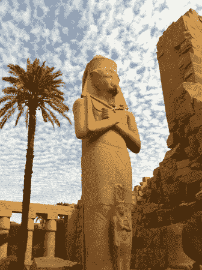

# 解放后:埃及 2.0 TechCrunch

> 原文：<https://web.archive.org/web/http://techcrunch.com/2011/02/17/after-tahrir-egypt-2-0/>

***编者按:**客座作者 Seth Goldstein， [@seth](https://web.archive.org/web/20230203004323/http://www.twitter.com/seth) ，是旧金山的天使投资人和初创企业家。Christopher M. Schroeder， [@cmschroed](https://web.archive.org/web/20230203004323/http://www.twitter.com/cmschroed) ，是一位常驻华盛顿和纽约的天使投资人，也是在线健康初创公司[healthcentral.com](https://web.archive.org/web/20230203004323/http://www.healthcentral.com/)的首席执行官。*

突尼斯沦陷前一周，我们在开罗，代表美国国务院全球创业项目会见了数十家埃及科技初创企业。他们想法的质量让我们激动不已，他们的技能、远见和坚定的决心也是如此。我们毫不惊讶地听说，最近几周，我们遇到的许多人关闭了他们的笔记本电脑，在埃及的街道上游行。通过电子邮件、手机、短信和社交网络，我们在这场巨变中与他们保持了密切联系。

甚至在解放广场永远铭刻在全球意识中之前，新一代企业家已经成为阿拉伯政治和社会的第三种声音。他们不只是参与政治辩论或宗教解释，而是埋头专注于开发新产品，进而开发新产业。虽然他们的参照系包括从硅谷到印度的成功，但他们是一场与他们的国家和地区在文化上截然不同的运动。这些年轻男女是我们称之为埃及 2.0 的祖先。

这些先驱创新者是谁？大多数人受过大学教育，有些人甚至拥有美国的高级技术学位。许多人正致力于成熟的美国商业模式的阿拉伯版本:社交网络、移动应用、约会网站、旅游引擎等等。然而，许多其他人正在发明全新的模式。销量最大的 iPad 天气应用程序、改善服务器处理的突破性芯片，甚至是对谷歌的直接攻击都是由埃及的企业家发起的，你会感到惊讶吗？正如一位不愿透露姓名的创始人告诉我们的那样，“初创企业很棒，即使它只是现有产品的复制品，但把初创企业视为创新平台更好，因为它会激励更多的人。”

最近几周的事件坚定了他们的决心。移动经纪初创公司 [EME](https://web.archive.org/web/20230203004323/http://www.emeint.net/) 的首席执行官纳德·伊斯坎德尔告诉我们，“这一周前所未有地提升了我们的希望。我们目睹了一个“新埃及”正在通过我们数百万人民难以置信的勇气、毅力、希望和牺牲而形成。”我们听到了许多版本的 iPad 应用程序公司[首席执行官阿姆尔·拉马丹与我们分享:“我不认为任何人，包括我在内，知道爱国主义和对国家的爱到底意味着什么，直到上周。人们觉得这个国家不是他们的。现在他们做到了。”有了这种主人翁感，就有了更强的自主感。他继续说道，“最后，政府害怕它的人民，而不是相反。通讯中断证实了这一点。政府说，“我在颤抖”，这给了人们一种占上风的感觉。”](https://web.archive.org/web/20230203004323/http://www.vimov.com/)

尽管许多埃及企业家仍然(有充分的理由)怀疑美国的外交政策，但他们仍然渴望我们作为有经验的投资者和企业家参与进来。在线就业委员会[的首席技术官阿米尔·谢里夫(Ameer Sherif)恳求道，“我们需要导师，帮助将硅谷的创业经验转移到尼罗河谷。”拉马丹梦想着“一座通往硅谷的桥梁，一座有可能加速和促进埃及创新，并在埃及和美国创造新就业机会的桥梁。”](https://web.archive.org/web/20230203004323/http://www.basharsoft.com/)

在过去几周我们与埃及初创企业创始人的交谈中，我们可以提供即时帮助的方式有三个主题:

1.  ***扩大美国和埃及大学和公司在研发领域的积极合作关系& D.*** 埃及初级和中级教育的巨大差异是有据可查的，但我们遇到的企业家同样专注于改善技术研发。他指出“埃及有一些伟大的思想家。但在美国的大学里，无论是本科生还是研究生，都没有进行任何有意义的有用研究。”语义搜索引擎 Kngine 的首席执行官 Haytham ElFadeel 感叹道:“埃及在 2009 年只获得了 3 项专利，而以色列在同一年获得了 1525 项专利，以色列的总人口还不到开罗的人口。
2.  ***促成美埃创业导师项目。地区风险资本社区正以令人兴奋的速度增长，但他们欢迎带来资金和专业知识的合作伙伴。反过来，这些伙伴关系可能会让美国公司进入拥有 3 亿人口的中东北非地区。最重要的是，埃及企业家希望遇到积极的榜样，能够在创业到退出的过程中积极指导他们。对他们来说，从建设性的错误中学习比听到幸运的成功更有价值。***
3.  **解除行程摩擦 。埃尔法迪尔恳求道，“签发签证的过程是漫长的，在许多情况下，他们会拒绝年轻人的申请。为了帮助埃及人创建世界级的创业公司和文化，我们需要与美国人建立物理网络。”维莫夫的《斋月》对此表示赞同:“我希望有一天我不再听说有人因为签证需要八个月才能处理而错过技术会议。”对于那些有幸进入美国的人，他们抱怨边境巡逻队对他们的羞辱。"逃离暴政却被判定为恐怖分子——这是非常令人心碎的事情。"**

尽管我们感到乐观，但我们仍然不知道埃及或该地区其他地方的政治局势将如何解决。毫无疑问，将会有更多希望和绝望的循环，但这些循环已经通过我们遇到的企业家的创业之旅内在化了。一位企业家很好地总结了这种态度，他笑着告诉我们，“看，这种事情无论如何都会发生，大多数人都不会有什么损失！最后一周让他们也无所畏惧！对他们来说，未来几年情况会有多糟？埃及人民真正想要的是过上公平的生活，接受对他们的身份和行为的评判。”这难道不是每个人不管来自哪里都想要的吗？