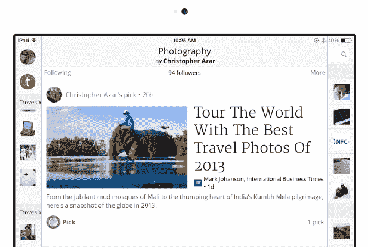
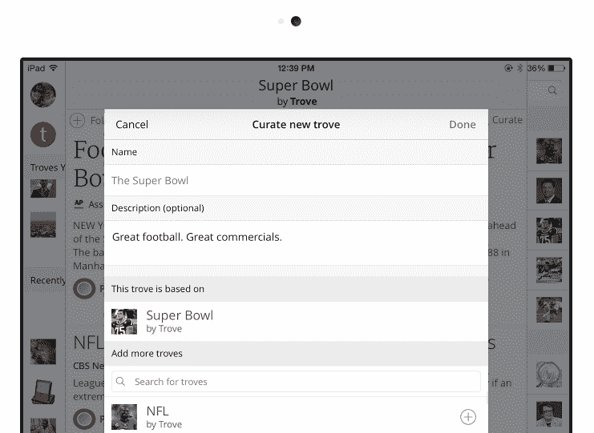

# WaPo 出售后，格雷厄姆控股重新推出其 Flipboard 竞争对手 Trove TechCrunch

> 原文：<https://web.archive.org/web/https://techcrunch.com/2014/01/22/after-wapo-sale-graham-holdings-relaunches-its-flipboard-competitor-trove/>

几年前，Washington Post Co. [的 Labs group 推出了](https://web.archive.org/web/20221003152223/https://beta.techcrunch.com/2011/04/20/the-washington-post-launches-trove-a-personalized-social-news-site/) [Trove](https://web.archive.org/web/20221003152223/http://trove.com/) ，这是一个个性化的社交新闻网站和聚合器，严重依赖脸书的监管。当然，该公司的旗舰报纸 WaPo 于去年[被](https://web.archive.org/web/20221003152223/https://beta.techcrunch.com/2013/08/05/jeff-bezos-acquires-the-washington-post/)卖给了【杰夫·贝索斯】，而 Labs 集团被吸收进了新的华盛顿邮报公司，也就是现在的 Graham Holdings。今天，格雷厄姆控股公司将 Trove 重新推出，作为一个独立的社交新闻阅读器，它结合了原始 Trove 应用程序和 WaPo Labs 社交阅读器应用程序的现有部分，创造了一种新的社交新闻阅读体验。

Trove 目前正在推出 iPhone 和 iPad 应用，以及一个移动网站，它与 Flipboard 和该领域的其他公司基于相同的前提:互联网上充斥着新闻，需要有一种方法来消除所有噪音。脸书和推特无法消除这种噪音，但这些网络提供的社交和个人数据可以帮助筛选出可能与我和我的兴趣相关的信息。

Trove 的社交新闻应用是 Flipboard 和 LinkedIn 的 Pulse 的结合。这款应用想给你带来与你志趣相投的人挑选的故事。因此，一旦你进入应用程序，你就可以关注某些主题(这些主题被称为 troves)，你会看到围绕这些 Troves 的新闻提要。因此，如果你围绕“时尚”、“技术”和“食品”挑选新闻，Trove 将从超过 15，000 个新闻来源中积累适合这些领域的最佳文章。如果你整合了你的 Twitter 和脸书账户，Trove 会根据你在脸书的喜好和你在 Twitter 上发布的话题，向你推荐各种“Trove”。

收藏品中的故事也是由对某个主题充满热情的策展人挑选的。因此，一些主题的收藏是由 Trove 的算法管理的，还有一些收藏是由用户和管理者创建的。正如 Trove 的团队解释的那样，“算法很聪明，但人更聪明。因此，在 Trove 上，策展人的选择出现在顶部。”在发布会上，该组织聚集了一批策展人，包括前 Bravo 顶级厨师选手斯派克·门德尔松(Spike Mendelsohn)、《华盛顿邮报》(The Washington Post)高级记者拉吉夫·钱德拉塞卡兰(Rajiv Chandrasekaran)，负责“阿富汗战争”，记者兼科技企业家维韦克·瓦德瓦(Vivek Wadhwa)，负责“推进技术”。

要创建一个收藏，你可以命名你的策展(如时装周)，添加一个描述(如巴黎时装周的故事)，并为你的策展添加额外的收藏。

Trove 的核心思想是，你正在通过你信任的各种人的眼睛以及通过你自己的兴趣来管理你的新闻。在每个宝库中，你可以挑选故事，这类似于喜欢一个故事。基于更多的选择，这个故事将在宝藏中上升得更高。你也可以在 Trove 上给脸书评论、发推特或张贴故事。此外，Trove 编辑团队将展示某些精选的 Trove。

Trove 的团队解释说:“Trove 是为了减少你寻找故事所需的工作量。”。“我们认为这是引入了一种不同的方式来寻找和发现优质新闻。”

Trove 的创造者想帮助用户屏蔽新闻噪音，并使用他们的社交数据和个人兴趣来帮助做到这一点，这是正确的。但我怀疑 Trove 将很难与这个领域的巨头 Flipboard 区分开来。有了新的资金支持，Flipboard 的增长令人印象深刻，现在已经拥有超过 1 亿用户的 T2。不仅 Flipboard 在处理个性化新闻，而且 [CNN 旗下的 Zite](https://web.archive.org/web/20221003152223/https://beta.techcrunch.com/2013/08/28/zite-android-google-glass/) 和 prism 也是强大的竞争对手。

