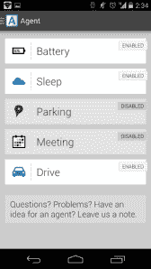
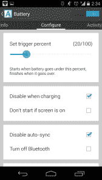

# Agent 让您的智能手机变得更加智能 TechCrunch

> 原文：<https://web.archive.org/web/https://techcrunch.com/2013/11/29/agent-makes-your-smartphone-a-little-bit-smarter/>

你不能教一部旧手机新把戏。

哈！开玩笑的。你当然可以。这不是 1998 年。

Agent 是一个应用程序，旨在让你的 Android 智能手机稍微智能一点，使用你手机的所有传感器来检测你在做什么，并自动调整你的设置。开车？它会自动回复短信，让人们知道你很忙，并记住你把车停在哪里。睡觉？它只会让最重要的电话通过。

代理是另一个名为“触发器”(或者曾经被称为“NFC 任务启动器”)的 Egomotion 产品的衍生产品。通过 Trigger，Egomotion 出售可编程 NFC 标签包，可以在你的手机上启动操作。想让手机在睡觉时自动静音并设置闹钟吗？你可以在你的床头柜上贴一个他们的 NFC 标签，然后设置一系列任务，只要检测到该标签就启动。想让它在你上车的时候自动启动你喜欢的音乐 app？将其中一个标签塞进你的杯架。

然而，随着时间的推移，团队意识到许多最流行的用例并不真正需要*T4 NFC。与其在你的床头柜上安装一个 NFC 标签，为什么不在特定时段自动静音呢？与其把标签藏在杯架里，为什么不直接检测用户何时连接到他们汽车的蓝牙？于是，代理人诞生了。*

Agent 把触发器这个核心概念，归结为它的本质。NFC 标签已经不复存在，取而代之的是依赖手机的内置功能——比如加速度计、时钟或 WiFi/蓝牙。相对复杂的任务设置过程已经一去不复返了，取而代之的是 Egomotion 提供了一小组他们称之为“代理”的预置动作。

目前，该应用程序有五个不同的内置代理:

*   **电池代理:**当你的电池电量开始下降时，电池代理就会开始消耗你手机的电量。您可以告诉它自动调暗屏幕、关闭自动数据同步或关闭蓝牙。一旦你插上电源，它会自动打开一切。
*   睡眠代理:在指定的时间自动让你的手机静音，但是有一个聪明的白名单系统。您可以指定允许哪些联系人叫醒您，并允许重复的(因此可能是紧急的)呼叫响起。它可以自动回复短信，告诉用户如果是紧急情况，可以回复“紧急”(这时，你的手机会大声响起来叫醒你)。您可以告诉该代理仅在您的手机接通电源时启动。这样，它可能不会在你晚上去俱乐部的时候让你的手机静音。
*   **停车代理:**试图自动记住你把车停在哪里。默认情况下，它通过检测你的速度来工作；一旦你停止以一定速度行驶超过几分钟，它就会认为你已经停好车，并相应地标记位置。当然，像乘坐 BART 这样的事情可能会产生误报，所以如果你的车有蓝牙连接，你可以告诉代理将其逻辑基于蓝牙连接。
*   **会议代理:**会议期间将手机静音。使用您的 Google 日历来确定您的会议日程。
*   **驾驶代理:**使用蓝牙检测你何时在车内。可以自动使您的手机静音，大声朗读您的短信，并回复收到的短信，让他们知道您正在开车。

该公司表示，他们正在开发更多的代理，可能会提供针对特定用例定制的附加代理“套件”——一套适用于学校，一套适用于工作，等等。这样，他们可以继续添加更多的功能，而不会使核心应用程序复杂化。

如果你是一个久经沙场的安卓专家，代理的把戏可能不会引起惊讶。“Pft，我有 [Tasker](//web.archive.org/web/20221007220650/https://play.google.com/store/apps/details?id=net.dinglisch.android.taskerm&hl=en) ！”你说。“我把我进口的 HTC J One 换成了根，用一个定制的 rom 刷新了它，这个 rom 在*年前就做了所有这些事情。”*

然而，对于那些不太紧张的人来说，代理人应该找到一个甜蜜点。这很简单，它做*它承诺做的事情*，并且设置非常简单，经过深思熟虑。

我的一个犹豫:虽然我通常讨厌人们说“但是如果 X 公司决定这么做怎么办”，但这是一个非常合理的担忧。随着所有的数据被谷歌吞噬并传输到 Google Now，几乎可以肯定的是，他们现在正在修补类似的概念。

实际上，这并不*几乎*确定。它*是*确定的。谷歌旗下的摩托罗拉已经发布了一款名为 [Assist](//web.archive.org/web/20221007220650/https://play.google.com/store/apps/details?id=com.motorola.contextual.smartrules2) 的应用，该应用旨在做许多与代理相同的事情。正如 Egomotion 的联合创始人 Kulveer Taggar 向我指出的那样，Assist 只能在少数摩托罗拉手机上运行，而 Agent 可以在很多很多安卓手机上运行。但 Moto 的手机往往是谷歌的测试平台(见:在被集成到 Android 4.4 之前的几个月，Moto X 上首次出现了“ok Google”语音命令)。如果这个概念被证明是受欢迎的，谷歌开始将这样的功能捆绑到 Android 本身的核心还要多久？

然而，与此同时，Egomotion 似乎发现了一些东西:根据该公司的统计数据，95%的代理人都保持兴奋状态。

这款应用通常售价 1.99 美元，感恩节周末售价 0.99 美元。