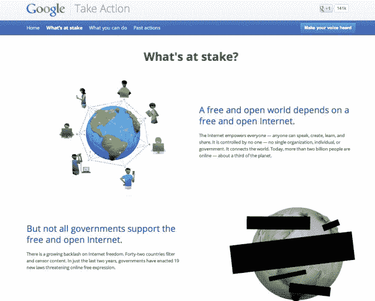

# 在国际电联峰会召开之前，谷歌希望您通过新的活动 TechCrunch 帮助维护自由开放的互联网

> 原文：<https://web.archive.org/web/https://techcrunch.com/2012/11/20/ahead-of-itu-summit-google-wants-you-to-help-preserve-a-free-internet-with-new-campaign/>

# 在国际电联峰会之前，谷歌希望你通过新的活动帮助维护一个自由开放的互联网

今天，谷歌宣布了一项名为“采取行动”的支持开放和自由互联网的新举措该公司已经建立了一个网站，网站上的材料可以帮助你了解你的权利，以及法律的变化会对你今天在互联网上享受的自由产生什么影响。

在[之后，我们经历了我们对 SOPA](https://web.archive.org/web/20221206222053/https://beta.techcrunch.com/2011/12/22/over-40-internet-companies-have-come-out-publicly-against-sopa/) 的所作所为，是时候听好了，这样我们就不必那么快就做出那样的反应。教育可以有所帮助。

所有这些事情的困难在于，包括我自己在内的大多数人，并不理解可以引入的法律的所有细微差别。大多数时候，这些法律直到战斗达到白热化时才会出现在“主流媒体”上。那很累。

以下是[公司对此的评论](https://web.archive.org/web/20221206222053/https://plus.google.com/u/1/+google/posts/SXWJMNfh3Lj):

> 从 12 月 3 日开始，世界各国政府关起门来讨论互联网的未来。国际电信联盟或#ITU 的这次会议将在迪拜举行。一些政府想利用迪拜的这次会议来加强审查和监管互联网。
> 
> 了解更多关于利害关系以及如何参与的信息:[http://google.com/takeaction](https://web.archive.org/web/20221206222053/http://google.com/takeaction)
> 
> 自由开放的世界依赖于自由开放的互联网。一个#自由开放的互联网取决于你。

[https://web.archive.org/web/20221206222053if_/https://www.youtube.com/embed/z-lwA9GJ1e0?feature=oembed](https://web.archive.org/web/20221206222053if_/https://www.youtube.com/embed/z-lwA9GJ1e0?feature=oembed)

视频

你可以[“承诺”支持这里的事业](https://web.archive.org/web/20221206222053/https://www.google.com/intl/en/takeaction/what-you-can-do/)，该网站允许你在 Google+、脸书和 Twitter 上分享该网站。

甚至连 reddit 的联合创始人亚历克西斯·奥哈尼安(Alexis Ohanian)也在其中，他在 SOPA 会议期间直言不讳:

[推文 https://Twitter . com/alexisohanian/status/270973714642923521]

无论你是记者、活动家还是像我一样经常发微博的人，这都是一个需要支持和理解的重要原因。以下是谷歌希望让你加入的内容:

> 互联网赋予每个人权力——任何人都可以发言、创作、学习和分享。它不受任何人控制——没有一个组织、个人或政府。它连接着世界。今天，超过 20 亿人上网，约占地球的三分之一。

我们都在网上，我们都在一起。让我们保持自由和开放。你的声音的确与众不同。