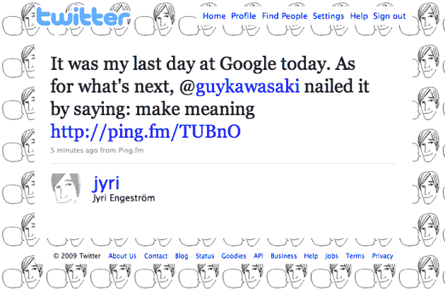

# 为了“创造意义”，Jaiku 联合创始人离开 Google 

> 原文：<https://web.archive.org/web/https://techcrunch.com/2009/10/12/aiming-to-make-meaning-jaiku-co-founder-leaves-google/>

# 为了“创造意义”，Jaiku 联合创始人离开谷歌

2007 年 10 月，[谷歌收购了](https://web.archive.org/web/20221208234008/http://www.beta.techcrunch.com/2007/10/09/google-buys-social-mobile-startup-jaiku/)芬兰社交网站 [Jaiku](https://web.archive.org/web/20221208234008/http://www.jaiku.com/) 。在接下来的几年里，尽管竞争对手 Twitter 越来越受欢迎，他们还是设法什么也没做。如今，联合创始人[Jyri enge strm](https://web.archive.org/web/20221208234008/http://www.crunchbase.com/person/jyri-engestrom)即将[离开谷歌](https://web.archive.org/web/20221208234008/http://twitter.com/jyri/status/4817814513)。

当我们最后一次在 5 月与他交谈时，恩格斯特伦似乎很享受他在谷歌的工作。在谷歌决定停止 Jaiku 的内部开发后，他在一月份告诉我们，“[我们没有死，我们在变形。谷歌决定允许 Jaiku 移植到 App Engine 上，并且开源，而不是完全消灭 Jaiku，就像它对 Dodgeball 和其他软件所做的那样。可悲的是，这种情况仍然没有多少结果。现在，还不清楚从现在开始 Engeströ将与该项目有多大关系。](https://web.archive.org/web/20221208234008/http://www.beta.techcrunch.com/2009/01/17/jaiku-founder-were-not-dying-were-morphing/)

原因是他正在转移到其他事情上。正如他在推文中指出的，他的目标是做一些“有意义”的事情，借用盖伊·川崎在他的一本书里说的话。我们知道一点那将会是什么。

首先，我们听说 Engeströ非常渴望回到他的祖国芬兰。在谷歌收购 Jaiku 之后，Engeströ和他的家人搬到了旧金山，在谷歌总部工作。在这里的时候，他确实设法建立了一些联系，似乎为我们指明了他下一步要做什么的方向。

其中一个联系人是克里斯·梅西纳，他是开放网络开发社区的一个重要人物。据说，恩格斯特伦和墨西拿正在研究“社交对象”这个词，这个词是恩格斯特伦[创造的](https://web.archive.org/web/20221208234008/http://www.zengestrom.com/blog/2005/04/why_some_social.html)。我们听说，这很可能与梅西纳正在进行的另一个项目 [Activitystrea.ms](https://web.archive.org/web/20221208234008/http://activitystrea.ms/) 有关。

另一个可能会占用 Engeströ一些时间的项目是帮助他的妻子创办新公司 [Thinglink](https://web.archive.org/web/20221208234008/http://www.thinglink.org/weSwitch) 。该服务的登陆页面(它处于封闭测试阶段)将其描述为“一种分享设计收藏和照片的方式。”

这两件事看起来更像是项目，而不是创业。因此，您可能会发现 Engeströ很快也会尝试另一种方法。Engeströ回到芬兰后，似乎也有可能做一些自己的天使投资。

最近，Engeströ给[做了一个有趣的演讲](https://web.archive.org/web/20221208234008/http://www.slideshare.net/jyri/snack-size-sociality)，其中有一些关于社会元素的想法。我把它嵌在下面了。

至于谷歌，他们在热门领域收购初创公司，结果却让它们陷入困境并失去创始人的传统仍在延续。至少他们在恩格斯特伦呆了整整两年。