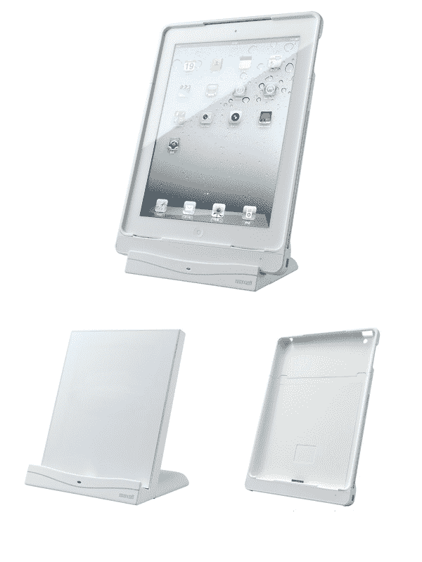

# 空气电压:Maxell 日本公司宣布 iPad 2 无线充电器 

> 原文：<https://web.archive.org/web/http://techcrunch.com/2011/09/28/air-voltage-maxell-japan-announces-wireless-charger-for-ipad-2/>

# 空气电压:Maxell 日本宣布 iPad 2 无线充电器

[日立 Maxell](https://web.archive.org/web/20230204104709/http://www.maxell.com/) 与[村田](https://web.archive.org/web/20230204104709/http://www.murata.com/)合作，[宣布了](https://web.archive.org/web/20230204104709/http://www.maxell.co.jp/jpn/news/2011/news110928.html)【JP】今天面向日本市场的所谓空气电压，这是一个无线充电板(被称为“能量支架”)和外套(“能量罩”)的组合，专门用于 [iPad 2](https://web.archive.org/web/20230204104709/https://techcrunch.com/tag/ipad/) 。据 Maxell 称，该设备是同类产品中的第一款(批量生产)。

它的工作方式是用户将 iPad 2 放入外套中，放在平板电脑上，让空气电压系统给平板电脑充电——不需要电缆。Maxell 说，10W 的无线电力传输充满电大约需要 3 个小时，只要用常规方式(交流适配器)给 iPad 充电。

用户可以将 iPad 2 水平或垂直放置在平板电脑上，并在充电时继续使用平板电脑。

Maxell 计划于 11 月 25 日在日本开始销售空气电压，售价 196 美元。内置于空气电压中的无线电力传输模块的制造商村田制作了一个详细的网页，用英语解释该产品。