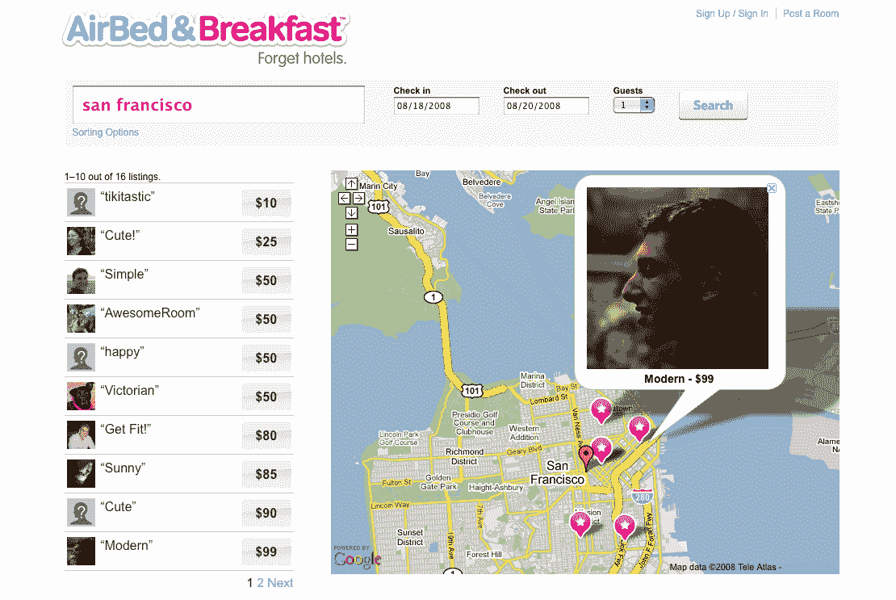

# 充气床垫和早餐将 Pad 碰撞提升到一个全新的水平 

> 原文：<https://web.archive.org/web/https://techcrunch.com/2008/08/11/airbed-and-breakfast-takes-pad-crashing-to-a-whole-new-level/>

# 充气床垫和早餐把床垫推到了一个全新的高度

 找不到参加 TechCrunch50 或下一场会议的酒店？如果你不介意过艰苦的生活，试试[充气床垫和早餐。](https://web.archive.org/web/20230210184557/http://www.airbedandbreakfast.com/)任何有充气床垫(或沙发)的人都可以“贴出房间”和价格。节俭的旅行者可以在网站上预订并支付住宿费用。

这个网站很少，但它做了工作(它是从创始人的朋友和家人那里筹集到的不到 2 万美元的种子资金，创始人是旧金山的设计师乔·格比亚(Joe Gebbia)和布莱恩·切斯基(Brian Chesky)，以及软件工程师内森·布莱查尔奇克(Nathan Blecharczyk)。

充气床垫和早餐肯定会吸引年轻的旅行者，以及找不到普通酒店房间的与会者。在超额预订的丹佛，将有 20，000 人前来参加民主党全国代表大会，酒店已经售罄。超过 600 人通过空气床和早餐找到了替代住所，每天都有 50 到 100 个新的房源出现。价格从 20 美元一晚的充气床垫到 3000 美元一整栋房子不等。

总的来说，价格通常要便宜得多(例如，旧金山的房价从每晚 10 美元到 175 美元不等，中位数是 85 美元)。你可以和一个友好的当地人住在一起，他会带你去你可能永远也找不到的餐馆和商店。

通常情况下，每个提供房间的人都会贴上自己和公寓或房子的照片，以及一些非常基本的信息。例如，花 99 美元一晚，你就可以在旧金山这个 24 岁的人的房间里过夜:

 *> **可容纳**:单人
> **床型**:充气床
> **房型:**公共空间
> **早餐**:我留点东西
> **吸烟**:不
> 
> **描述**:
> 
> 我的单元是一个 700 平方英尺的阁楼，位于历史悠久的 Clocktower 大楼，这是一个有 100 年历史的仓库，由建筑师大卫·贝克翻新。它有一个共享的庭院空间和市中心的屋顶景观。
> 
> 位于南海滩中心，距离莫斯克尼中心仅几个街区。
> 
> 充气床垫是一种有氧凸起床垫。

有氧运动和互联网的结合让每个人都成了旅店老板。

*